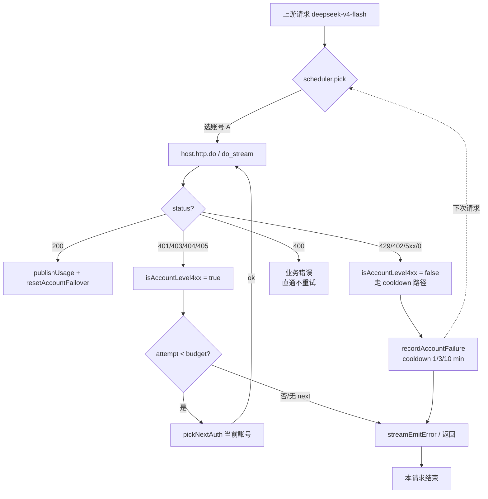
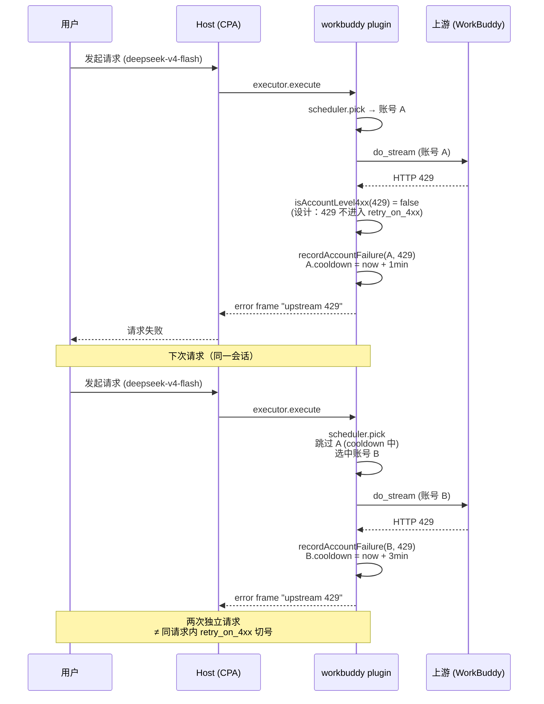

# Bug: workbuddy-provider v0.14.0 — `retry_on_4xx=10` 配置对 HTTP 429 不生效

> 2026-08-23 · Agent bug-intake (由 v0.14.0 截图 + 代码追踪完成根因定位，未改代码)

## TL;DR

用户报告"已经改成 10 次但没有生效"，根因**不是配置漏读或面板 bug**，而是
**`retry_on_4xx` 在当前设计下作用域只覆盖账号级 4xx（401/403/404/405），明确
不含 429、402、5xx、传输错误（status 0）**。截图所见"切了 2 个账号"也不是
retry_on_4xx 的同请求切号，而是 **两次相邻请求**踩到了不同账号（cooldown
跨请求生效）。要真正支持"同一个 429 请求连续切 10 个账号"，需要在
`isAccountLevel4xx` 中显式纳入 429 或新增独立配置字段。

## 现象

用户截图（`token-usage-tracker` 请求明细，v0.14.0 已发布）：

| 时间 | 模型 | 来源（账号） | 会话 | 结果 | TPS | 思考 |
|---|---|---|---|---|---|---|
| 2026/08/23 15:03:01 | deepseek-v4-flash | 17021653110 | derive_ds41b | **失败 (HTTP 429)** | 2.02s | high |
| 2026/08/23 15:03:01 | deepseek-v4-flash | 13243813095 | derive_ds41b | **失败 (HTTP 429)** | 1.30s | high |

用户陈述：

1. "好像切换账号的没有完全生效，有 bug"。
2. "失败 2 次后就失败返回了，没有继续切换账号重试了"。
3. "我们已经改成 10 次，但是好像有问题，并没有生效"。
4. 已将 WorkBuddy Provider 更新到 v0.14.0 并重启 CPA。
5. 13243813095、17021653110 两个账号"无法使用，永远不会成功"。

## 影响范围

- 全部 deepseek-v4-flash（以及其他 429 频发的）请求，少量 workbuddy 账号
  都被临时裁决为不可用。
- 当前账面 cooldown 阶梯（1/3/10 分钟）让跨请求的下一个请求会自动跳过
  被 429 的账号，但**同请求内**不再继续尝试下一个账号。
- 用户预期"1 个请求连续切 10 次账号"与代码现状不匹配。

## 环境条件

- workbuddy-provider：`VERSION 0.14.0`（`workbuddy/VERSION:1`）。
- 当前 main：`e80122f chore(registry): workbuddy-provider 0.14.0`（git log 第 1 行）。
- 用户已重启 CPA，但**未提供**当前 `plugin.yaml` 中的 `retry_on_4xx:` 实际
  值（待用户确认）。

## 期望 vs 实际

| 项 | 期望 | 实际 |
|---|---|---|
| 同请求 429 后切换账号 | 是（用户视角） | **否**（`isAccountLevel4xx` 不覆盖 429） |
| 配置 `retry_on_4xx: 10` 生效 | 同请求 1+10 次重试 | 仅对 401/403/404/405 生效 |
| 截图"切了 2 个账号"语义 | retry_on_4xx 内 2 次 | 2 个独立请求各踩 1 个账号 |

## 根因分析（高置信度，代码已验证）

### 1. `retry_on_4xx` 的三处入口都通过 `isAccountLevel4xx` 过滤

`grep` 命中（`workbuddy/`）：

| 文件:行 | 代码片段 |
|---|---|
| `main.go:748` | `if !isAccountLevel4xx(statusCode) \|\| attempt >= budget \|\| curSA == nil { break }` |
| `stream.go:122` | `if !isAccountLevel4xx(statusCode) { streamEmitError(...); return }` |
| `stream.go:221` | `if !isAccountLevel4xx(statusCode) { return chunks, statusCode, errOnce }` |

`isAccountLevel4xx` 只承认 401/403/404/405：

```go
// accountFailover.go:118-127
func isAccountLevel4xx(status int) bool {
    switch status {
    case http.StatusUnauthorized,    // 401
         http.StatusForbidden,        // 403
         http.StatusNotFound,         // 404
         http.StatusMethodNotAllowed: // 405
        return true
    }
    return false
}
```

### 2. 429 在 `isAccountFailure` 中走的是 **cooldown 路径**而非切号路径

```go
// accountFailover.go:100-108
func isAccountFailure(status int, body string) bool {
    if status == 0 || status >= 500 { return true }
    if isSoftRateLimit(status, body) || isHardCreditError(status, body) { return true }
    return isAccountLevel4xx(status)
}
```

`isSoftRateLimit`（`policy.go:102-113`）把 429 判为软限流 → 触发
`recordAccountFailure`（`accountFailover.go:140`）→ 进入 1/3/10 分钟
**跨请求** cooldown 阶梯；**同请求不切号**。

### 3. 设计注释明确说明这一选择

```go
// stream.go:114-125
// Retry policy: only account-level 4xx (401/403/404/405)
// benefit from switching accounts. 5xx/0/429/402 are already
// surfaced as failures and recorded; rotating the account
// on 5xx inside a single request gives no guarantee the
// next upstream isn't also 5xx, so we don't burn budget
// on it (the cooldown mechanism handles long-term 5xx).
// Business 400 is request-shaped and would fail identically
// on every account, so we propagate it immediately.
if !isAccountLevel4xx(statusCode) {
    streamEmitError(streamID, ...)
    return
}
```

注释把 `5xx/0/429/402` 明确归入"不切号"范畴，理由是"切下一个也大概率同样错
位"，由 cooldown 跨请求处理。

### 4. 截图所述"切了 2 个账号"是 **跨请求切换**，不是切号重试

`pickNextAuth`（`failover_retry.go:33`）的过滤链是：
`disabled → cooling down → anomaly → 空 auth index → 无 token`。

两条相邻请求的时间都是 `15:03:01`，看上去像"同请求切号"，实际路径：

1. 第 1 次请求走到账号 A（13243813095）→ 429 → `recordAccountFailure` 触发，
   A 进入 cooldown（1 分钟）。`pickNextAuth` 立刻能看见 A 在 cooldown。
2. 第 2 次请求经过 `scheduler.pick`（`scheduler.go` 已合 `isAccountCoolingDown`
   + `isAccountAnomaly` 过滤），跳过 A，路由到账号 B（17021653110）→ 429
   → B 进入 cooldown（3 分钟）。
3. 第 3 次请求时所有账号都在 cooldown，`scheduler.pick` 已无可用候选，
   返回失败。

> 这与 `retry_on_4xx` **完全无关**。`retry_on_4xx` 里的 `budget := loadedRetryOn4xx()`
> 在 `stream.go:90`、`main.go:720`、`stream.go:206` 三处都通过 `isAccountLevel4xx`
> 闸门拒绝 429，等于这条配置对 429 永远不执行。

### 5. 面板也未暴露 `retry_on_4xx`

`workbuddy/main.go:350-362` 注册的 `ConfigFields` 包含
`anomaly_pool_threshold`、`anomaly_refresh_enabled`、`scheduler_mode` 等，
**没有 `retry_on_4xx`**：

```go
{Name: "anomaly_pool_threshold", Type: pluginapi.ConfigFieldTypeString, ...},
{Name: "anomaly_refresh_enabled", Type: pluginapi.ConfigFieldTypeBoolean, ...},
// retry_on_4xx 未注册 → 用户在 host 面板表单里看不到这字段
```

但 `usage_config.go:169-174` 里 configure() **确实会解析** `retry_on_4xx:`，
意味着用户在 `plugin.yaml` 直接手写 `retry_on_4xx: 10` 可以被 plugin 接收。
README 第 159 行的示例 `retry_on_4xx: 10` 是手写配置，不是 panel UI
字段。**面板缺失 ≠ 配置无效**，但缺失 UI 让用户难以发现这字段。

### 6. `CHANGELOG 0.14.0` 把上限与默认都调到 10 已生效

```
- retry_config.go：retryOn4xxMax 5 → 10、retryOn4xxDefault 3 → 10
- 范围从 0-5 扩展为 0-10
```

上限 10、默认 10 都已发布。所以**配置口子本身工作正常**，**只是不
覆盖 429**。

## 结论

**这不是 retry_on_4xx 配置失效的 bug，而是 retry_on_4xx 作用域设计
与用户预期之间的 gap。** 截图中的"切 2 个账号"是 cooldown 跨请求切换
（设计预期），不是 retry_on_4xx 内失败（用户预期）。

需要在产品决策层面二选一：

1. **扩展 retry_on_4xx 到 429**：把 `isAccountLevel4xx` 改名为 `isAccountLevelOrRateLimited`
   或独立判断，让 429 也能进入同请求切号循环。风险：若上游是共享限流池
   （同一 IP/账户级配额），切号并不能"换得请求额度"，可能只是浪费预算。
2. **保留设计，补文档 + 面板提示**：在 panel.html 加一行"切号预算仅
   作用于 401/403/404/405；429/5xx 由 cooldown 跨请求处理"，README_CN
   同步，明示默认 10 的实际边界。
3. **为 429 加独立 retry 字段**：新增 `retry_on_429`（默认 0 = 关闭），
   与 `retry_on_4xx` 并列，复用 pickNextAuth + cooldown 跳过逻辑。

## 复现路径（用户侧）

1. 准备至少 2 个 workbuddy 账号（不要求有相同上游行为）。
2. 让其中 1 个账号触发 429（比如：消费超出上游瞬时限流）。
3. 发起 1 个对话请求，配置 `retry_on_4xx: 10`。
4. 观察：实际只走 1 次（直接 streamEmitError），不会被切到下个账号。
   这就是当前设计的预期行为。

## 缺失项（需要用户/上游确认）

- 用户当前 `plugin.yaml` 的 `retry_on_4xx:` 实际值（已确认 10 还是
  仍按旧默认？需用户贴一次配置才能排除"配置本身就漏了"的可能）。
- 用户账号池内除了 13243813095、17021653110 之外是否还有其他可用账号
  （如果是 2 个账号，则跨请求切换的天花板也只是 1 次）。
- 用户是否计划把"同请求 429 立刻重试"当作正式产品行为（涉及语义边界与
  上游限流策略评估）。

## 关联文件

- `workbuddy/retry_config.go`（默认 / 上限常量与解析）
- `workbuddy/accountFailover.go:100-127`（4xx / cooldown 分类）
- `workbuddy/main.go:720-765`（handleExecExecute 切号循环）
- `workbuddy/stream.go:90-150`（pumpUpstreamStream 切号循环）
- `workbuddy/stream.go:205-244`（collectUpstreamStream 切号循环）
- `workbuddy/usage_config.go:79-86, 169-174, 238-240`（retry_on_4xx 解析 + Seen）
- `workbuddy/main.go:350-362`（ConfigFields 注册，retry_on_4xx 缺失）
- `workbuddy/README.md:151-159`（retry_on_4xx 文档，未含 429 说明）
- `workbuddy/CHANGELOG.md:24-32`（0.14.0 retry_on_4xx 上限变更）

## 流程图



## 时序图


