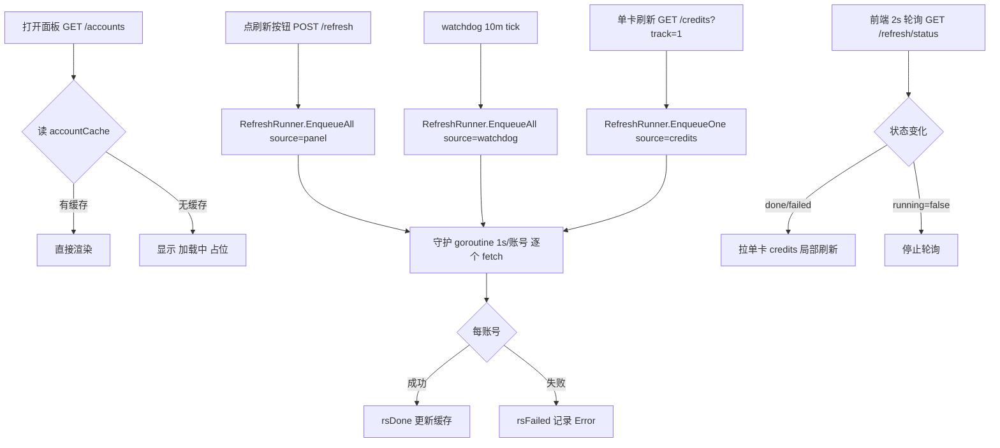

# 账号面板「异步节流刷新」实施计划

> 来源对象：需求「账号面板刷新改为 1s/账号异步节流」
> 设计基线：`analysis/workbuddy-async-refresh-design.md`（行号级实现要点、单测、风险回退）
> 落盘时间：2026-08-23 21:36

## 最终方案简要说明

把「打开面板触发全量并发拉上游」和「刷新按钮同步阻塞」两处，统一收敛为一个进程内 `RefreshRunner` 单例：1s/账号硬编码节流、异步入队即返回，前端 2s 轮询 `GET /refresh/status` 做每卡片局部刷新。watchdog 10m tick 改为入队即返回，preserve 判断走缓存。workbuddy 与 qoderwork 对称同步。

### 第二轮修订（2026-08-23 晚，最终口径）

1. **去掉「刷新数据」按钮**：进入页面（init + saveKey）自动触发一次异步刷新，前端无感知；页面先渲染缓存，后台 1s/账号慢慢刷新 + 轮询局部更新。软刷新（checkin/unfreeze/delete/select）只渲染缓存，不再触发整轮。
2. **刷新轮幂等**：`EnqueueAll` / `EnqueueOne` 运行中则忽略（`idx < len(batch)` → 返回 0/false），多路触发（进入页面 / watchdog / 单卡 track）并发到达也只跑一轮。
3. **范围**：后端幂等双插件同步；前端「去按钮 + 进入自动刷新」本次仅 WorkBuddy，qoderwork 面板前端暂不动。

## Agent 对问题的理解

- **问题**：账号量增长后，当前「全量一次性刷新」会在打开面板和点刷新时对上游 billing API 造成 N 并发冲击，且刷新按钮同步阻塞导致 UI 长期转圈。
- **目标**：打开面板零上游请求（纯缓存/账号 JSON 展示）；2 个刷新入口（面板按钮 + watchdog 10m）共用同一 1s/账号节流的异步刷新器；前端能渐进看到每个账号刷新状态。
- **本轮范围**：workbuddy + qoderwork 双插件的新增 RefreshRunner、路由改造、watchdog 异步化、panel.html 异步轮询 + 卡片三态。
- **不在范围**：SSE 推送（本期轮询）；节流参数可配置化（本期硬编码 1s）；token-usage-tracker 插件。
- **优先闭环**：workbuddy 单插件跑通「打开面板不刷新 → 点刷新异步 → 卡片渐进更新」端到端闭环，再对称到 qoderwork。
- **关键假设**：1s/账号硬编码足够；轮询 2s 间隔可接受；已有 `accountDetailFlight` singleflight 继续复用不引入新锁。

## 实施周期

单一周期（本轮一次闭环，不拆多期）：

| 周期 | 定位 | 目标 |
|---|---|---|
| 01 | 后端 RefreshRunner + 路由/watchdog + 前端轮询 + qoderwork 对称 | workbuddy + qoderwork 双插件端到端「异步节流刷新」闭环 |

## 最小任务清单（含 AC-*）

### Task 1 — workbuddy RefreshRunner 单例 + 单测

- **产出**：`workbuddy/refresh_runner.go`（新增）+ `workbuddy/refresh_runner_test.go`（新增）
- **接口契约（冻结，供 Task 2/4 调用）**：
  ```go
  const refreshTickInterval = 1 * time.Second

  type refreshStatus string
  const ( rsPending; rsRunning; rsDone; rsFailed )

  type refreshTarget struct { AuthIndex, AuthID string }
  type refreshJobState struct {
      AuthIndex, AuthID string
      Status refreshStatus
      Error  string
      FetchedAt time.Time
      Source string // panel | watchdog | credits
  }
  type refreshSnapshot struct {
      Running bool            `json:"running"`
      Total int               `json:"total"`
      Done int                `json:"done"`
      Failed int              `json:"failed"`
      Pending int             `json:"pending"`
      RunningIndex int        `json:"running_index"`
      Sources []string        `json:"sources"`
      PerAccount []refreshJobState `json:"per_account"`
      StartedAt string        `json:"started_at,omitempty"`
  }

  var globalRefresh = newRefreshRunner()

  func newRefreshRunner() *refreshRunner           // fetchFn 可注入，默认 doFetchOne
  func (r *refreshRunner) EnqueueAll(targets []refreshTarget, source string) int
  func (r *refreshRunner) EnqueueOne(authIndex, authID, source string) bool
  func (r *refreshRunner) Snapshot() refreshSnapshot
  func (r *refreshRunner) run()                    // 守护 goroutine，1s tick
  func doFetchOne(authIndex, authID string) error  // hostAuthGet + cachedAccountDetails(force=true)
  ```
- **AC-1**：`EnqueueAll` 后立即返回，不阻塞调用方（runner 后台跑）
- **AC-2**：连续多次 Enqueue 合并为同一 batch，不重复启动 worker
- **AC-3**：1s/账号节流——N 个账号耗时 ≥ (N-1)×1s（单测用 fake fetchFn + 缩短 tick 可测，生产硬编码 1s）
- **AC-4**：`Snapshot()` 返回 running/done/failed/pending 计数与 per_account 状态一致
- **AC-5**：`doFetchOne` 失败时状态置 `failed` 并记 Error，不影响后续账号
- **AC-6**：`refresh_runner_test.go` 至少覆盖：合并入队 / 不阻塞 / 节流 / 状态快照 / 失败隔离

### Task 2 — workbuddy 路由 + watchdog 异步化

- **产出**：改 `workbuddy/management.go`、`workbuddy/credits_handler.go`、`workbuddy/watchdog.go`
- **AC-1**：`POST /refresh` 改为 `globalRefresh.EnqueueAll(targets, "panel")` 后立即返回 `{started:true, source:"panel", refresh_id}`，不再同步 `buildDashboardEx(true,true)`
- **AC-2**：新增 `GET /refresh/status` 返回 `globalRefresh.Snapshot()`
- **AC-3**：`GET /credits?auth_index=…&track=1` 走 `EnqueueOne(...,"credits")` 返回 202；`track` 缺省保持旧单卡立即拉行为
- **AC-4**：`runPreserveWatchdogTick` 改为 `EnqueueAll(targets, "watchdog")` 后立即 return，不阻塞 tick
- **AC-5**：`mutatingManagementPath` 不含 `/refresh/status`（读路径）；`POST /refresh` 仍走 mutating 鉴权

### Task 3 — workbuddy panel.html 异步刷新 + 三态 + 轮询

- **产出**：改 `workbuddy/panel.html`
- **AC-1**：删除打开面板时的 `lazyLoadCredits(accounts)` 全量并发触发（仅读缓存，无 credits 显示「加载中…」占位）
- **AC-2**：`load(true)`（刷新按钮）改异步：toast「已开始后台刷新（N 个账号）」+ 启动 `pollRefreshStatus()`，不阻塞 UI
- **AC-3**：`pollRefreshStatus()` 每 2s `GET /refresh/status`；对 done/failed 状态变化的账号拉单卡 `GET /credits?auth_index=…` 局部刷新卡片
- **AC-4**：卡片加 `data-refresh-state` 三态（pending/running/done/failed）+ CSS 高亮/⚠️/错误文案
- **AC-5**：`!d.running` 时停止轮询
- **AC-6**：`node --check` 语法通过

### Task 4 — qoderwork 对称同步

- **产出**：新增 `qoderwork/refresh_runner.go`（整文件同步 Task 1 产物）；改 `qoderwork/management.go`、`qoderwork/credits_handler.go`、`qoderwork/panel.html`
- **AC-1**：`refresh_runner.go` 与 workbuddy 同构（仅 providerName 差异自动跟随）
- **AC-2**：路由 `/refresh` 异步 + `/refresh/status` 新增 + `/credits?track=1`，与 Task 2 一致
- **AC-3**：panel.html 异步刷新 + 三态 + 轮询，与 Task 3 一致（qoderwork 无 watchdog，不涉及）
- **AC-4**：`node --check` 语法通过

### Task 5 — 双插件验证 + 发版

- **产出**：验证证据 + 发版（workbuddy 0.14.9 + qoderwork 0.9.4）
- **AC-1**：`python scripts/cgo-shim-build.py workbuddy` + `qoderwork` 全绿（build+vet+test）
- **AC-2**：双 panel.html `node --check` 通过
- **AC-3**：发版链路 bump→commit→push→CI→assets→publish→registry→远端 raw 200（**发版需用户本轮显式授权 commit/push**）

## 依赖与执行顺序

```
Task1(refresh_runner+单测)  ──串行──>  [Task2 路由/watchdog │ Task3 panel.html │ Task4 qoderwork]  ──并行──>  Task5 验证+发版
      (定接口契约)                       (写集互斥)                                        (串行收口)
```

- Task 1 是唯一「必须串行」的前置：它冻结 `refreshRunner` 接口契约，Task 2/4 依赖该接口。
- Task 2/3/4 写集互斥（Task2→workbuddy 三个 .go；Task3→workbuddy/panel.html；Task4→qoderwork 四个文件），可并行。
- Task 5 依赖全部完成。

## 真实测试安排

| 项 | 内容 |
|---|---|
| 测试入口 | `python scripts/cgo-shim-build.py workbuddy` / `qoderwork`（build+vet+test）；`node --check panel.html` |
| 依赖环境 | Windows 无 gcc，走 cgo-shim 隔离构建（项目既定验证方式） |
| 样本/数据 | 单测用 fake fetchFn（不依赖 host API）；`refresh_runner_test.go` 覆盖节流/合并/状态机 |
| 通过标准 | 双插件 build/vet/test 全绿 + 双 panel.html node --check 通过 |
| 手工验证（用户侧） | 10 账号开面板瞬开无 credits 占位 → 点刷新 toast → 1s/账号渐进 done 高亮 → 故意 5xx 时单卡 ⚠️ 不影响其他 |
| 阻断项 | 发版 commit/push 需用户本轮显式授权；真实页面交互验证依赖 CPA 宿主，无法在 cgo-shim 下完成 |

## 新增文件目录树

```
workbuddy/
  refresh_runner.go        # RefreshRunner 单例 + 状态机 + 1s 节流守护 goroutine
  refresh_runner_test.go   # 合并入队/不阻塞/节流/状态快照/失败隔离 5 类单测
qoderwork/
  refresh_runner.go        # 对称同步（整文件，逻辑同 workbuddy）
```

## Mermaid 流程图


