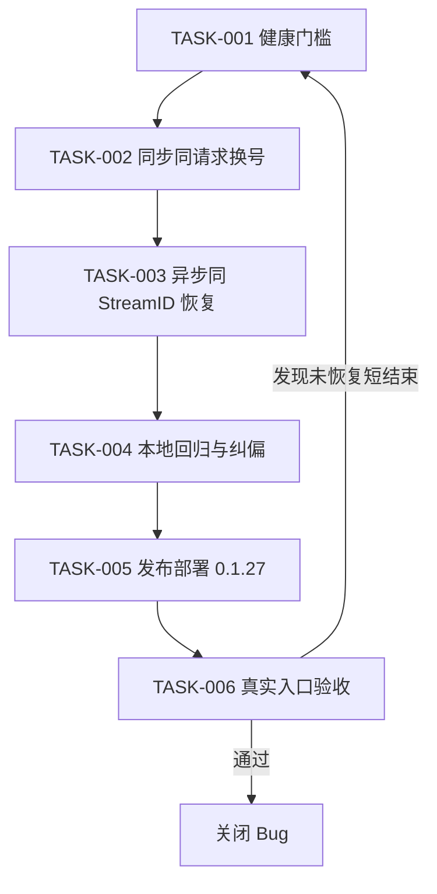
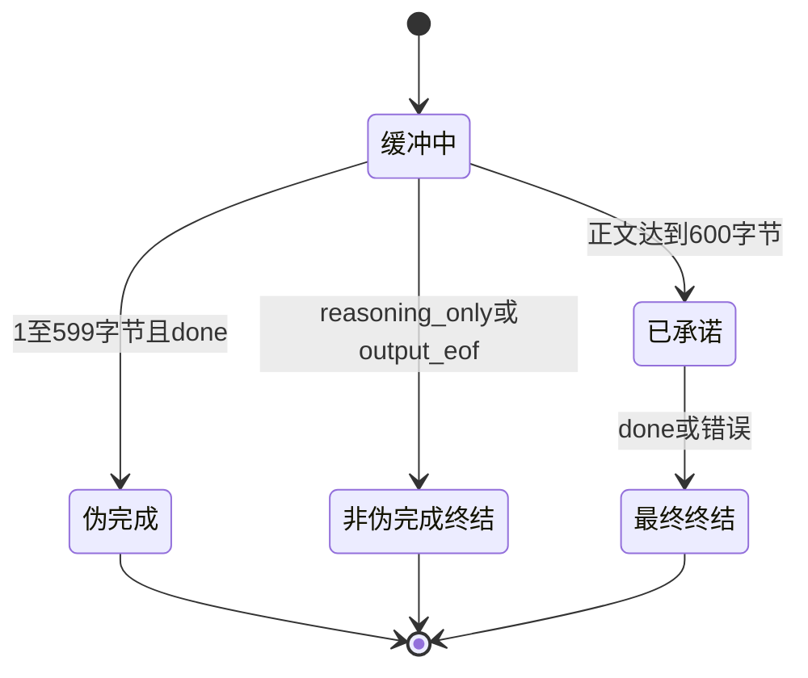
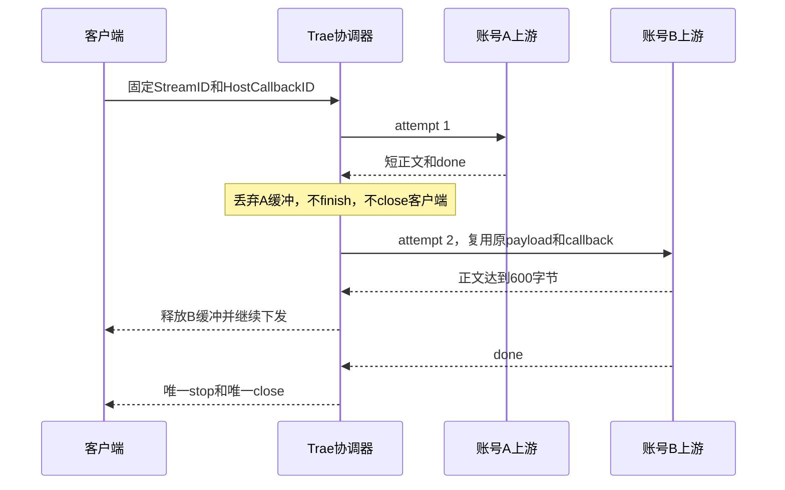

# Trae 伪完成同请求换号恢复实施总览

结论：TraeWork 已在本地实现同一请求内自动换号，长输入遇到第一账号短正文后 `done` 时不再把短答发给客户端。影响：`qwen3.8-max` 的偶发伪完成可以由备用账号接续，客户端只看到最终健康结果。范围：单次 SSE 健康门槛、同步和异步流式换号、资源关闭、失败核算、本地回归、0.1.27 发布准备和后续入口验收。非范围：不改模型映射、600 字节与 200 字节阈值、账号冷却算法、宿主 ABI、其他插件和生产配置。变化：长输入的前 600 字节正文暂存，伪完成内容丢弃，健康内容按原顺序释放。完成标准：本地确定性测试全绿，0.1.27 完成发布部署，并在允许的环境中验证真实 `/v1/responses` 长推理。术语说明：伪完成是长输入下正文只有 1 至 599 个 UTF-8 字节但上游已发送 `done`；健康门槛是正文累计 600 字节后才向客户端承诺当前账号输出。验证状态：前四项本地实现与回归已完成，build、vet、test、污染门禁和三幅 Mermaid 图真解析通过；0.1.27 尚未发布，生产入口尚未验收。

## 当前计划最终方案简要说明

`traework/stream.go` 负责解析单次上游 SSE 并在健康门槛前缓存分片，`traework/executor.go` 负责一个逻辑请求内的账号选择、失败核算和唯一终结。伪完成 attempt 的正文与 reasoning 全部丢弃，随后复用原 payload 与 `HostCallbackID` 选择新账号；只有最终健康 attempt 可以发送 finish 并关闭客户端流。

## 基本信息

| 项目 | 内容 |
| --- | --- |
| 来源 Bug | [`BUG-TRAE-HTTP200-EMPTY-SUCCESS-20260830`](../4-bugs/2026-08-30_202238_Trae_HTTP200异常响应被静默当作空成功.md) |
| 代码基线 | `a122eefb02a42d3d509161e3585e1c113b5c36aa` |
| 当前版本 | `traework-provider 0.1.26` |
| 目标版本 | `traework-provider 0.1.27` |
| 本轮测试 | [`TEST-TRAE-PSEUDO-SAME-REQUEST-20260901`](../5-tests/2026-09-01_225756_Trae伪完成同请求换号恢复回归.md) |
| 风格回归 | [`STYLE-TRAE-PSEUDO-SAME-REQUEST-20260901`](../6-review/2026-09-01_225756_Bug-Trae伪完成同请求换号恢复_6-review.md) |

关键假设已经冻结：阈值继续按 Go `len(string)` 的 UTF-8 字节数计算；仅长输入下正文 1 至 599 字节且明确 `done` 判为伪完成；正文达到门槛后若读取或发送失败，不允许换号混合两个账号的内容。`unresolved_decisions` 中没有 P0 或 P1 决策。

## 实施周期总览

| 周期 | 任务 | 当前状态 | 收口条件 |
| --- | --- | --- | --- |
| CYCLE-01 确定性实现 | TASK-001 至 TASK-003 | 已完成 | 门槛、同步恢复、异步恢复的确定性测试通过 |
| CYCLE-02 整体验证 | TASK-004 | 已完成 | cgo-shim、静态门禁、污染检查和状态纠偏完成 |
| CYCLE-03 发布部署 | TASK-005 | 未开始 | 0.1.27 版本、资产、registry 与部署版本一致 |
| CYCLE-04 真实入口验收 | TASK-006 | 未开始 | 真实 `/v1/responses` 多轮长推理满足验收口径 |

图形目的：说明六个最小任务的唯一执行顺序和失败回流点。关联 ID：CYCLE-01、CYCLE-02、CYCLE-03、CYCLE-04。



图形目的：说明健康门槛前后的单次 attempt 状态。关联 ID：TASK-001、AC-001、AC-002。



## 阶段计划

CYCLE-01 先锁定单次 attempt 的零泄漏，再把结果接入同步和异步协调器。CYCLE-02 证明测试进入真实编译路径，完成全模块回归、测试归位和错误完成结论纠偏。CYCLE-03 只发布 `traework-provider 0.1.27`，不得混入共享工作树的其他会话文件。CYCLE-04 只做协议入口行为验收，不修改生产配置或账号数据。

## 最小任务清单

| 任务 | 文件/符号 | 实施结果 | 真实测试 |
| --- | --- | --- | --- |
| TASK-001 | `traework/stream.go::pumpTraeStreamAttempt` | 600 字节前缓存，伪完成零泄漏 | TEST-001 |
| TASK-002 | `traework/executor.go::runTraeSyncStream` | A 伪完成后同请求选择 B，拒绝 A 至 B 至 A 回跳 | TEST-002 |
| TASK-003 | `traework/executor.go::runTraeAsyncStream` | 保持同一 `StreamID`，复用 `HostCallbackID`，唯一 finish 与 close | TEST-003 |
| TASK-004 | `scripts/cgo-shim-build.py`、`test/traework/`、项目状态文档 | 根镜像测试进入 shim，清理完整临时根，纠正 0.1.26 结论 | TEST-004 |
| TASK-005 | `traework/VERSION`、`traework/main.go`、`traework/CHANGELOG.md`、发布资产和 `registry.json` | 未开始 | TEST-005 |
| TASK-006 | 真实 `/v1/responses` 入口 | 未开始 | TEST-006 |

每个任务的停止条件如下：出现失败账号内容泄漏、双 finish、双 close、账号回跳、上游句柄未关闭或测试未进入编译时，停止后续任务并回到当前任务修复。发布阶段若缺少当前消息的 Git 写历史授权、暂存区混入其他会话文件、资产校验不一致或部署目标不明确，停止在未提交状态。真实入口验收若受环境规则限制，记录未执行，不能改写成通过。

## 现状与落点

```text
traework/
├── executor.go
└── stream.go
scripts/
└── cgo-shim-build.py
test/traework/
├── async_stream_failover_test.go
├── executor_pseudo_retry_test.go
└── stream_pseudo_test.go
doc/
├── 3-实施/2026-09-01_225756_Bug-Trae伪完成同请求换号恢复_实施总览.md
├── 5-tests/2026-09-01_225756_Trae伪完成同请求换号恢复回归.md
└── 6-review/2026-09-01_225756_Bug-Trae伪完成同请求换号恢复_6-review.md
```

不新增第三方依赖。生产代码复用 `callLLMStream`、`pickNextAuth`、`noteForcedAccountFailure`、`evictSessionBindingsForAuth` 和 `publishUsage`；测试通过 shim 临时复制到同包执行，没有增加生产测试专用导出 API。

图形目的：说明异步同一逻辑请求从 A 伪完成切换到 B 健康完成的时序。关联 ID：TASK-003、AC-003、AC-004。



## 真实测试安排

| 测试 ID | 入口 | 样本与通过标准 | 状态 |
| --- | --- | --- | --- |
| TEST-001 | `test/traework/stream_pseudo_test.go` | 599 字节零 emit，600 字节按序释放，短输入与 reasoning-only 不误判 | PASS |
| TEST-002 | `test/traework/executor_pseudo_retry_test.go` | 同步 A 至 B 仅返回 B；全 pseudo 显式池耗尽；同请求不重复账号 | PASS |
| TEST-003 | `test/traework/async_stream_failover_test.go` | callback 一致，A 零泄漏，上游各 close 一次，唯一 stop/close，panic 内部收口 | PASS |
| TEST-004 | `python scripts/cgo-shim-build.py traework` | build、vet、test 全绿；哨兵先失败后移除；无 shim 与缓存残留 | PASS |
| TEST-005 | GitHub Actions、资产和部署版本校验 | 版本、提交、资产 SHA、registry 和 active version 一致 | 未执行 |
| TEST-006 | 允许环境中的真实 `/v1/responses` | 多轮长推理完整；若发生 pseudo，证明 A 至 B 同请求恢复 | 未执行 |

本地执行环境不连接数据库、缓存、消息队列或 HTTP 上游。cgo-shim 只使用项目源码、Go 工具链和内存样本。真实测试记录见关联测试主文档，`6-review` 只检查格式、命名、注释、日志、可读性与目录归位。

## 风险与阻断项

- 长输入首包需要等待正文达到 600 字节，这是零泄漏保证的一部分；短输入保持原实时语义。
- gate 打开后不能换号，否则客户端会收到两个账号的混合内容；读取、发送或取消错误继续走原失败出口。
- 当前工作树包含其他会话修改，TASK-005 只能显式暂存本任务白名单文件。
- 当前消息没有 Git 提交或推送授权，TASK-005 不得写入 Git 历史。
- 仓库测试红线禁止连接 production，TASK-006 在该规则未变化时不得由本会话直接执行。
- 图片资产决策：N/A。原因：任务对象是 Go 流状态与协议行为。证据：没有 UI、视觉基线或空间布局改动，三张 Mermaid 图已覆盖流程、状态和时序。

## 任务完成、停止与最大推进边界

本实施总览只有在 TASK-001 至 TASK-006 全部有真实证据时才能标记 accepted。TASK-004 已满足本地完成条件；TASK-005 和 TASK-006 尚未开始，因此当前不能宣告 Bug 已关闭。最大推进边界是 `traework-provider 0.1.27` 及其测试、文档、发布资产和 registry 条目，不改其他插件、宿主、生产配置或账号数据。

## 自审结论

实施方案、文件/符号、任务顺序、真实测试、停止条件、回滚边界和最大推进边界均已明确。`unresolved_decisions` 为 0 个 P0/P1；当前唯一外部边界是后续 Git 授权与 production 连接红线，它们不会影响 TASK-004 的本地通过结论，也不得被解释成 TASK-005 或 TASK-006 已完成。

## 执行附录

本地验证命令：

```bash
python scripts/cgo-shim-build.py traework
git diff --check -- traework/executor.go traework/stream.go scripts/cgo-shim-build.py
```

回滚规则：发布前只撤销本来源对象自己的 hunk；不得用 checkout、reset 或整体覆盖处理共享工作树。发布后出现问题只能递增 patch 版本，不改写已公开 tag 或资产。

## 追踪附录

| 来源 | 验收条件 | 任务 | 测试与证据 |
| --- | --- | --- | --- |
| SRC-001 用户要求当前请求恢复 | AC-001 A 内容零泄漏 | TASK-001、TASK-003 | TEST-001、TEST-003、EVIDENCE-001 |
| DEC-001 门槛前禁止 emit | AC-002 600 字节后有序释放 | TASK-001 | TEST-001、EVIDENCE-002 |
| REQ-001 同请求换号 | AC-003 A 至 B 且不回跳 | TASK-002、TASK-003 | TEST-002、TEST-003、EVIDENCE-003 |
| REQ-002 唯一终结 | AC-004 一个 finish 和一个 close | TASK-003 | TEST-003、EVIDENCE-004 |
| REQ-003 全 pseudo 显式失败 | AC-005 不释放最后短答 | TASK-002、TASK-003 | TEST-002、TEST-003、EVIDENCE-005 |
| SRC-002 发布后真实入口验证 | AC-006 0.1.27 行为验收 | TASK-005、TASK-006 | TEST-005、TEST-006、EVIDENCE-006 |

- ROLLBACK-001：发布前按来源对象 hunk 回滚，不覆盖共享工作树。
- EVIDENCE-001 至 EVIDENCE-005：见关联测试主文档和 `6-review`。
- EVIDENCE-006：尚未产生，TASK-005 与 TASK-006 保持未执行。
