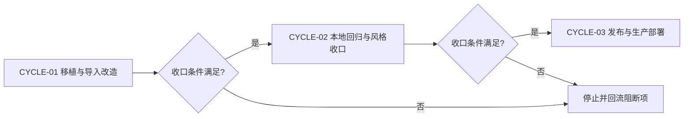
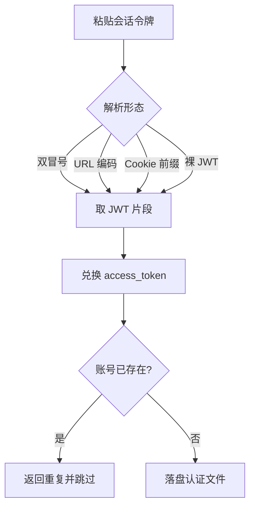
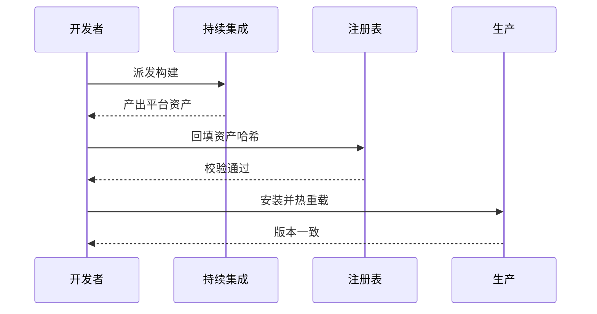

# Cursor Provider 插件移植与 Token 导入实施总览

结论：把上游 Cursor 插件移植为仓库独立插件，并新增用会话令牌导入账号的能力；影响：CPA 宿主新增一个 Cursor 供应商，可粘贴会话令牌批量导入账号而无需浏览器登录；范围：新增插件目录、令牌导入与导出删除启停管理接口、面板改造、单元测试、持续集成与插件注册表接入；非范围：不修改宿主核心二进制，不改动既有其它插件；变化：账号接入从仅浏览器登录扩展为可直接粘贴会话令牌导入；完成标准：本地隔离构建、静态检查与单元测试全绿，新增测试真实进入编译，注册表校验通过；术语说明：会话令牌是浏览器登录后得到的账号凭据串，可换取调用令牌；验证状态：本地构建、静态检查、单元测试、面板语法与注册表校验均已通过，发布、生产部署与端到端验收均已完成。

## 当前计划最终方案简要说明

以仓库内 traework 的导入与管理接口结构和 workbuddy 的面板交互为蓝本，把上游 Cursor 插件整套实现移植进独立插件目录，插件标识统一为 cursor-provider，认证文件前缀保持 cursor- 加账号哈希。令牌兑换链路改用标准 OAuth 令牌端点：会话令牌只取双冒号之后的 JWT 片段，作为 refresh_token 换取 access_token。

## Agent 对当前问题的理解

- 问题 / 目标：上游 Cursor 插件只支持浏览器登录，没有令牌导入入口；需要移植进本仓库并与 workbuddy 面板风格统一，同时补上粘贴令牌导入账号的能力。
- 本轮范围：移植源码到独立插件目录；统一插件标识；修正令牌兑换链路；新增导入、导出、删除、启用、禁用管理接口；面板改造；单元测试与哨兵验证；持续集成与注册表接入。
- 非范围：不修改父目录宿主代码；不影响既有其它插件。
- 当前优先闭环：源码移植与令牌导入改造，本地隔离构建全绿并补齐导入导出删除启停的真实单元测试。
- 关键假设 / 待确认点：插件标识为 cursor-provider；认证文件顶层类型为 cursor-provider；兑换端点为标准 OAuth 令牌端点；品牌图标暂缺故留空以避免死链。
- `unresolved_decisions`：无 P0 或 P1 决策。

## 图片资产决策与实施边界

- 图片资产决策：N/A + 原因 + 证据：任务对象是协议与账号管理，无界面视觉基线或空间布局改动；三张 Mermaid 图已覆盖流程、状态与时序，证据见本文档 Mermaid 小节。
- Mermaid 边界：流程、时序、状态与依赖关系继续使用 Mermaid，图片不替代既有 Mermaid 门禁。
- 生成契约：本轮无图片生成需求，不调用真实生成链路；原因与证据见上一行图片资产决策。
- 引用契约：本轮无图片引用。

## 已冻结决策与方案比较

| ID | 决策问题 | 候选方案 | 选定方案 | 排除原因 | 影响面 | 回滚 | 证据 |
| --- | --- | --- | --- | --- | --- | --- | --- |
| `DEC-001` | 插件标识 | cursor / cursor-provider | cursor-provider | 宿主按插件标识派生路由前缀与执行器标识，需与二进制名一致 | 路由与凭据识别 | `ROLLBACK-001` | `SRC-001` |
| `DEC-002` | 令牌兑换端点 | 旧交换端点 / 标准 OAuth 令牌端点 | 标准 OAuth 令牌端点 | 旧交换端点已失效返回 401，旧交换路径返回 404 | 令牌兑换链路 | `ROLLBACK-001` | `SRC-002` |
| `DEC-003` | 认证文件命名 | 账号标识直连文件名 / 哈希文件名 | cursor 加账号哈希 | 避免非法字符与路径穿越，且重复导入落到同一文件 | 文件落点 | `ROLLBACK-001` | `SRC-001` |

## 系统边界与现状基线

代码落点目录树：

```text
cursor/
├── main.go                     # C ABI 导出与版本注入
├── VERSION                     # 0.1.0
├── go.mod / go.sum             # 独立模块（testify 与 protobuf）
├── internal/plugin/
│   ├── handler.go              # providerName 常量与方法分发
│   ├── import.go               # 新增：令牌解析与导入
│   ├── operations.go           # 新增：导出、删除、启停
│   ├── authfile.go             # 新增：命名、直写与安全路径
│   ├── management.go           # 管理路由表
│   └── assets/management.html  # 面板（导入导出删除启停）
├── internal/cursorapi/         # 连接式 RPC 客户端与状态机
├── internal/cursorauth/        # 凭据与令牌刷新
├── internal/cursorproto/       # 协议编解码
├── internal/cursorsession/     # 会话存储
└── internal/openai/            # OpenAI 兼容输出
.github/workflows/build.yml      # 接入 cursor-provider
registry.json                    # 新增 cursor-provider 条目
```

## 实施周期总览

| 顺序 | 周期 ID | 期次定位 | 单一周期目标 | 进入条件 | 收口条件 | 依赖 | 文档 |
| --- | --- | --- | --- | --- | --- | --- | --- |
| 1 | `CYCLE-01` | 第一期 | 移植源码并完成令牌导入改造 | 来源插件已就绪 | 本地隔离构建全绿且导入测试通过 | 无 | 本文档 |
| 2 | `CYCLE-02` | 第二期 | 本地回归与风格收口 | `CYCLE-01` 收口 | 静态检查、哨兵与风格回归通过 | `CYCLE-01` | 本文档 |
| 3 | `CYCLE-03` | 第三期 | 发布与生产部署 | `CYCLE-02` 收口且获发布授权 | 版本、资产、注册表与部署版本一致 | `CYCLE-02` | 本文档 |

图形目的：说明周期门禁和不可跳期规则。关联 ID：`CYCLE-01`、`CYCLE-02`、`CYCLE-03`。



## 阶段计划

| 阶段 | 周期 | 唯一目标 | 输入 | 输出 | 验证门槛 |
| --- | --- | --- | --- | --- | --- |
| `PHASE-01` | `CYCLE-01` | 移植与标识统一 | 上游源码 | 独立插件目录 | 本地构建可编译 |
| `PHASE-02` | `CYCLE-01` | 令牌导入与管理接口 | 会话令牌样本 | 导入导出删除启停接口 | 导入单元测试通过 |
| `PHASE-03` | `CYCLE-02` | 本地回归与风格收口 | 插件全量源码 | 风格回归记录 | 静态检查与哨兵通过 |
| `PHASE-04` | `CYCLE-03` | 发布与部署 | 版本与资产 | 注册表与部署版本 | 远端与部署校验一致 |

## 最小任务清单

| 周期内顺序 | 任务 ID | 垂直切片目标 | 预计文件数 | 文件/符号契约 | 真实测试 | 完成条件 | 停止条件 |
| --- | --- | --- | ---: | --- | --- | --- | --- |
| 1 | `TASK-001` | 移植源码并统一标识 | 全目录 | `cursor/internal/plugin/handler.go::providerName` | `TEST-001` | 本地构建通过 | 编译失败即停止 |
| 2 | `TASK-002` | 令牌解析与导入 | 4 | `cursor/internal/plugin/import.go::parseCursorTokenImport` | `TEST-002` | 导入测试通过 | 兑换失败即停止 |
| 3 | `TASK-003` | 导出删除启停接口 | 3 | `cursor/internal/plugin/operations.go::exportCredentials` | `TEST-003` | 操作测试通过 | 路径校验失败即停止 |
| 4 | `TASK-004` | 面板与本地回归收口 | 3 | `cursor/internal/plugin/assets/management.html` | `TEST-004` | 面板语法与风格通过 | 语法失败即停止 |
| 5 | `TASK-005` | 发布与部署 | 4 | `registry.json`、`cursor/VERSION` | `TEST-005` | 注册表与部署一致 | 未获授权即停止 |

## 追踪矩阵

| 来源/完成条件 | 周期 | 任务 | 文件/符号 | 测试 | 风格回归 | 证据 | 状态 |
| --- | --- | --- | --- | --- | --- | --- | --- |
| `REQ-001` / `AC-001` | `CYCLE-01` | `TASK-002` | `cursor/internal/plugin/import.go::importCredential` | `TEST-002` | `STYLE-CURSOR-PROVIDER-PORT-20261007` | `EVIDENCE-001` | 已完成 |
| `REQ-002` / `AC-002` | `CYCLE-01` | `TASK-003` | `cursor/internal/plugin/operations.go::deleteCredential` | `TEST-003` | `STYLE-CURSOR-PROVIDER-PORT-20261007` | `EVIDENCE-003` | 已完成 |
| `REQ-003` / `AC-003` | `CYCLE-02` | `TASK-004` | `cursor/internal/plugin/assets/management.html` | `TEST-004` | `STYLE-CURSOR-PROVIDER-PORT-20261007` | `EVIDENCE-002` | 已完成 |
| `SRC-002` / `AC-004` | `CYCLE-03` | `TASK-005` | `registry.json` | `TEST-005` | `STYLE-CURSOR-PROVIDER-PORT-20261007` | `EVIDENCE-005` | 已完成 |

图形目的：说明令牌导入的数据流与去重分支。关联 ID：`TASK-002`、`AC-001`。



## 现状与落点

新插件为独立模块，仅依赖 testify 与 protobuf，不依赖宿主 SDK。新增文件 import.go 负责令牌解析与导入，operations.go 负责导出删除启停，authfile.go 负责命名直写与安全路径。生产代码复用上游既有执行器、会话与协议层，不新增生产测试专用导出接口。

## 真实测试安排

| 测试 ID | 任务 | 命令/入口 | local 环境 | 样本 | 断言 | 失败预期 | 清理 | 证据 |
| --- | --- | --- | --- | --- | --- | --- | --- | --- |
| `TEST-001` | `TASK-001` | 本地隔离构建脚本 | 本机 Go 工具链 | 插件全量源码 | 构建 vet 与 test 全绿 | 编译失败 | 临时目录删除 | `EVIDENCE-001` |
| `TEST-002` | `TASK-002` | `import_operations_test.go` | 内存样本 | 四种令牌形态 | 解析与导入断言 | 断言失败 | 临时目录删除 | `EVIDENCE-004` |
| `TEST-003` | `TASK-003` | `import_operations_test.go` | 临时目录 | 认证文件样本 | 导出删除启停断言 | 断言失败 | 临时目录删除 | `EVIDENCE-003` |
| `TEST-004` | `TASK-004` | 面板语法校验 | 本机 Node | 单脚本块 | 语法退出码为 0 | 语法错误 | 临时文件删除 | `EVIDENCE-002` |
| `TEST-005` | `TASK-005` | 注册表校验脚本 | 本机 Python | 注册表文件 | 校验通过 | 校验失败 | 无 | `EVIDENCE-005` |

本地执行环境不连接数据库、缓存、消息队列或外部上游；隔离构建只使用项目源码、Go 工具链与内存样本。真实测试证据见关联测试主文档与风格回归记录。

图形目的：说明发布与部署的门禁顺序。关联 ID：`TASK-005`、`AC-004`。



## 风险与阻断项

| ID | 风险/阻断 | 触发证据 | 当前措施 | 恢复路径 | 禁止动作 |
| --- | --- | --- | --- | --- | --- |
| `GAP-001` | 注册表资产哈希与体积为占位值 | 资产未产出 | 已由发布脚本回填并通过远端校验（2026-10-07 闭环） | 已闭环，无需恢复 | 未回填即发布 |
| `ROLLBACK-001` | 移植缺陷影响既有插件 | 构建失败 | 只改本插件目录 | 撤销本来源对象改动 | 覆盖共享工作树 |

- 任务完成条件：本地构建、静态检查、单元测试与面板语法全绿，注册表校验通过。
- 任务停止 / 结束条件：出现编译失败、路径校验失败、未获发布授权或注册表校验失败时停止后续任务。
- 当前 agent 最大推进边界：仅限本插件目录、持续集成配置与注册表条目，不改宿主、生产配置或账号数据。
- 是否已获得用户开始实施授权：是。

## 自审结论

- 零决策交接：`unresolved_decisions` 为 0 个 P0 或 P1。
- 文件/符号落点：新增与修改文件及关键符号已在最小任务清单列明。
- 需求/验收/任务/测试覆盖率：`REQ-001` 至 `REQ-003` 分别由 `AC-001` 至 `AC-003` 与 `TEST-002` 至 `TEST-004` 覆盖。
- 周期顺序与闭环：三期按 01 到 03 顺序推进，前一期未闭环不得进入下一期。
- 图形语义与 Mermaid 解析：三张 Mermaid 图覆盖周期门禁、导入数据流与发布时序。
- 占位词和 N/A 证据：图片资产决策与风格回归 N/A 均已给原因与证据。
- 用户确认状态：来源需求由用户确认，本轮实施授权为是。

## 执行附录

- 本地环境、执行顺序、精确命令、样本与日志：隔离构建脚本、面板语法校验、注册表校验。
- 清理与回滚步骤：临时目录与临时文件删除；发布前按来源对象回滚。

## 追踪附录

- 稳定 ID：`SRC-001`、`SRC-002`、`DEC-001` 至 `DEC-003`、`REQ-001` 至 `REQ-003`、`AC-001` 至 `AC-004`、`CYCLE-01` 至 `CYCLE-03`、`TASK-001` 至 `TASK-005`、`TEST-001` 至 `TEST-005`、`EVIDENCE-001` 至 `EVIDENCE-005`、`ROLLBACK-001`、`GAP-001`。
- 来源与证据：来源需求 `REQ-CURSOR-TOKEN-IMPORT-20261007`；风格回归 `doc/6-review/2026-10-07_192400_CursorProvider移植与Token导入_6-review.md`。

