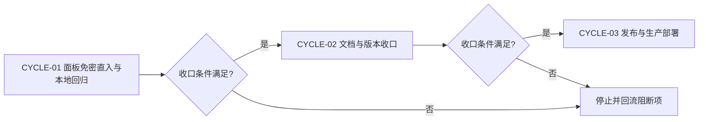
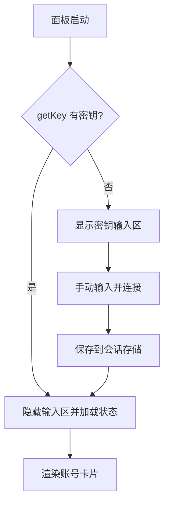
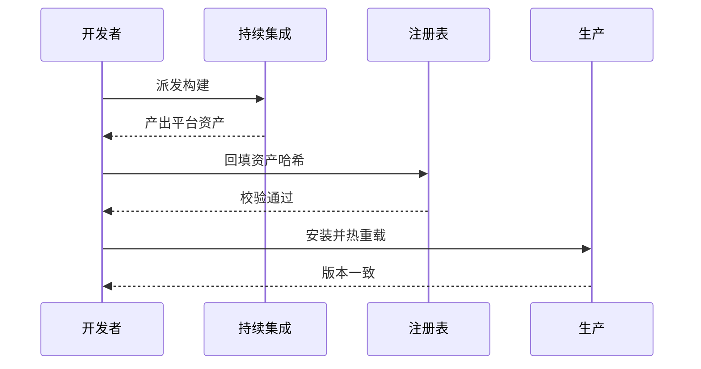

# Cursor 面板免密直入与 workbuddy 对齐实施总览

结论：把 Cursor 管理面板改造为「免密直入 + workbuddy 面板交互口径」，嵌入 CPA 主面板时从父页自动读取管理密钥直接进入，密钥输入区仅在无法自动获取时显示，并移除冗余的订阅额度说明区块；影响：运维人员打开 Cursor 面板不再需要手动输入管理密钥；范围：面板 HTML 改造、管理面板单元测试断言、面板免密直入回归脚本、插件文档与版本；非范围：不修改插件后端接口契约、不修改宿主核心、不改动其它插件；变化：面板启动从「等待手动输入密钥」变为「有密钥自动加载状态、无密钥才显示输入区」；完成标准：本地隔离构建全绿、面板语法与免密直入回归脚本通过、管理面板断言通过、版本与注册表一致；术语说明：免密直入指嵌入主面板场景下自动读取主面板同源存储的管理密钥并直接加载状态；验证状态：本地回归完成，待发布部署。

## 当前计划最终方案简要说明

以 workbuddy 面板的密钥三级回退 + 启动自动进入逻辑为蓝本，把 Cursor 面板的密钥输入区改为默认隐藏的 authBox 形态：启动时若已有密钥（父页同源存储 / URL 参数 / 会话存储）则直接加载状态，否则显示输入区；同时按用户截图红框移除「订阅额度说明」警告区块与对应翻译键。

## Agent 对当前问题的理解

- 问题 / 目标：用户截图红框标注「订阅额度说明」区块与「管理密钥输入 + 加载状态」区，要求「不用密码，直接进入面板」，且面板参考 workbuddy 面板实现。
- 本轮范围：面板 HTML 免密直入改造（authBox 化、启动自动加载、移除额度说明区块）；管理面板测试断言同步；新增面板自动进入回归脚本；文档与版本收口。
- 非范围：插件后端接口契约、宿主核心、其它插件。
- 当前优先闭环：面板 HTML 改造 + 本地回归全绿。
- 关键假设 / 待确认点：嵌入场景下父页 localStorage 的 cli-proxy-auth 仍为同源可读；独立打开时保持手动输入降级。
- `unresolved_decisions`：无 P0 或 P1 决策。

## 图片资产决策与实施边界

- 图片资产决策：N/A + 原因 + 证据：任务为面板交互逻辑改造，无新位图资产需求；用户截图仅作为缺陷定位证据。
- Mermaid 边界：本轮改动为单文件交互逻辑，不新增 Mermaid 图。
- 生成契约：本轮无图片生成需求。
- 引用契约：无图片引用。

## 已冻结决策与方案比较

| ID | 决策问题 | 候选方案 | 选定方案 | 排除原因 | 影响面 | 回滚 | 证据 |
| --- | --- | --- | --- | --- | --- | --- | --- |
| `DEC-001` | 密钥输入区形态 | 常显 / authBox 默认隐藏 | authBox 默认隐藏 | workbuddy 口径：可自动获取时不打扰用户 | 面板交互 | `ROLLBACK-001` | `SRC-001` |
| `DEC-002` | 订阅额度说明区块 | 保留 / 移除 | 移除 | 用户截图红框指向；workbuddy 无对应块；信息冗余 | 面板布局 | `ROLLBACK-001` | `SRC-002` |
| `DEC-003` | 无密钥场景 | 静默失败 / 显示输入区 | 显示输入区 | 独立打开时仍需手动输入路径 | 面板交互 | `ROLLBACK-001` | `SRC-001` |

## 系统边界与现状基线

代码落点目录树：

```text
cursor/
├── VERSION                     # 0.1.0 -> 0.1.1
├── CHANGELOG.md                # 新增 0.1.1
├── DESIGN.md                   # §6/§8 更新
├── main.go                     # var version
├── README.md                   # 密钥说明同步
└── internal/plugin/
    ├── assets/management.html  # 面板（本次改造）
    └── management_test.go      # 断言同步
test/cursor/
└── panel_auto_entry_repro.mjs  # 新增回归脚本
```

## 实施周期总览

| 顺序 | 周期 ID | 期次定位 | 单一周期目标 | 进入条件 | 收口条件 | 依赖 | 文档 |
| --- | --- | --- | --- | --- | --- | --- | --- |
| 1 | `CYCLE-01` | 第一期 | 面板免密直入改造与本地回归 | 用户截图需求已确认 | 本地构建与回归脚本全绿 | 无 | 本文档 |
| 2 | `CYCLE-02` | 第二期 | 文档与版本收口 | `CYCLE-01` 收口 | 文档、版本与风格回归通过 | `CYCLE-01` | 本文档 |
| 3 | `CYCLE-03` | 第三期 | 发布与生产部署 | `CYCLE-02` 收口且获发布授权 | 版本、资产、注册表与部署一致 | `CYCLE-02` | 本文档 |

图形目的：说明周期门禁和不可跳期规则。关联 ID：`CYCLE-01`、`CYCLE-02`、`CYCLE-03`。



## 阶段计划

| 阶段 | 周期 | 唯一目标 | 输入 | 输出 | 验证门槛 |
| --- | --- | --- | --- | --- | --- |
| `PHASE-01` | `CYCLE-01` | 面板 HTML 免密直入改造 | 现有面板与 workbuddy 参考 | 新面板 HTML | 面板语法与回归脚本通过 |
| `PHASE-02` | `CYCLE-01` | 测试断言同步 | 改造后面板 | 更新的单元测试 | cgo-shim-build 全绿 |
| `PHASE-03` | `CYCLE-02` | 文档与版本收口 | 插件全量改动 | 文档与版本 | 6-review 通过 |
| `PHASE-04` | `CYCLE-03` | 发布与部署 | 版本与资产 | 注册表与部署版本 | 远端与部署校验一致 |

## 最小任务清单

| 周期内顺序 | 任务 ID | 垂直切片目标 | 预计文件数 | 文件/符号契约 | 真实测试 | 完成条件 | 停止条件 |
| --- | --- | --- | ---: | --- | --- | --- | --- |
| 1 | `TASK-001` | 面板免密直入改造 | 1 | `cursor/internal/plugin/assets/management.html` | `TEST-001` | 面板语法与回归通过 | 语法失败即停止 |
| 2 | `TASK-002` | 测试与本地回归 | 3 | `cursor/internal/plugin/management_test.go`、`test/cursor/panel_auto_entry_repro.mjs` | `TEST-001`、`TEST-002` | cgo-shim-build 全绿 | 构建失败即停止 |
| 3 | `TASK-003` | 文档与版本收口 | 4 | `cursor/DESIGN.md`、`cursor/CHANGELOG.md`、`cursor/VERSION`、`cursor/main.go` | `TEST-003` | 6-review 通过 | 风格回归失败即停止 |
| 4 | `TASK-004` | 发布与部署 | 3 | `registry.json`、`cursor/VERSION` | `TEST-004` | 注册表与部署一致 | 未获授权即停止 |

## 追踪矩阵

| 来源/完成条件 | 周期 | 任务 | 文件/符号 | 测试 | 风格回归 | 证据 | 状态 |
| --- | --- | --- | --- | --- | --- | --- | --- |
| `REQ-001` / `AC-001` | `CYCLE-01` | `TASK-001` | `cursor/internal/plugin/assets/management.html` | `TEST-001` | `STYLE-CURSOR-PANEL-AUTOENTRY-20261008` | `EVIDENCE-001` | 进行中 |
| `REQ-002` / `AC-002` | `CYCLE-01` | `TASK-002` | `cursor/internal/plugin/management_test.go` | `TEST-002` | `STYLE-CURSOR-PANEL-AUTOENTRY-20261008` | `EVIDENCE-002` | 待开始 |
| `REQ-003` / `AC-003` | `CYCLE-02` | `TASK-003` | `cursor/DESIGN.md` | `TEST-003` | `STYLE-CURSOR-PANEL-AUTOENTRY-20261008` | `EVIDENCE-003` | 待开始 |
| `SRC-001` / `AC-004` | `CYCLE-03` | `TASK-004` | `registry.json` | `TEST-004` | `STYLE-CURSOR-PANEL-AUTOENTRY-20261008` | `EVIDENCE-004` | 待开始 |

## 现状与落点

面板为单文件内联脚本形态，密钥获取已有三级回退函数（readPanelKey / readUrlKey / persistKey / getKey），本次在其上补「启动自动加载」与「authBox 默认隐藏」两个交互；翻译表同步移除额度说明键。管理测试为字符串断言形态，直接同步断言内容。

图形目的：说明面板启动的密钥获取与进入分支。关联 ID：`TASK-001`、`AC-001`。



## 真实测试安排

| 测试 ID | 任务 | 命令/入口 | local 环境 | 样本 | 断言 | 失败预期 | 清理 | 证据 |
| --- | --- | --- | --- | --- | --- | --- | --- | --- |
| `TEST-001` | `TASK-001` | `node test/cursor/panel_auto_entry_repro.mjs` | 本机 Node | 面板 HTML 单脚本块 | 有密钥自动加载、无密钥显示输入区 | 断言失败 | 无 | `EVIDENCE-001` |
| `TEST-002` | `TASK-002` | `python scripts/cgo-shim-build.py cursor` | 本机 Go 工具链 | 插件全量源码 | build/vet/test 全绿 | 编译失败 | 临时目录删除 | `EVIDENCE-002` |
| `TEST-003` | `TASK-003` | 文档校验与 6-review | 本机 Python | 实施总览与风格记录 | 校验通过 | 校验失败 | 无 | `EVIDENCE-003` |
| `TEST-004` | `TASK-004` | 注册表校验脚本 | 本机 Python | registry.json | 校验通过 | 校验失败 | 无 | `EVIDENCE-004` |

本地执行环境不连接数据库、缓存、消息队列或外部上游；面板回归使用 Node vm + DOM 桩在内存中执行。

图形目的：说明发布与部署的门禁顺序。关联 ID：`TASK-004`、`AC-004`。



## 风险与阻断项

| ID | 风险/阻断 | 触发证据 | 当前措施 | 恢复路径 | 禁止动作 |
| --- | --- | --- | --- | --- | --- |
| `GAP-001` | 独立打开面板时无密钥来源 | 无父页存储且无 URL 参数 | 显示输入区降级 | 手动输入一次 | 静默失败 |
| `ROLLBACK-001` | 改造引入面板回归 | 回归脚本失败 | 单文件回滚 | 撤销本来源对象改动 | 覆盖共享工作树 |

- 任务完成条件：面板回归与单元测试全绿、文档与版本一致、发布链路完成。
- 任务停止 / 结束条件：出现回归失败、构建失败或未获发布授权时停止后续任务。
- 当前 agent 最大推进边界：仅限 cursor 插件目录、测试目录与 registry 条目。
- 是否已获得用户开始实施授权：是。

## 自审结论

- 零决策交接：`unresolved_decisions` 为 0 个 P0 或 P1。
- 文件/符号落点：已在最小任务清单列明。
- 需求/验收/任务/测试覆盖率：`REQ-001` 至 `REQ-003` 分别由 `AC-001` 至 `AC-003` 与 `TEST-001` 至 `TEST-003` 覆盖。
- 周期顺序与闭环：两期按顺序推进。
- 图形语义与 Mermaid 解析：本轮无新增 Mermaid 图（单文件交互改造）。
- 占位词和 N/A 证据：图片资产决策已给原因与证据。
- 用户确认状态：来源需求由用户截图确认，本轮实施授权为是。

## 执行附录

- 本地环境、执行顺序、精确命令、样本与日志：`node test/cursor/panel_auto_entry_repro.mjs`、`python scripts/cgo-shim-build.py cursor`。
- 清理与回滚步骤：无临时产物；发布前按来源对象回滚。

## 追踪附录

- 稳定 ID：`SRC-001`、`SRC-002`、`DEC-001` 至 `DEC-003`、`REQ-001` 至 `REQ-003`、`AC-001` 至 `AC-004`、`CYCLE-01` 至 `CYCLE-03`、`TASK-001` 至 `TASK-004`、`TEST-001` 至 `TEST-004`、`EVIDENCE-001` 至 `EVIDENCE-004`、`ROLLBACK-001`、`GAP-001`。
- 来源与证据：来源需求 `REQ-CURSOR-PANEL-AUTOENTRY-20261008`；风格回归 `doc/6-review/2026-10-08_Cursor面板免密直入_6-review.md`。

