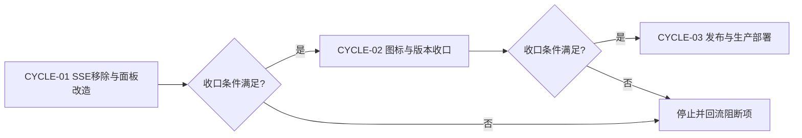
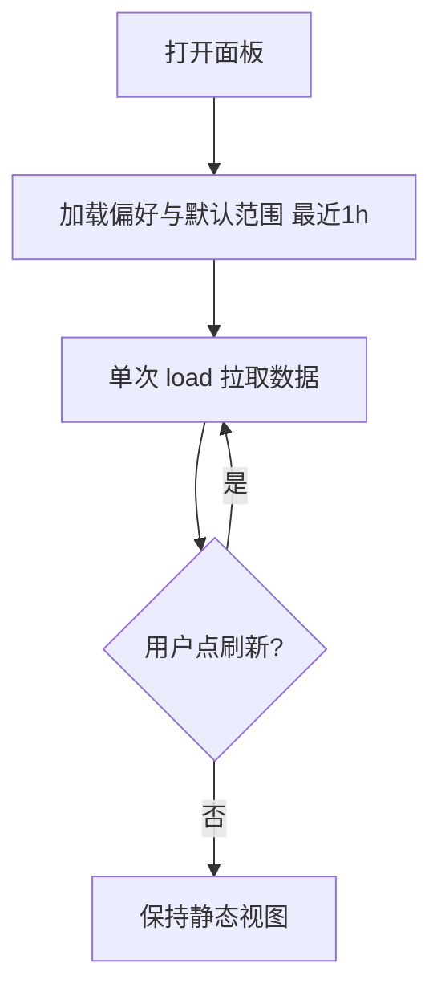
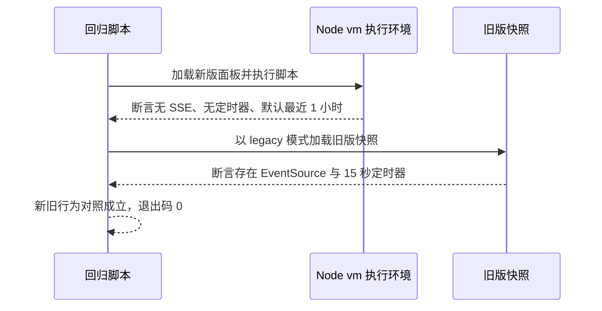

# Token 用量面板性能优化与插件图标修复实施总览

结论：把 Token 用量面板的自动刷新链路（SSE 短连接轮询 + 15s 定时轮询）整体移除，改为仅在打开面板与点击「刷新」按钮时加载；默认时间范围改为「最近 1 小时」，减少打开面板时的数据量；同时修复插件图标（自有仓库托管新图标并更新注册元数据）。影响：打开 Token 用量面板不再持续消耗服务器性能，插件列表恢复图标展示；范围：token-usage-tracker 后端 SSE 通道、面板前端逻辑、时间范围模式与本地化、图标资产与 registry；非范围：不修改统计口径与聚合逻辑、不修改其它插件、不改动宿主核心；变化：面板打开从「SSE 每 2 秒通知 + 15 秒轮询」变为「单次加载 + 手动刷新」，默认视图从「今天」变为「最近 1 小时」；完成标准：本地隔离构建全绿、面板回归脚本通过、远端与生产部署验证一致；术语说明：SSE 是服务器向浏览器持续推送事件的短连接通知机制，本轮已整体移除；验证状态：后端清理、面板回归、图标与注册表校验均已通过，发布与生产部署验证待执行。

## 当前计划最终方案简要说明

后端删除 /usage/events 资源路由、serveUsageEvents 与 feedNotifier 序列（SSE 通知机制整体移除）；前端删除 startUsageEvents 与 startTimer，保留既有的手动「刷新」按钮；时间范围新增 last_1_hour 预设并设为默认值（覆盖未保存偏好的场景），四个语言包同步补充文案；图标以自有仓库 assets/icons/TokenTracker.png 托管并更新插件 Logo URL 与 registry logo 字段。

## Agent 对当前问题的理解

- 问题 / 目标：用户反馈「token 用量面板打开时非常消耗服务器性能」（SSE 每 2 秒短连接 + 15 秒定时 load 为主因），要求去掉 SSE 刷新、改为手动触发刷新、默认只加载最近 1h 数据；同时反馈「token 用量插件没有图标」（插件 Logo URL 实测 404）。
- 本轮范围：`token-usage-tracker/management.go`、`token-usage-tracker/feed_ingest.go`、`token-usage-tracker/feed_ingest_test.go`、`token-usage-tracker/usage_stats/dashboard.go`、`token-usage-tracker/usage_stats/preferences.go`、`token-usage-tracker/usage_stats/locales/*.json`、`token-usage-tracker/main.go`、`token-usage-tracker/VERSION`、`assets/icons/TokenTracker.png`、`registry.json`、新增面板回归脚本与文档。
- 非范围：统计核心（aggregate/cost/pricing 等）不改动；其它插件不改动；宿主核心不改动。
- 当前优先闭环：本地构建与面板回归全绿后进入发布链路。
- 关键假设 / 待确认点：面板默认范围只对「未保存过偏好」的用户生效；已保存过自定义范围的用户保留其选择（可在面板重新选择覆盖）。
- `unresolved_decisions`：无 P0 或 P1 决策。

## 已冻结决策与方案比较

| ID | 决策问题 | 候选方案 | 选定方案 | 排除原因 | 影响面 | 回滚 | 证据 |
| --- | --- | --- | --- | --- | --- | --- | --- |
| `DEC-001` | SSE 通道去留 | 保留仅前端停用 / 后端整体移除 | 后端整体移除 | 用户要求去掉 SSE 刷新；保留死代码会继续产生短连接开销与维护歧义 | 后端路由与测试 | `ROLLBACK-001` | `SRC-001` |
| `DEC-002` | 自动刷新策略 | 保留 15s 轮询 / 仅手动刷新 | 仅手动刷新 | 用户明确要求改为手动触发刷新 | 面板交互 | `ROLLBACK-001` | `SRC-001` |
| `DEC-003` | 默认时间范围 | 保持今天 / 新增最近 1 小时 | 新增 last_1_hour 并设为默认 | 用户要求默认加载最近 1h、不要加载太多数据 | 模式白名单与本地化 | `ROLLBACK-001` | `SRC-001` |
| `DEC-004` | 已保存偏好处理 | 强制覆盖 / 尊重保存值 | 尊重保存值 | 保存值是用户显式选择；默认值只影响未保存场景 | 偏好机制 | `ROLLBACK-001` | `SRC-001` |
| `DEC-005` | 图标资产来源 | 第三方仓库引用 / 自有仓库托管 | 自有仓库托管 | 原引用 URL 实测 404，第三方仓库无该资产 | 图标资产与注册 | `ROLLBACK-002` | `SRC-002` |

## 系统边界与现状基线

代码落点目录树：

```text
token-usage-tracker/
├── VERSION                          # 0.2.3 -> 0.2.4
├── main.go                          # pluginLogoURL + var version
├── management.go                    # 移除 /usage/events 路由与 serveUsageEvents
├── feed_ingest.go                   # 移除 feedNotifier 序列
├── feed_ingest_test.go              # SSE 测试改为路由移除负向断言
└── usage_stats/
    ├── dashboard.go                 # 前端：去自动刷新、新增 last_1_hour
    ├── preferences.go               # 默认值 last_1_hour + 白名单
    └── locales/{en,zh-CN,zh-TW,ru}.json  # range.lastHour 文案
assets/icons/
└── TokenTracker.png                 # 新增图标（192x192 透明底）
registry.json                        # workbuddy-token-usage 条目补 logo
test/token-usage/
└── panel_perf_repro.mjs             # 新增面板回归脚本
```

## 实施周期总览

| 顺序 | 周期 ID | 期次定位 | 单一周期目标 | 进入条件 | 收口条件 | 依赖 | 文档 |
| --- | --- | --- | --- | --- | --- | --- | --- |
| 1 | `CYCLE-01` | 第一期 | 后端 SSE 移除与前端面板改造 | 用户需求已确认 | 本地构建与面板回归全绿 | 无 | 本文档 |
| 2 | `CYCLE-02` | 第二期 | 图标资产与版本收口 | `CYCLE-01` 收口 | 图标校验与 6-review 通过 | `CYCLE-01` | 本文档 |
| 3 | `CYCLE-03` | 第三期 | 发布与生产部署验证 | `CYCLE-02` 收口 | 版本、资产、注册表与部署一致 | `CYCLE-02` | 本文档 |

图形目的：说明周期门禁和不可跳期规则。关联 ID：`CYCLE-01`、`CYCLE-02`、`CYCLE-03`。



## 阶段计划

| 阶段 | 周期 | 唯一目标 | 输入 | 输出 | 验证门槛 |
| --- | --- | --- | --- | --- | --- |
| `PHASE-01` | `CYCLE-01` | 后端 SSE 通道移除 | 现有路由与测试 | 精简后的后端 | cgo-shim-build 全绿 |
| `PHASE-02` | `CYCLE-01` | 面板前端改造 | 现有面板模板 | 手动刷新 + 1h 默认 | 面板回归脚本通过 |
| `PHASE-03` | `CYCLE-02` | 图标与版本收口 | 生成图标与元数据 | 资产与版本一致 | 图标校验与 6-review 通过 |
| `PHASE-04` | `CYCLE-03` | 发布与部署 | 版本与资产 | 注册表与部署版本 | 远端与部署校验一致 |

## 最小任务清单

| 周期内顺序 | 任务 ID | 唯一目标 | 预计文件数 | 文件/符号契约 | 真实测试 | 完成条件 | 停止条件 |
| --- | --- | --- | ---: | --- | --- | --- | --- |
| 1 | `TASK-001` | 后端移除 SSE 通道（路由、函数、通知序列、测试同步） | 3 | `management.go`、`feed_ingest.go`、`feed_ingest_test.go` | `TEST-001` | cgo-shim-build 全绿 | 编译失败即停止 |
| 2 | `TASK-002` | 面板前端改造（去自动刷新、新增 last_1_hour、本地化） | 3 | `dashboard.go`、`preferences.go`、`locales/*.json` | `TEST-002` | 面板回归脚本通过 | 回归失败即停止 |
| 3 | `TASK-003` | 图标资产与注册（新图标入库、Logo URL、registry logo） | 3 | `assets/icons/TokenTracker.png`、`main.go`、`registry.json` | `TEST-003` | 图标校验通过 | 图标缺失即停止 |
| 4 | `TASK-004` | 版本与文档收口（VERSION/main.go bump、6-review、测试文档） | 5 | `VERSION`、`main.go`、`doc/6-review/`、`doc/5-tests/` | `TEST-004` | 6-review 通过 | 风格回归失败即停止 |
| 5 | `TASK-005` | 发布与生产部署验证 | 3 | `registry.json`、`release-assets/` | `TEST-005` | 注册表与部署一致 | 未获授权即停止 |

## 追踪矩阵

| 来源/完成条件 | 周期 | 任务 | 文件/符号 | 测试 | 风格回归 | 证据 | 状态 |
| --- | --- | --- | --- | --- | --- | --- | --- |
| `REQ-001` / `AC-001` | `CYCLE-01` | `TASK-001` | `management.go` | `TEST-001` | `STYLE-TOKEN-USAGE-PERF-20261008` | `EVIDENCE-001` | 已完成 |
| `REQ-002` / `AC-002` | `CYCLE-01` | `TASK-002` | `dashboard.go` | `TEST-002` | `STYLE-TOKEN-USAGE-PERF-20261008` | `EVIDENCE-002` | 已完成 |
| `REQ-003` / `AC-003` | `CYCLE-02` | `TASK-003` | `main.go` | `TEST-003` | `STYLE-TOKEN-USAGE-PERF-20261008` | `EVIDENCE-003` | 已完成 |
| `REQ-004` / `AC-004` | `CYCLE-02` | `TASK-004` | `VERSION` | `TEST-004` | `STYLE-TOKEN-USAGE-PERF-20261008` | `EVIDENCE-004` | 已完成 |
| `SRC-001` / `AC-005` | `CYCLE-03` | `TASK-005` | `registry.json` | `TEST-005` | `STYLE-TOKEN-USAGE-PERF-20261008` | `EVIDENCE-005` | 待开始 |

## 现状与落点

后端 `/usage/events` 为 SSE 短连接通知（每 2 秒一次 EventSource 重连），前端另有 15 秒 `setInterval` 兜底轮询；两者均随面板打开持续产生请求。时间范围模式当前为 custom/last_5_hours/last_7_days/last_30_days/current_month 五种；插件 Logo URL 指向第三方仓库中不存在的 TokenTracker.png（404）。

图形目的：说明移除后的面板刷新路径。关联 ID：`TASK-001`、`TASK-002`。



## 真实测试安排

| 测试 ID | 任务 | 命令/入口 | local 环境 | 样本 | 断言 | 失败预期 | 清理 | 证据 |
| --- | --- | --- | --- | --- | --- | --- | --- | --- |
| `TEST-001` | `TASK-001` | `python scripts/cgo-shim-build.py token-usage-tracker` | 本机 Go 工具链 | 插件全量源码 | build/vet/test 全绿 | 编译失败 | 临时目录删除 | `EVIDENCE-001` |
| `TEST-002` | `TASK-002` | `node test/token-usage/panel_perf_repro.mjs` | 本机 Node | 面板内嵌 JS | 无自动定时器、无 EventSource、默认 1h | 断言失败 | 无 | `EVIDENCE-002` |
| `TEST-003` | `TASK-003` | PIL 校验 + 远端 raw 可达 | 本机 Python | TokenTracker.png | 192x192 RGBA | 校验失败 | 无 | `EVIDENCE-003` |
| `TEST-004` | `TASK-004` | 文档校验与 6-review | 本机 Python | 实施/测试文档 | 校验通过 | 校验失败 | 无 | `EVIDENCE-004` |
| `TEST-005` | `TASK-005` | 注册表校验 + 生产 install | 本机 Python / 服务器 | registry.json | 校验与部署一致 | 校验失败 | 临时文件删除 | `EVIDENCE-005` |

本地执行环境不连接数据库、缓存、消息队列或外部上游；面板回归使用 Node vm + DOM 桩在内存中执行。

图形目的：说明面板回归脚本对新旧版本对照验证的时序。关联 ID：`TEST-002`、`EVIDENCE-002`。



## 风险与阻断项

| ID | 风险/阻断 | 触发证据 | 当前措施 | 恢复路径 | 禁止动作 |
| --- | --- | --- | --- | --- | --- |
| `GAP-001` | 已保存偏好导致默认 1h 不生效 | 用户保存过自定义范围 | 尊重保存值并在交付说明中提示 | 面板重新选择范围 | 强制清空用户偏好 |
| `ROLLBACK-001` | 面板改造引入回归 | 回归脚本失败 | 单文件回滚 | 撤销本来源对象改动 | 覆盖共享工作树 |
| `ROLLBACK-002` | 图标不合规或损坏 | 图标校验失败 | 重新生成 | 重新生成新版本图标 | 脚本合成冒充 |

- 任务完成条件：面板回归与单元测试全绿、图标与版本一致、发布链路完成。
- 任务停止 / 结束条件：出现回归失败、构建失败或未获发布授权时停止后续任务。
- 当前 agent 最大推进边界：仅限 token-usage-tracker 目录、assets/icons、test/token-usage、registry 条目与本轮文档。
- 是否已获得用户开始实施授权：是（仓库默认提交/发布授权，用户当轮无负面边界）。

## 自审结论

- 零决策交接：`unresolved_decisions` 为 0 个 P0 或 P1。
- 文件/符号落点：已在最小任务清单列明。
- 需求/验收/任务/测试覆盖率：`REQ-001` 至 `REQ-004` 分别由 `AC-001` 至 `AC-004` 与 `TEST-001` 至 `TEST-004` 覆盖。
- 周期顺序与闭环：三期按顺序推进。
- 图形语义与 Mermaid 解析：三个 mermaid 图（两个 flowchart 与一个 sequenceDiagram）均通过语法前置校验。
- 占位词与 N/A 证据：正文无占位词；图片资产决策：N/A，原因为本轮改动为代码、配置与插件资产，文档不需要图片资产，证据为 `SRC-002` 与 `TEST-003` 的图标像素校验记录。
- 用户确认状态：来源需求由用户消息与截图确认，本轮实施授权为是。

## 执行附录

- 本地环境、执行顺序、精确命令、样本与日志：`node test/token-usage/panel_perf_repro.mjs`、`python scripts/cgo-shim-build.py token-usage-tracker`。
- 清理与回滚步骤：无临时产物遗留；发布前按来源对象回滚。

## 追踪附录

- 稳定 ID：`SRC-001`、`SRC-002`、`DEC-001` 至 `DEC-005`、`REQ-001` 至 `REQ-004`、`AC-001` 至 `AC-005`、`CYCLE-01` 至 `CYCLE-03`、`TASK-001` 至 `TASK-005`、`TEST-001` 至 `TEST-005`、`EVIDENCE-001` 至 `EVIDENCE-005`、`ROLLBACK-001`、`ROLLBACK-002`、`GAP-001`。
- 来源与证据：来源需求 `REQ-TOKEN-USAGE-PERF-ICON-20261008`（用户消息 + 面板截图）；风格回归 `doc/6-review/2026-10-09_002158_Token用量面板性能优化与插件图标_6-review.md`。
