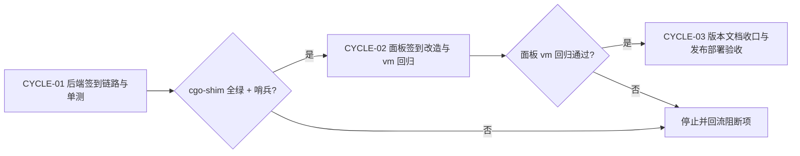
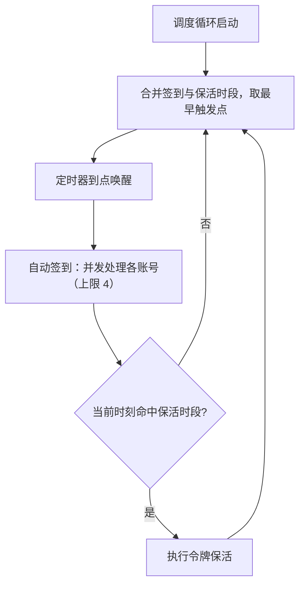
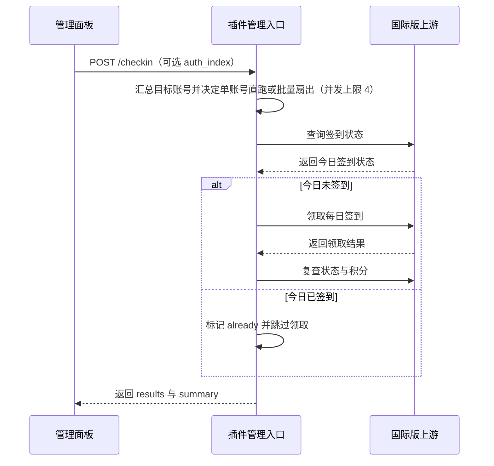

# WorkBuddy AI 国际版签到改造实施总览

结论：把 workbuddy-ai 面板上已失效的「领取专家加油包」替换为国际版每日签到（状态查询 + 领取积分），后端按国际版真实端点直调、前端对齐 CN 面板交互口径；影响：使用 WorkBuddy AI 国际版账号的运维用户在面板上恢复每日领取积分的能力；范围：workbuddy-ai 插件后端签到链路、管理路由、面板前端、测试与 0.1.8 发布部署；非范围：不改动 CN 插件与宿主核心、不实现「聊天消息触发签到」（日志实证无效）、不物理删除既有试用领取后端路由；变化：面板出现「签到/已签到」按钮、「全部签到」按钮与「自动签到」开关，每日 00/04/08/12/16/20 点自动签到；完成标准：本地隔离构建与面板回归全绿、0.1.8 发布并生产热重载、真实账号签到链路验收通过；术语说明：无；验证状态：客户端侧侦察已闭环，后端数据链路与控制面调度已实现并通过本地隔离构建、失败哨兵确证与风格回归，面板签到改造已通过 vm 回归（含旧版反证）与风格回归，版本已 bump 0.1.8 并完成文档收口，发布链与生产热重载验收全部通过（active_version=0.1.8，落盘 .so 与本地 zip sha256 一致），生产签到端点按契约透传上游真实结果；真实签到领取因上游国际版活动离线（active=false、banner 12302、code=10001）暂被环境阻断，已登记为环境性阻断记录，非代码缺陷。

## 当前计划最终方案简要说明

- 推荐方案一句话结论：在 workbuddy-ai 插件内新增签到链路（POST /v2/billing/meter/checkin-activity-status 查状态 + POST /v2/billing/meter/daily-checkin 领取），复用 CN 插件 checkin.go 结构逐函数适配并去除 Global 分支；面板把卡片动作从「领取专家加油包」替换为「签到」。
- 主落点 / 主路径：workbuddy-ai/checkin.go（新增）+ billing.go / cache.go / panel.go / management.go / credits_handler.go / keepalive.go 接线 + panel.html 改造。
- 为什么先走这条路线：同端点与 CN 生产先例、客户端 hasToken=false 时照发请求的日志实证（168 条中 4 条无 token 同样发送）、零新增依赖；仅当生产实测被风控拒绝才评估 Windows 端 token 透传备选。

## Agent 对当前问题的理解

- 问题 / 目标：workbuddy-ai 面板没有签到功能、原「领取专家加油包」已失效；国际版已解锁签到规则，需要以插件方式实现签到（用户描述的「用客户端 hi 一下」经核验实为误解，见 DEC-005）。
- 本轮范围：workbuddy-ai 签到后端链路、管理路由、面板前端、测试、版本与发布部署验收。
- 非范围：CN 插件（workbuddy/）、宿主核心、其它插件、聊天触发签到。
- 当前优先闭环：CYCLE-01 后端签到链路实现 + 单测全绿。
- 关键假设 / 待确认点：国际版账号签到资格（personal + billing access + checkinEnabled）需生产实测；本地无国际版账号文件（账号全在生产服务器），最终资格验证放到生产验收环节；若被风控拒绝，如实报告并给出 Windows 端 token 透传备选评估。
- `unresolved_decisions`：无 P0 或 P1 决策。

## 已冻结决策

| ID | 决策问题 | 候选方案 | 选定方案 | 排除原因 | 影响面 | 回滚 | 证据 |
| --- | --- | --- | --- | --- | --- | --- | --- |
| DEC-001 | 签到请求身份策略 | A 无 token 直调 / B Windows 端 token 透传 | A：复用 billingHeaders 直调 | 客户端 hasToken=false 照发请求（日志实证）；CN 同端点生产先例；B 依赖用户机器在线且链路复杂 | 全链路 | 版本回退 | 侦察报告 RECON-WBAI-CHECKIN-20261008 |
| DEC-002 | 「领取专家加油包」入口处置 | 保留 / 替换为签到 | 替换前端入口；后端 /trial 路由保留兼容 | 加油包已失效；国际版签到为官方现行机制；后端保留避免破坏既有 API 契约 | 面板 | 前端回滚 | 用户原话 + 侦察 |
| DEC-003 | 自动签到调度时段 | 09:00/21:00 文案 / 00-20 六时段 | 沿用 checkinHours 00/04/08/12/16/20；前端文案写实际时段 | usage_config.go 既有配置；CN 同为六时段；09:00/21:00 是 CN 遗留错误文案 | 调度 + 面板 | 配置回滚 | usage_config.go:18 |
| DEC-004 | 业务错误码处理 | 纯字符串匹配 / 显式错误码映射 | 显式映射 1001→already、1002→not_eligible、1003→event_ended + 字符串兜底 | 比 CN 纯字符串匹配更稳 | checkin.go | 无 | 侦察报告（错误码表） |
| DEC-005 | 「hi 一下」触发签到 | 实现聊天消息触发 / 不实现 | 不实现 | 日志实证：发聊天消息不触发签到；签到唯一触发点=状态查询+按钮领取 | 范围边界 | 无 | 侦察报告 Q4 |

## 系统边界与现状基线

代码落点目录树：

```text
workbuddy-ai/
├── checkin.go                  # 新增：签到域（summary/状态/领取/手动/自动/缓存合并/调度时间）
├── billing.go                  # 增加 billingBase 测试注入点 + 签到 JSON helpers
├── cache.go                    # accountCacheEntry 加 checkin；cachedAccountDetails 扩 3 路并发
├── panel.go                    # wbAccount.Checkin 回填 + 响应加 checkin_auto
├── lifecycle.go                # cachedAccountDetails 调用点签名适配
├── refresh_runner.go           # cachedAccountDetails 调用点签名适配
├── management.go               # /checkin、/checkin/config 路由注册 + mutating
├── credits_handler.go          # handleCheckinConfig（运行时开关）
├── keepalive.go                # schedulerLoop 合并 checkin+keepalive 调度
├── panel.html                  # 面板签到 UI 改造（遗留修正 + 元素补充 + 入口替换）
├── checkin_test.go             # 新增：签到链路单测
├── VERSION                     # 0.1.7 -> 0.1.8
└── main.go                     # var version 0.1.7 -> 0.1.8
test/workbuddy-ai/
└── panel_checkin_repro.mjs     # 新增：面板 vm 回归脚本
doc/3-实施/
└── 2026-10-08_WorkBuddyAI国际版签到改造实施总览.md
doc/6-review/
└── 2026-10-09_021500_WorkBuddyAI国际版签到_6-review.md
```

现状基线要点：

- panel.html 前端签到代码已存在但后端无路由（/checkin、/checkin/config 会 404）；Global 卡片仍显示「领取专家加油包」；toolbar 为「全部领取 Pro」；缺 autoToggle 元素；checkinAll 的 mark-done 循环仍带 cn 过滤。
- checkinLocks/checkinLockFor/pruneCheckinLocks 已在 lifecycle.go 就位；checkinHours/checkinAuto 配置解析与应用已在 usage_config.go 就位。
- billingCallOnce 目前直接使用 upstreamBase，无测试注入点（需新增 billingBase 变量）。
- cachedAccountDetails 现为 2 路并发（plan+credits），3 个调用点（panel.go:107、lifecycle.go:447、refresh_runner.go:303）。

## 实施周期总览

| 顺序 | 周期 ID | 期次定位 | 单一周期目标 | 进入条件 | 收口条件 | 依赖 |
| --- | --- | --- | --- | --- | --- | --- |
| 1 | CYCLE-01 | 第一期 | 后端签到链路与单测 | 侦察冻结、CN 参考就绪 | cgo-shim 全绿 + 哨兵确认 | 无 |
| 2 | CYCLE-02 | 第二期 | 面板签到改造与 vm 回归 | CYCLE-01 收口 | 面板 vm 回归通过 | CYCLE-01 |
| 3 | CYCLE-03 | 第三期 | 版本文档收口与发布部署验收 | CYCLE-02 收口 | 生产验收通过 | CYCLE-02 |

图形目的：说明周期门禁与不可跳期规则。关联 ID：`CYCLE-01`、`CYCLE-02`、`CYCLE-03`。



## 阶段计划

| 阶段 | 周期 | 唯一目标 | 输入 | 输出 | 验证门槛 |
| --- | --- | --- | --- | --- | --- |
| PHASE-01 | CYCLE-01 | 签到数据面（checkin.go + 缓存 3 路 + 回填） | CN 参考 + 侦察报告 | 后端数据链路 + 单测 | cgo-shim 全绿 |
| PHASE-02 | CYCLE-01 | 签到控制面（路由 + 配置 + 调度） | PHASE-01 产出 | 管理接口 + 调度 | cgo-shim 全绿 |
| PHASE-03 | CYCLE-02 | 面板签到改造 | CN 面板参考 + 后端契约 | 新面板 HTML + 回归脚本 | vm 回归通过 |
| PHASE-04 | CYCLE-03 | 收口与发布 | 全量改动 | 版本、文档、registry、部署 | 生产验收 |

图形目的：说明签到与保活合并后的调度唤醒与到点分支。关联 ID：`TASK-002`、`GAP-004`。



## 最小任务清单

| 周期内顺序 | 任务 ID | 唯一目标 | 预计文件数 | 文件/符号契约 | 真实测试 | 完成条件 | 停止条件 |
| --- | --- | --- | ---: | --- | --- | --- | --- |
| 1 | `TASK-001` | 后端签到数据链路：新增 checkin.go，扩展缓存 3 路与面板回填 | 7 | checkin.go、billing.go、cache.go、panel.go、lifecycle.go、refresh_runner.go、checkin_test.go | `TEST-001` | cgo-shim 全绿 + 哨兵确认新测试进编译 | 构建失败即停止 |
| 2 | `TASK-002` | 后端控制面与调度：/checkin 路由、配置开关、调度器合并 | 4 | management.go、credits_handler.go、keepalive.go、checkin_test.go | `TEST-002` | cgo-shim 全绿 | 构建失败即停止 |
| 3 | `TASK-003` | 面板签到改造与 vm 回归脚本 | 2 | panel.html、test/workbuddy-ai/panel_checkin_repro.mjs | `TEST-003` | vm 执行无 ReferenceError + 关键断言通过 | 断言失败即停止 |
| 4 | `TASK-004` | 文档与版本收口：bump 0.1.8、6-review | 3 | workbuddy-ai/VERSION、workbuddy-ai/main.go、doc/6-review/ | `TEST-004` | 版本一致 + STYLE: PASS | 不一致即停止 |
| 5 | `TASK-005` | 发布与生产部署验收 | 3+ | registry.json、release-assets/、doc/3-实施/ | `TEST-005` | 远端 ALL PASS + 生产热重载 + 签到链路验收 | 风控拒绝→报告并评估选项 B |

任务依赖与阻断补充：

- TASK-002 前置依赖 TASK-001（checkinOneAccount/nextCheckinTime 等符号）；TASK-003 前置 TASK-002（契约字段）；TASK-004 前置 TASK-003；TASK-005 前置 TASK-004。
- 阻断条件：cgo-shim 失败、哨兵未确认、面板 vm 回归失败、生产风控拒绝（非业务码）时，停止推进并如实报告。

图形目的：说明手动签到从面板到上游的请求链路。关联 ID：`TASK-001`、`TASK-002`、`TASK-003`。



## 追踪矩阵

| 来源/完成条件 | 周期 | 任务 | 文件/符号 | 测试 | 风格回归 | 证据 | 状态 |
| --- | --- | --- | --- | --- | --- | --- | --- |
| REQ-001 / AC-001 | CYCLE-01 | TASK-001 | checkin.go 等 7 文件 | TEST-001 | STYLE-WBAI-CHECKIN-20261008 | EVIDENCE-001 | 已完成 |
| REQ-002 / AC-002 | CYCLE-01 | TASK-002 | management.go、credits_handler.go、keepalive.go、checkin_test.go | TEST-002 | STYLE-WBAI-CHECKIN-20261008 | EVIDENCE-002 | 已完成 |
| REQ-003 / AC-003 | CYCLE-02 | TASK-003 | panel.html + mjs | TEST-003 | STYLE-WBAI-CHECKIN-20261008 | EVIDENCE-003 | 已完成 |
| REQ-004 / AC-004 | CYCLE-03 | TASK-004 | VERSION/main.go/6-review | TEST-004 | STYLE-WBAI-CHECKIN-20261008 | EVIDENCE-004 | 已完成 |
| REQ-005 / AC-005 | CYCLE-03 | TASK-005 | registry.json 等 | TEST-005 | STYLE-WBAI-CHECKIN-20261008 | EVIDENCE-005 | 已完成（部署验收通过；真实签到受上游活动离线阻断，GAP-001） |

REQ / AC 定义：REQ-001 签到数据链路可解析国际版响应（AC-001 shim 全绿 + 单测断言）；REQ-002 管理接口可手动/自动签到（AC-002 路由与开关断言）；REQ-003 面板交互对齐 CN（AC-003 vm 回归通过）；REQ-004 版本与文档一致（AC-004 版本一致 + 6-review PASS）；REQ-005 发布与生产验收（AC-005 远端 ALL PASS + 热重载 + 验收）。

## 现状与落点

- 复用点：checkinLockFor/pruneCheckinLocks（lifecycle.go）、checkinHours/checkinAuto 解析与应用（usage_config.go）、hostAuthList/hostAuthGet/hostHTTPDo（host_auth.go/host_bridge.go）、billingCall 重试链（billing.go）、markCheckinDone/checkin/toggleAuto/load 回填（panel.html 已存在）。
- 身份口径：官方客户端请求会携带 X-Device-Token 设备令牌（腾讯 Turing SDK 生成，仅 win32/darwin 平台）；本插件按 CN 生产先例采用无令牌直调，日志实证客户端无令牌时同样发送请求。
- CN 参考映射（只读参考，禁止整体覆盖）：
  - workbuddy/checkin.go -> workbuddy-ai/checkin.go（逐函数适配，删除 isGlobalDomain 跳过分支与 skipped_global 计数）
  - workbuddy/billing.go fetchCheckinStatus/performCheckinCall/json helpers -> workbuddy-ai/billing.go
  - workbuddy/management.go checkinSummary -> workbuddy-ai/checkin.go（新文件聚合）
  - workbuddy/credits_handler.go handleCheckinConfig -> workbuddy-ai/credits_handler.go
  - workbuddy/panel.html 签到段 -> workbuddy-ai/panel.html（对齐既有 workbuddy-ai 结构）

## 真实测试安排

| 测试 ID | 任务 | 命令/入口 | local 环境 | 样本 | 断言 | 失败预期 | 清理 | 证据 |
| --- | --- | --- | --- | --- | --- | --- | --- | --- |
| TEST-001 | TASK-001 | /mnt/c/Python314/python.exe scripts/cgo-shim-build.py workbuddy-ai | Windows Go 1.26.5 | 插件源码 + checkin_test.go | build/vet/test 全绿 + 哨兵 FAIL 确认 | 编译失败 | shim 目录清理 | EVIDENCE-001 |
| TEST-002 | TASK-002 | 同上 | 同上 | 控制面单测 | 同上 | 编译失败 | 同上 | EVIDENCE-002 |
| TEST-003 | TASK-003 | node test/workbuddy-ai/panel_checkin_repro.mjs | WSL Node 24 | 面板 HTML 全部 script 块 | vm 无 ReferenceError + 关键表达式断言 | 断言失败 | 无 | EVIDENCE-003 |
| TEST-004 | TASK-004 | 版本一致性核对 + 6-review | 本机 | VERSION/main.go | 两处一致 + STYLE: PASS | 不一致 | 无 | EVIDENCE-004 |
| TEST-005 | TASK-005 | 发布链（CI/资产/registry/热重载）+ 生产签到验收 | CI + 生产服务器 | 真实国际版账号 | ALL PASS + 签到业务结果 | 风控拒绝→报告 | 临时文件清理 | EVIDENCE-005 |

本地执行环境不连接数据库、缓存或外部上游；单测通过 httptest 本地桩服务器完成；面板回归使用 Node vm + DOM 桩在内存中执行。

## 风险与阻断项

| ID | 风险/阻断 | 触发证据 | 当前措施 | 恢复路径 | 禁止动作 |
| --- | --- | --- | --- | --- | --- |
| GAP-001 | 真实签到领取被上游活动离线阻断（环境性） | 全 11 账号 active=false；banner code=12302 activity is offline；daily-checkin code=10001；CN 域同端点 active=true（反证） | 已排除客户端标识因素（T0-T3 请求头对照零差异、设备令牌无效）；插件 0.1.8 功能就绪，自动签到 00/04/08/12/16/20 待活动开启自动生效 | 上游活动开启后由自动签到或面板手动签到直接复验 | 伪造成功结论 |
| GAP-002 | 面板 JS 运行时缺陷（踩坑 51） | vm 回归 ReferenceError | 三件套验证：vm 全量执行 + 定义/使用 grep 成对 + 关键表达式分支断言 | 修复后重跑 | 仅 node --check 就发布 |
| GAP-003 | 并行会话工作树污染 | git status 混入他会话改动 | 显式列文件 add + staged 反向确认 | 剥离重提 | git add 目录 |
| GAP-004 | 调度器合并引入回归 | shim 失败或 keepalive 断言失败 | nextCheckinTime 合并断言 + 保留 shouldRunKeepaliveNow | 修复重跑 | 跳过测试 |
| ROLLBACK-001 | 发布后发现问题 | 生产行为异常 | registry 回退 + 生产重装旧版 | 重新发布修复版 | 强推历史 |

- 任务完成条件：全部 5 个最小任务完成条件满足；发布链与生产验收通过（或风控拒绝时如实报告并完成选项 B 评估）。
- 任务停止 / 结束条件：任一最小任务真实测试失败且未修复；生产风控拒绝且无替代路径；用户显式叫停。
- 当前 agent 最大推进边界：workbuddy-ai/、test/workbuddy-ai/、doc/3-实施/、doc/6-review/、registry.json、release-assets/workbuddy-ai-provider-0.1.8/；不得触碰 CN 插件、宿主核心与其它插件。

## 自审结论

- 覆盖度检查：REQ-001 至 REQ-005 分别由 AC-001 至 AC-005 与 TEST-001 至 TEST-005 覆盖。
- 实施周期检查：三期按顺序推进，CYCLE-01 含两个后端最小任务。
- 最小任务闭环检查：每个任务含实现、真实测试、6-review 与停止条件。
- 阶段单一目标检查：四个阶段各承载单一目标。
- 占位词检查：无空泛占位。
- 可执行性检查：文件/符号落点与 CN 参考映射均已列明。
- 图文一致性检查：Mermaid 图与周期门禁、调度合并和签到链路描述一致。
- 图片资产决策：N/A，原因为本轮改动为代码、配置与面板逻辑，文档不需要位图资产，证据为本文档的代码落点目录树与真实测试安排中的面板回归脚本（TEST-003）。
- 用户确认状态：用户诉求明确（面板签到改造），仓库默认授权成立。

## 执行附录

- 本地环境：Windows Go 1.26.5（C:/Program Files/Go/bin/go.exe）；Windows Python 3.14（/mnt/c/Python314/python.exe）跑 cgo-shim；WSL Node 24 跑面板 vm 回归。
- 精确命令：python scripts/cgo-shim-build.py workbuddy-ai；node test/workbuddy-ai/panel_checkin_repro.mjs。
- 哨兵法：临时加必失败 Test -> shim 输出 FAIL -> 删哨兵重跑。
- 清理与回滚：shim 目录逐删；发布失败按 ROLLBACK-001。
- 面板回归主文档：`doc/5-tests/2026-10-09_033900_WorkBuddyAI国际版面板签到改造回归.md`（TEST-003 完整断言记录与旧版反证数据）。
- 部署验收主文档：`doc/5-tests/2026-10-09_044707_WorkBuddyAI国际版签到部署验收.md`（TEST-005 发布链与 GAP-001 根因实验记录）。

## 追踪附录

- 稳定 ID：SRC-001、DEC-001 至 DEC-005、REQ-001 至 REQ-005、AC-001 至 AC-005、CYCLE-01 至 CYCLE-03、TASK-001 至 TASK-005、TEST-001 至 TEST-005、EVIDENCE-001 至 EVIDENCE-005、GAP-001 至 GAP-004、ROLLBACK-001。
- 来源与证据：用户诉求（2026-10-08）；侦察报告 RECON-WBAI-CHECKIN-20261008；风格回归 `doc/6-review/2026-10-09_021500_WorkBuddyAI国际版签到_6-review.md`。

