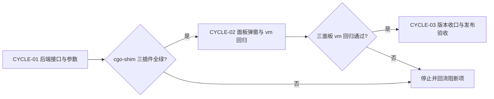
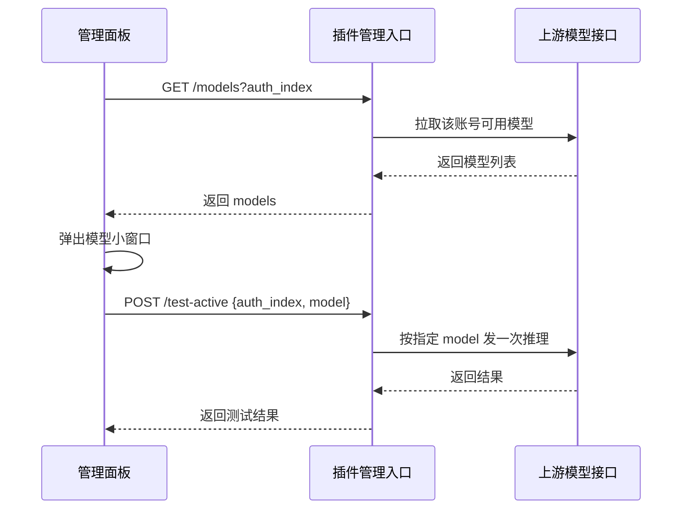

# 插件测试按钮模型选择改造实施总览

结论：把 workbuddy / workbuddy-ai / traework 三个插件面板卡片的「测试」按钮，从「随机挑一个模型直接测」改为「先弹出该账号支持的模型小窗口、点选指定模型再测」；影响：三个插件面板的测试交互与各自 /test-active 后端接口；范围：三个插件的 panel.html、management.go、active_ping.go、models.go、单测与前端 vm 回归脚本；非范围：不改动随机定时活跃探测（watchdog）、不改动插件与宿主 ABI、不改动 CN 签到与保号链路、不触碰 cursor/ 与 qoderwork/ 插件；变化：面板点「测试」先弹出模型列表，选中后按该模型发一次推理请求，弹窗内显示结果；完成标准：三个插件 cgo-shim build/vet/test 全绿、面板 vm 回归全绿（含旧版反证）、6-review STYLE PASS、版本 bump 与 registry 同步。

## 当前计划最终方案简要说明

- 推荐方案一句话结论：新增只读管理路由 GET /plugins/<id>/models?auth_index=<idx> 返回该账号可用模型列表；POST /test-active 增加可选 model 字段，前端「测试」按钮改为打开模型选择弹窗、点选后带 model 调 /test-active。
- 主落点 / 主路径：三插件 management.go（新增 /models 路由 + 注册）、active_ping.go（handleTestActive 读取 model、handleTestActiveWithAuth 支持指定模型）、models.go（新增账号级模型列表 helper）、panel.html（测试弹窗 + testActive 改造 + openTestModal）。
- 为什么先走这条路线：与既有 /test-active、pickRandom*Model、callModelsAPI 完全同源复用，零新增依赖，改动最小；不新建并行接口，避免出现「随机测试」与「指定测试」两套并行路径。

## Agent 对当前问题的理解

- 问题 / 目标：三个插件面板「测试」按钮当前固定调用 pickRandom*Model 随机挑模型，用户无法指定模型验证某个具体模型是否可用；需要在点「测试」时弹出该账号支持的模型小窗口，点选指定模型后按该模型测试。
- 本轮范围：workbuddy / workbuddy-ai / traework 三插件的测试按钮交互与 /test-active 接口扩展、模型列表接口、单测与前端 vm 回归、版本与发布收口。
- 非范围：随机定时活跃探测（watchdog / doActivePing）保持随机模型；不改宿主核心、不改 cursor/、qoderwork/；不改其它按钮。
- 当前优先闭环：CYCLE-01 后端 /models 接口 + /test-active 指定模型参数 + 单测全绿。
- 关键假设 / 待确认点：模型列表来源复用各插件既有动态发现链路（workbuddy/workbuddy-ai 走 callModelsAPI，traework 走 fetchTraeModels）；本地无真实账号凭据，真实上游模型拉取在生产验收；本地用 httptest 桩与 vm 回归验证契约与交互。
- unresolved_decisions：无 P0 或 P1 决策。

## 已冻结决策

| ID | 决策问题 | 候选方案 | 选定方案 | 排除原因 | 影响面 | 回滚 | 证据 |
| --- | --- | --- | --- | --- | --- | --- | --- |
| DEC-001 | 模型列表来源 | A 复用插件既有动态发现 / B 新增独立拉取 | A：复用 callModelsAPI / fetchTraeModels | 与路由/模型列表同源，避免第二套模型事实源 | 三插件 | 版本回退 | 三插件 models.go |
| DEC-002 | 测试接口扩展方式 | A /test-active 加可选 model / B 新建 /test | A：model 为空保持随机（兼容旧面板） | 最小改动、不引入并行接口 | 三插件 | 版本回退 | active_ping.go |
| DEC-003 | 模型列表接口形态 | A GET /models?auth_index / B POST /models | A：GET + query，复用 req.Query | 与 /credits 同风格 | 三插件 | 版本回退 | credits_handler.go:handleCreditsQuery |
| DEC-004 | 弹窗在无模型时行为 | A 报错中止 / B 空列表提示 | B：提示「暂无可用模型」并允许关闭 | 上游瞬时失败不应阻断面板 | 前端 | 前端回滚 | 三插件 panel.html |

## 系统边界与现状基线

代码落点目录树：

```text
workbuddy/
├── models.go                 # 新增 modelsForAuthIndex(auth_index) helper
├── active_ping.go            # handleTestActive 读 model；handleTestActiveWithAuth 支持指定模型
├── management.go             # 新增 GET /models 路由 + 注册
├── active_ping_test.go       # 指定模型 / 缺省随机断言
├── management_test.go        # /models 路由断言
├── panel.html                # 测试弹窗 + openTestModal + testActive 改造
└── VERSION / main.go         # 0.15.3 -> 0.15.4
workbuddy-ai/
├── models.go / active_ping.go / management.go / *_test.go / panel.html
└── VERSION / main.go         # 0.1.8 -> 0.1.9
traework/
├── models.go / active_ping.go / management.go / *_test.go / panel.html
└── VERSION / main.go         # 0.2.2 -> 0.2.3
test/
├── workbuddy/panel_test_model_repro.mjs
├── workbuddy-ai/panel_test_model_repro.mjs
└── traework/panel_test_model_repro.mjs
doc/3-实施/
└── 2026-10-09_212334_插件测试按钮模型选择改造实施总览.md
doc/5-tests/
└── 2026-10-09_XXXXXX_插件测试按钮模型选择回归.md
doc/6-review/
└── 2026-10-09_XXXXXX_插件测试按钮模型选择_6-review.md
```

现状基线要点：

- 三插件面板卡片「测试」按钮均绑定 testActive(idx, btn)，直接 POST /test-active {auth_index}，后端 handleTestActive 固定调用 pickRandom*Model，用户无法指定模型。
- 三插件 management.go 均已有 base + "/test-active" 路由与 managementRegistration() 路由清单；test-active 已在 mutatingManagementPath 或 POST 分支受鉴权保护。
- 三插件 models.go 已具备账号级动态发现能力（workbuddy callModelsAPI(token)、workbuddy-ai callModelsAPI(token, enterpriseID)、traework fetchTraeModels(auth)）与 hostAuthGet。
- 面板已有 modal-mask / modal / modal-hd / modal-bd / modal-ft 样式与导入、删除弹窗先例，可直接复用。

## 实施周期总览

| 顺序 | 周期 ID | 期次定位 | 单一周期目标 | 进入条件 | 收口条件 | 依赖 |
| --- | --- | --- | --- | --- | --- | --- |
| 1 | CYCLE-01 | 第一期 | 后端 /models 接口 + /test-active 指定模型参数 | 侦察冻结 | cgo-shim 三插件全绿 + 哨兵确认 | 无 |
| 2 | CYCLE-02 | 第二期 | 三插件面板测试弹窗与 vm 回归 | CYCLE-01 收口 | 三面板 vm 回归通过 | CYCLE-01 |
| 3 | CYCLE-03 | 第三期 | 版本文档收口与发布部署验收 | CYCLE-02 收口 | 远端 ALL PASS + 生产热重载 | CYCLE-02 |

图形目的：说明周期门禁与不可跳期规则。关联 ID：CYCLE-01、CYCLE-02、CYCLE-03。



## 阶段计划

| 阶段 | 周期 | 唯一目标 | 输入 | 输出 | 验证门槛 |
| --- | --- | --- | --- | --- | --- |
| PHASE-01 | CYCLE-01 | 后端模型列表接口与指定模型测试参数 | 三插件 models.go / active_ping.go | /models 路由 + model 参数 + 单测 | cgo-shim 全绿 |
| PHASE-02 | CYCLE-02 | 三插件面板测试弹窗 | 后端契约 + 面板 modal 先例 | 新面板 HTML + vm 回归脚本 | vm 回归通过 |
| PHASE-03 | CYCLE-03 | 版本与文档收口、发布部署 | 全量改动 | VERSION/registry/部署 | 生产验收 |

## 最小任务清单

| 周期内顺序 | 任务 ID | 唯一目标 | 预计文件数 | 文件/符号契约 | 真实测试 | 完成条件 | 停止条件 |
| --- | --- | --- | ---: | --- | --- | --- | --- |
| 1 | TASK-001 | 后端：/models 路由 + modelsForAuthIndex + handleTestActive 指定模型 | 6 | 三插件 models.go / active_ping.go / management.go | TEST-001 | cgo-shim 三插件全绿 + 哨兵确认 | 构建失败即停止 |
| 2 | TASK-002 | 后端单测：指定模型 / 缺省随机 / /models 路由 | 4 | 三插件 active_ping_test.go / management_test.go | TEST-002 | cgo-shim 全绿 | 断言失败即停止 |
| 3 | TASK-003 | 前端：三插件测试弹窗 + vm 回归脚本 | 6 | 三插件 panel.html + test/*/panel_test_model_repro.mjs | TEST-003 | vm 无 ReferenceError + 断言通过 | 断言失败即停止 |
| 4 | TASK-004 | 版本文档收口：bump 三插件版本、6-review | 7 | 三插件 VERSION/main.go + doc/6-review/ | TEST-004 | 版本一致 + STYLE: PASS | 不一致即停止 |
| 5 | TASK-005 | 发布与生产部署验收 | 3+ | registry.json、release-assets/、doc/3-实施/ | TEST-005 | 远端 ALL PASS + 生产热重载 | 失败→报告并回退 |

任务依赖与阻断补充：

- TASK-002 前置 TASK-001（符号 modelsForAuthIndex / handleTestActiveWithAuth）；TASK-003 前置 TASK-002（契约字段）；TASK-004 前置 TASK-003；TASK-005 前置 TASK-004。
- 阻断条件：cgo-shim 失败、哨兵未确认、面板 vm 回归失败、CI 或生产安装失败时，停止推进并如实报告。

图形目的：说明「点测试 → 选模型 → 发起指定模型测试」的请求链路。关联 ID：TASK-001、TASK-003。



## 追踪矩阵

| 来源/完成条件 | 周期 | 任务 | 文件/符号 | 测试 | 风格回归 | 证据 | 状态 |
| --- | --- | --- | --- | --- | --- | --- | --- |
| REQ-001 / AC-001 | CYCLE-01 | TASK-001 | 三插件 models.go/active_ping.go/management.go | TEST-001 | STYLE-TEST-MODEL-20261009 | EVIDENCE-001 | 已完成 |
| REQ-002 / AC-002 | CYCLE-01 | TASK-002 | 三插件 *_test.go | TEST-002 | STYLE-TEST-MODEL-20261009 | EVIDENCE-002 | 已完成 |
| REQ-003 / AC-003 | CYCLE-02 | TASK-003 | 三插件 panel.html + mjs | TEST-003 | STYLE-TEST-MODEL-20261009 | EVIDENCE-003 | 已完成 |
| REQ-004 / AC-004 | CYCLE-03 | TASK-004 | VERSION/main.go/6-review | TEST-004 | STYLE-TEST-MODEL-20261009 | EVIDENCE-004 | 已完成 |
| REQ-005 / AC-005 | CYCLE-03 | TASK-005 | registry.json 等 | TEST-005 | STYLE-TEST-MODEL-20261009 | EVIDENCE-005 | 已完成 |

REQ / AC 定义：REQ-001 后端可按账号返回模型列表且 /test-active 支持指定模型（AC-001 shim 全绿 + 单测断言）；REQ-002 指定模型与缺省随机行为正确（AC-002 单测断言）；REQ-003 面板点测试弹出模型窗口并可点选（AC-003 vm 回归通过）；REQ-004 版本与文档一致（AC-004 版本一致 + 6-review PASS）；REQ-005 发布与生产验收（AC-005 远端 ALL PASS + 热重载）。

## 现状与落点

- 复用点：hostAuthGet（取账号凭据）、callModelsAPI / fetchTraeModels（账号级动态发现）、sendActivePing*（发一次推理）、面板 modal-mask 样式与 api() 封装。
- 参考实现映射（三插件同构，逐函数适配）：
  - workbuddy/active_ping.go -> workbuddy-ai/active_ping.go -> traework/active_ping.go
  - workbuddy/management.go -> workbuddy-ai/management.go -> traework/management.go
  - workbuddy/panel.html 测试按钮段 -> 另两个面板（各自既有结构）

## 真实测试安排

| 测试 ID | 任务 | 命令/入口 | local 环境 | 样本 | 断言 | 失败预期 | 清理 | 证据 |
| --- | --- | --- | --- | --- | --- | --- | --- | --- |
| TEST-001 | TASK-001 | python scripts/cgo-shim-build.py <plugin> | Windows Go 1.26.5 | 插件源码 | build/vet/test 全绿 + 哨兵 FAIL 确认 | 编译失败 | shim 目录清理 | EVIDENCE-001 |
| TEST-002 | TASK-002 | 同上 | 同上 | 单测 | 指定模型断言 + /models 路由断言 | 断言失败 | 同上 | EVIDENCE-002 |
| TEST-003 | TASK-003 | node test/<plugin>/panel_test_model_repro.mjs | 本机 Node 24 | 面板 HTML 全部 script 块 | vm 无 ReferenceError + 关键断言 | 断言失败 | 无 | EVIDENCE-003 |
| TEST-004 | TASK-004 | 版本一致性核对 + 6-review | 本机 | VERSION/main.go | 三处一致 + STYLE: PASS | 不一致 | 无 | EVIDENCE-004 |
| TEST-005 | TASK-005 | 发布链 + 生产热重载验收 | CI + 生产服务器 | 真实账号 | ALL PASS + 指定模型测试成功 | 失败→报告 | 临时文件清理 | EVIDENCE-005 |

本地执行环境不连接数据库、缓存或外部上游；单测通过 httptest 本地桩服务器完成；面板回归使用 Node vm + DOM 桩在内存中执行。

## 风险与阻断项

| ID | 风险/阻断 | 触发证据 | 当前措施 | 恢复路径 | 禁止动作 |
| --- | --- | --- | --- | --- | --- |
| GAP-001 | 面板 JS 运行时缺陷 | vm 回归 ReferenceError | vm 全量执行 + 定义/使用 grep 成对 + 关键表达式分支断言 | 修复后重跑 | 仅 node --check 就发布 |
| GAP-002 | 并行会话工作树污染 | git status 混入 cursor/ 改动 | 显式列文件 add + staged 反向确认 | 剥离重提 | git add 目录 |
| GAP-003 | 三插件不同构导致改动漂移 | shim 失败或断言不符 | 逐函数适配、各自单测覆盖 | 修复重跑 | 整体覆盖文件 |
| ROLLBACK-001 | 发布后发现问题 | 生产行为异常 | registry 回退 + 生产重装旧版 | 重新发布修复版 | 强推历史 |

- 任务完成条件：全部 5 个最小任务完成条件满足；发布链与生产验收通过。
- 任务停止 / 结束条件：任一最小任务真实测试失败且未修复；用户显式叫停。
- 当前 agent 最大推进边界：workbuddy/、workbuddy-ai/、traework/、test/workbuddy/、test/workbuddy-ai/、test/traework/、doc/3-实施/、doc/5-tests/、doc/6-review/、registry.json、release-assets/；不得触碰 cursor/、qoderwork/、宿主核心与用户未提交的其它改动。

## 自审结论

- 覆盖度检查：REQ-001 至 REQ-005 分别由 AC-001 至 AC-005 与 TEST-001 至 TEST-005 覆盖。
- 实施周期检查：三期按顺序推进，CYCLE-01 含两个后端最小任务。
- 最小任务闭环检查：每个任务含实现、真实测试、6-review 与停止条件。
- 阶段单一目标检查：三个阶段各承载单一目标。
- 占位词检查：无空泛占位。
- 可执行性检查：文件/符号落点与三插件参考映射均已列明。
- 图文一致性检查：Mermaid 图与周期门禁、测试链路描述一致。
- 图片资产决策：N/A，原因为本轮改动为代码与面板逻辑，文档不需要位图资产，证据为本文档的代码落点目录树与真实测试安排中的面板回归脚本（TEST-003）。
- 用户确认状态：用户诉求明确（点测试选择模型），仓库默认授权成立。

## 执行附录

- 本地环境：Windows Go 1.26.5（C:/Program Files/Go/bin/go.exe）；Python 3.14 跑 cgo-shim；Node 24 跑面板 vm 回归。
- 精确命令：python scripts/cgo-shim-build.py workbuddy；node test/workbuddy/panel_test_model_repro.mjs。
- 哨兵法：临时加必失败 Test -> shim 输出 FAIL -> 删哨兵重跑。
- 清理与回滚：shim 目录逐删；发布失败按 ROLLBACK-001。

## 追踪附录

- 稳定 ID：SRC-001、DEC-001 至 DEC-004、REQ-001 至 REQ-005、AC-001 至 AC-005、CYCLE-01 至 CYCLE-03、TASK-001 至 TASK-005、TEST-001 至 TEST-005、EVIDENCE-001 至 EVIDENCE-005、GAP-001 至 GAP-003、ROLLBACK-001。
- 来源与证据：用户诉求（2026-10-09，附两张面板截图）；本仓库三插件源码侦察。
- 关联文档：测试主文档 doc/5-tests/2026-10-09_214631_插件测试按钮模型选择回归.md；风格回归 doc/6-review/2026-10-09_214631_插件测试按钮模型选择_6-review.md。

