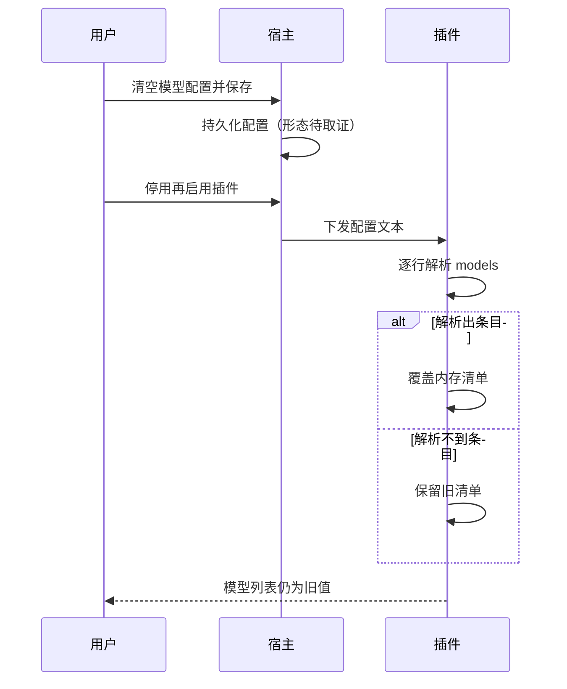

# 插件 models 配置清空后重新启用被还原

结论：清空模型配置后旧值复活，由两处叠加导致。插件侧已经确认存在缺陷，两个插件都无法可靠识别「用户把模型列表清空了」这个动作，Trae 插件尤其严重，任何清空写法都不会生效。宿主侧还需要取证，用来判断清空操作是否真的写进了数据库。影响：用户无法停用自定义模型列表，即便清空也会继续用旧列表，可能继续出现模型标识无效导致的对话失败。范围：Trae 插件与 WorkBuddy 插件的模型配置项，以及宿主配置面板的保存链路。非范围：账号凭据、签到积分和故障转移逻辑不在本次排查范围内。变化：本轮只做问题定位，还没有修改任何代码。完成标准：确认清空动作在宿主侧的真实落盘形态，并让两个插件在用户清空后都能真正回到自动获取或内置默认列表。术语说明：模型配置是用户在插件配置面板里手填的一份模型清单，配好之后它比插件自动获取的模型列表更优先；配置文件文本是宿主在插件启动或重新启用时下发给插件的一段配置内容。验证状态：插件侧结论已经通过阅读代码确认；宿主侧落盘形态尚未取证，需要生产环境只读查询或用户补充信息。

## 现象

用户在这两个插件的配置面板里填写过模型清单，之后把这一项清空并保存。重新执行「停用插件，再启用插件」之后，面板里的模型配置又变回清空之前填过的旧内容。

## 影响范围

| 插件 | 生产版本 | 清空是否生效 | 说明 |
|---|---|---|---|
| `traework-provider` | 0.1.14 | 任何写法都不生效 | 空列表不会被写回内存，旧值一直保留 |
| `workbuddy-provider` | 0.14.17 | 仅一种写法生效 | 只有配置文本写成空数组时才清空，写成空值或删除整行都不生效 |

## 根因定位

### 插件侧：无法区分「用户清空」和「没有配置」

两个插件在读取配置时都遵循同一条兜底规则：只有成功解析出至少一条模型时才覆盖内存里的清单，解析不到就保持原样。这条规则本意是防止一次误操作清空可用配置，但它同时让「用户主动清空」永远无法生效。

| 配置文本形态 | Trae 插件行为 | WorkBuddy 插件行为 |
|---|---|---|
| 写成空数组 | 解析成功但列表为空，不覆盖，旧值保留 | 识别为显式清空，成功清空 |
| 写成空值或 null | 解析失败，不覆盖，旧值保留 | 解析失败，不覆盖，旧值保留 |
| 整行被删除 | 不进入处理分支，旧值保留 | 不进入处理分支，旧值保留 |

关键代码证据：

- `traework/models.go:94`，`if len(out) > 0` 决定空列表不写回，且该变量没有并发保护。
- `traework/config.go:191-200`，只有解析成功才进入处理，缺少「这一行出现过」的记录。
- `workbuddy/usage_config.go:188-207`，同样缺少「这一行出现过」的记录，因此空值和删除整行两种情况都不清空。
- `workbuddy/models.go:92-96`，已经支持空数组形态的显式清空。

缺陷溯源：`workbuddy/models.go` 的清空能力由提交 `2e2ca6a`（随 0.14.13 发布）引入，当时只改了 WorkBuddy 插件。Trae 插件的模型配置文件自 0.1.0 首次发布以来从未同步这项修复。

### 插件停用再启用的影响

插件以动态库形式常驻宿主进程，停用和启用不会卸载动态库，内存变量不会重置。宿主会在注册和重新配置时把持久化的配置下发给插件。因此只要宿主侧保存的内容里仍然带着旧模型清单，重新启用就会把旧值重新写回插件内存。

### 宿主侧：清空是否真正写进数据库

用户猜测清空只改掉了配置文件文本，数据库里仍是旧值，重新启用时又从数据库覆盖回来。本仓库无法证实或推翻这一点，因为插件自身不保存配置，配置的持久化完全由宿主负责，插件侧也没有任何回写宿主配置的代码。这一点需要生产环境取证。

## 处理链路

图形目的：展示从用户清空配置到旧值重新出现的完整判断链路。
关联 ID：EVIDENCE-MODELS-001、EVIDENCE-MODELS-002。

## 交互时序

图形目的：展示用户、宿主与插件之间在清空与重新启用时的配置流转顺序。
关联 ID：EVIDENCE-MODELS-003、GAP-MODELS-001。

## 验证结论

- 代码级证据：已通过阅读两个插件的源码确认，具体文件和行号见上文。
- 生产配置取证：N/A。原因：涉及生产环境只读查询，本轮未获得授权。证据：执行附录说明排查方式仅限源码阅读与提交溯源。
- 复现验证：N/A。原因：宿主落盘形态未确认，无法构造准确的复现步骤。证据：待确认缺口小节已列出该前置依赖。
- 图片资产决策：N/A。原因：本轮排查对象是配置解析逻辑与提交历史，不涉及界面视觉证据。证据：全部证据均来自源码行号与提交记录。

## 完成标准

1. 确认宿主在用户清空后持久化的配置文本真实形态。
2. 两个插件在用户清空后都能回到自动获取或内置默认列表。
3. 补充覆盖「空数组」「空值」「删除整行」三种形态的自动化测试。
4. Trae 插件补齐并发保护，与 WorkBuddy 插件保持一致。

## 修复方向

1. 两个插件都引入「这一行是否出现过」的记录，只要配置项出现过就按解析结果写回，解析结果为空就清空。
2. 把空值和 null 也识别为显式清空。
3. Trae 插件同步 WorkBuddy 插件的清空函数与并发保护。
4. 若取证结果显示宿主删除整行来表示清空，则插件还需要把「配置项缺失」也识别为清空。

## 待确认缺口

| 缺口 | 影响 | 需要的取证方式 |
|---|---|---|
| 宿主清空后的落盘形态 | 决定修复是否需要覆盖「删除整行」 | 生产环境只读查询配置内容，或用户确认面板行为 |
| 宿主保存是否整体覆盖 | 决定主因在宿主侧还是插件侧 | 同上 |

## 执行附录

环境信息：

- 仓库：`F:\cpa-plugin`
- 生产插件版本：Trae 插件 0.1.14，WorkBuddy 插件 0.14.17
- 排查方式：源码阅读与提交历史溯源，未修改任何文件

关键文件：

- `traework/models.go`
- `traework/config.go`
- `workbuddy/models.go`
- `workbuddy/usage_config.go`

## 追踪附录

| 追踪 ID | 对应内容 | 证据 |
|---|---|---|
| EVIDENCE-MODELS-001 | Trae 插件空列表不写回 | `traework/models.go:94` |
| EVIDENCE-MODELS-002 | Trae 插件缺少出现标记 | `traework/config.go:191-200` |
| EVIDENCE-MODELS-003 | WorkBuddy 插件缺少出现标记 | `workbuddy/usage_config.go:188-207` |
| EVIDENCE-MODELS-004 | WorkBuddy 插件已支持空数组清空 | `workbuddy/models.go:92-96` |
| EVIDENCE-MODELS-005 | 修复未同步到 Trae 插件 | 提交 `2e2ca6a` |
| GAP-MODELS-001 | 宿主落盘形态未知 | 待生产取证 |
