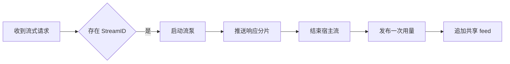
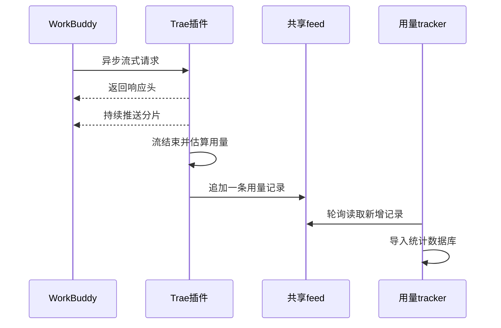

# Trae 异步流式请求响应成功但用量漏记

结论：Trae 插件的异步流式路径没有在请求结束时发布用量，本地代码已修复并发布为 `traework-provider 0.1.19`，但生产问题暂不能关闭。影响：用户通过 WorkBuddy 使用 `qwen-max-latest` 获得响应后，Token 用量统计面板可能没有对应记录。范围：`traework-provider` 的异步流式执行、用量发布和共享 feed 写入。非范围：Qwen 模型映射、豆包服务、tracker 导入过滤和统计面板排序不属于本次代码修改。变化：异步流泵在成功或失败终点统一调用 `publishUsage`，并用已发送分片估算 token。完成标准：本地构建、静态检查、测试和风格回归通过，生产安装后真实流式请求能新增一条 `traework-provider` 记录并被 tracker 查询到。术语说明：共享 feed 是多个插件追加用量记录的 NDJSON 文件，tracker 会读取它并导入自己的数据库。验证状态：代码、CI、release assets、registry 和 Raw CDN 校验通过；生产 SSH 密钥连接已恢复，生产安装与端到端验证尚未执行。

## 文档信息

- 来源：用户在 WorkBuddy 使用 `qwen-max-latest` 获得流式响应，但 Token 用量统计面板没有对应记录。
- 插件：`traework-provider`。
- 客户端模型别名：`qwen-max-latest`。
- Trae 上游模型：`qwen3.8-max`。
- 关联测试：[`Trae 异步流用量代码级验证`](../5-tests/2026-08-30_175903_Trae异步流用量代码级验证.md)。
- 关联风格回归：[`Bug-Trae 异步流用量漏记 6-review`](../6-review/2026-08-30_175903_Bug-Trae异步流用量漏记_6-review.md)。
- 图片资产决策：N/A。原因：现象和根因可由调用链、代码差异与测试结果完整表达。证据：本文件使用流程图和时序图说明执行关系。

## 现象与复现对照

| 请求方式 | 响应结果 | 共享 feed 增量 | 判断 |
| --- | --- | --- | --- |
| 非流式 `qwen-max-latest` | 成功 | 增加 1 条 | `publishUsage` 已执行 |
| 异步流式 `qwen-max-latest` | 成功 | 增加 0 条 | 旧版 `pumpTraeStream` 未发布用量 |

日志中的 `provider=mixed` 是宿主路由池标签，不能据此推断请求属于豆包。当前请求由 Trae 插件承接，模型是 Qwen。

## 根因

`handleExecStream` 在存在 `StreamID` 时启动后台 `pumpTraeStream`，随后立即返回响应头。旧版流泵只推送输出分片、发送错误和关闭流，没有在流结束或扫描失败时调用 `publishUsage`。非流式和同步流式路径都在返回前调用该函数，因此只有异步流式请求漏记。

图形目的：展示异步流式请求从响应成功到统计缺失的旧链路，以及修复后的记账点。
关联 ID：EVIDENCE-TRAE-USAGE-001、EVIDENCE-TRAE-USAGE-002。



## 修复方案

1. 新增 `traeStreamPumpContext`，把客户端模型、上游模型、账号 UID、状态码和开始时间传入异步流泵。
2. 流泵保存已成功生成的标准分片，沿用 `estimateUsageFromChunks` 估算输出 token。
3. SSE 扫描或分片下发失败时发布一次失败用量，已输出分片仍计入估算。
4. 流结束时关闭宿主流、恢复账号故障状态并发布一次成功用量。
5. 不在 `handleUsage` 增加 feed 写入，继续保持 `publishUsage` 为 executor 的唯一记账入口。

图形目的：展示 WorkBuddy、Trae 插件、共享 feed 与 tracker 的修复后交互顺序。
关联 ID：EVIDENCE-TRAE-USAGE-003、TEST-TRAE-ASYNC-USAGE-001。



## 验证结论

- 本地代码级验证：通过。cgo shim 的 build、vet、test 全部通过。
- 测试污染扫描：通过，输出 `POLLUTION: PASS`。
- 格式与空白检查：通过，`gofmt -l` 无目标文件输出，`git diff --check` 无错误。
- Mermaid 静态结构检查：通过，两段代码块类型、闭合和必需关系均已由文档校验器检查。
- Mermaid 真解析：N/A。原因：当前环境没有 `mmdc`、`mermaid` 或支持 `flowchart`、`sequenceDiagram` 的解析器。证据：命令可用性与 Node 模块解析检查均返回不可用；因此本轮不宣称 Mermaid 语法已经真实解析通过。
- 发布与资产校验：通过。`traework-provider 0.1.19` 的 CI 运行 `33307356764` 成功；7 个 release assets 的 `checksums.txt` 与 GitHub Raw CDN 文件大小、SHA-256 均与 `registry.json` 一致。
- 生产 SSH 连通性：通过。证据：使用 `cpa-server` 别名与专用密钥连接 `45.207.222.65:18998` 成功，远端身份为 `root`，主机名为 `ser736666210288`。
- 生产安装与真实流式验证：未执行。原因：本轮仅完成 SSH 配置与无害连通性验证，尚未调用 plugin-store 安装接口或发起 Qwen 请求。
- Bug 关闭结论：暂不关闭。完成标准仍缺生产安装后的真实流式 feed 增量与 tracker 明细查询证据。

## 完成标准

1. 本地 `go build ./...`、`go vet ./...`、`go test ./...` 通过。
2. 生产代码测试污染扫描为 `POLLUTION: PASS`。
3. 发布后发送一次 WorkBuddy 异步流式 `qwen-max-latest` 请求并获得响应。
4. 共享 feed 新增且仅新增一条记录，字段包含 `provider=traework-provider`、`alias=qwen-max-latest`、`model=qwen3.8-max`。
5. tracker 的 requests 数据源能查询到该记录，Token 用量统计面板可显示对应明细。

## 修复后复盘

- 测试接缝：异步流泵的结束点此前没有用量断言，新增回归测试可在发布前拦截同类漏记。
- 隐藏耦合：异步路径在 handler 返回后继续运行，用量发布责任随 goroutine 转移，旧签名没有携带完整统计上下文。
- 可验证性：共享 feed 是可观察结果；生产验证应同时检查 feed 增量和 tracker requests，不能只看对话响应。
- 架构建议：N/A。原因：当前最小修复已把用量责任放回异步生命周期终点，不需要扩大为流框架重构。证据：改动只涉及上下文传递、终点发布和回归测试。

## 执行附录

本轮修改文件：

- `traework/executor.go`
- `traework/stream.go`
- `traework/usage_feed_test.go`

本地验证命令：

```bash
python scripts/cgo-shim-build.py traework
python test-strategy-rules/scripts/scan_test_pollution.py --root . --diff-only
git diff --check -- traework/executor.go traework/stream.go traework/usage_feed_test.go
```

结果摘要：

```text
POLLUTION: PASS
[cgo-shim] OK: go build ./...
[cgo-shim] OK: go vet ./...
ok github.com/luode0320/cpa-workbuddy-plugin/traework 1.388s
[cgo-shim] OK: go test ./...
[cgo-shim] all green (traework)
```

生产重验入口：先恢复目标服务器 SSH 的密钥交换可用性，再安装已发布的 `traework-provider 0.1.19`；随后从 WorkBuddy 发起异步流式 `qwen-max-latest` 请求，记录请求前后的 feed 行数，再通过 `workbuddy-token-usage` 的 requests 数据源按时间、provider 和模型核对导入结果。

### 已解除的 SSH 阻断

`BLK-TRAE-SSH-001` 已于 2026-08-30 19:35 解除：`cpa-server` 的密钥认证无害连接已成功。后续工作回到生产安装与端到端验证阶段；本轮尚未调用 plugin-store 安装接口。

### 生产 Qwen 调用不可用排查

结论：当前“Trae 插件账号用不了”的直接原因位于 `new-api` 渠道选择层，不是 CPA 的 Trae 账号池耗尽，也不是 `qwen3.8-max` 上游模型整体不可用。证据：`new-api` 在 2026-08-30 19:49 至 19:56 多次返回 `No available channel for model qwen-max-latest under group GPT`；数据库非密钥字段显示当前 API token 属于 `GPT` 分组，`GPT` 渠道只支持 `gpt-5.6-sol`、`gpt-5.6-terra` 和 `gpt-5.6-luna`，而包含 `qwen-max-latest` 的 `国模` 渠道不属于该 token 可选范围。补充事实：`国模` 渠道的 `model_mapping` 为空，因此尚未确认生产运行的显式映射 `qwen-max-latest → qwen3.8-max` 已生效。处置边界：本轮仅做只读排查，未修改生产 token、渠道、模型映射、容器或账号。

## 追踪附录

| 追踪 ID | 对应内容 | 证据 |
| --- | --- | --- |
| EVIDENCE-TRAE-USAGE-001 | 异步流入口立即返回 | `traework/executor.go` 的 `handleExecStream` |
| EVIDENCE-TRAE-USAGE-002 | 旧版流泵缺少用量发布 | `traework/stream.go` 的历史差异 |
| EVIDENCE-TRAE-USAGE-003 | 成功和失败终点发布用量 | `traework/stream.go` 的 `pumpTraeStream` |
| TEST-TRAE-ASYNC-USAGE-001 | 流结束写入一条 feed | `TestPumpTraeStreamPublishesUsage` |
| EVIDENCE-TRAE-USAGE-004 | 模块代码级验证通过 | cgo shim build、vet、test 全绿 |
| EVIDENCE-TRAE-USAGE-005 | 无生产测试污染 | `POLLUTION: PASS` |
