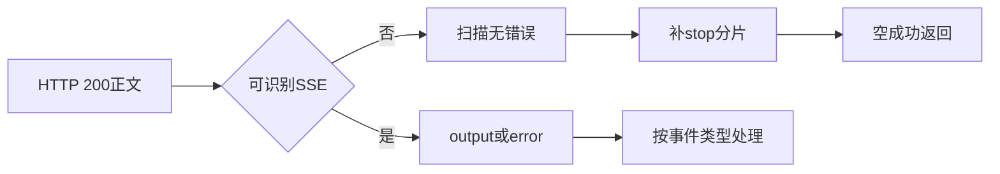
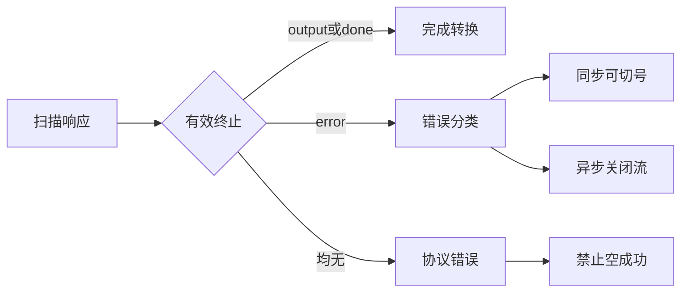

# Trae HTTP 200 异常响应被静默当作空成功

结论：TraeWork 曾将部分 HTTP 200 的非预期上游正文转换为空回答；本轮已将其改为可见的协议错误。影响：Qwen 对话不会再以空回复或仅 stop 分片掩盖异常。范围：Trae 的同步非流式、同步流式与带 `StreamID` 的异步流式响应解析。非范围：本记录不判定某一条具体 Qwen 对话必然命中此分支，也不处理模型映射、账号额度或请求参数错误。变化：共享转换层增加有效终止校验。完成标准：构建、静态检查、既有测试和污染扫描通过；取得脱敏原始响应后完成回放。术语说明：SSE 是服务端连续推送事件的响应格式；有效终止指收到可转换输出或明确结束事件。验证状态：代码级验证通过，真实问题对话的脱敏原始响应尚未取得。图片资产决策：N/A，原因：本次变更只涉及 Go 响应解析；证据：没有页面或视觉输出。

## 问题现象

用户反馈 Qwen 请求表面成功，但返回数据异常。Trae 上游已知会将部分业务错误包装为 HTTP 200 加 `event:error`，因此 HTTP 状态码本身不能证明模型完成成功。

## 静态根因

`traework/upstream.go` 的 `scanSSE` 仅在读到以换行结束的 `event:` 或 `data:` 行时派发事件；普通 JSON、HTML、没有换行的正文及未知事件都可能没有形成有效业务事件。随后 `traework/stream.go` 的两个聚合函数没有校验“是否接收到有效输出、done 或 error”：

1. `aggregateTraeCompletion` 在扫描无错误返回后直接生成 `chat.completion`，即使 `text` 和 `reasoning` 均为空。
2. `collectTraeStream` 在扫描无错误返回后无条件补一个 `finish_reason=stop` 分片。
3. `pumpTraeStream` 也会在扫描无错误返回后补 stop 分片并将账号状态复位为成功。

因此，未被识别为 SSE 错误的 HTTP 200 异常正文会落入“无错误扫描完成”的分支，静默变成空成功。该问题与已被分类处理的 `4011`、`14018` 不同：后两者只要按预期到达 `event:error`，就会触发账号失败核算；本问题发生在事件格式不符合解析器预期时。

图形目的：说明 HTTP 200 异常正文如何绕过当前 SSE 事件识别并被合成为空成功。
关联 ID：EVIDENCE-TRAE-HTTP200-001。

## 已排除与待区分的情况

| 形态 | 当前处理 | 是否属于本 Bug |
| --- | --- | --- |
| `event:error` + `4011` | 识别为限流，可进入账号失败处理 | 否 |
| `event:error` + `14018` | 识别为额度耗尽，可进入账号失败处理 | 否 |
| `event:error` + `4001` | 透传参数错误，不应换号 | 否 |
| `event:error` + `4023` | 透传模型错误，不应换号 | 否 |
| HTTP 200 普通 JSON、HTML、无换行正文或未知事件 | 可能生成空 completion / stop | 是，静态已确认 |

## 修复边界

最小修复应在 SSE 聚合层建立单一的“有效终止”契约：扫描完成后必须至少满足以下之一：收到有效 `output`、收到明确 `done`、或已返回 `error`。否则返回带有限长度脱敏正文摘要的上游协议错误，禁止生成 completion、stop 分片、成功用量或成功账号复位。

同步路径可以直接返回该错误；异步路径只应发送错误分片并关闭当前流，不应在已经建立的流中自动换号重放，避免混合两个账号的输出。修复前需先将未知事件、普通 JSON、HTML、末尾无换行和仅 done 五类输入固化为回归测试。

图形目的：展示修复后同步与异步路径共享的有效终止判定边界。
关联 ID：FIX-TRAE-HTTP200-001。

## 原始响应证据入口

仓库内未找到可直接复现本问题的原始 SSE fixture、请求日志或脱敏抓包。现有资料只证明 `qwen3.8-max` 是有效 `config_name`，并证明 `messages[].content` 必须为 parts 数组；这些不能判定本次异常响应的真实格式。

要完成运行时归因，需用户提供问题对话的最小脱敏证据：HTTP 状态码、`Content-Type`、响应正文前后各一小段，或 SSE 的 `event:` 与 `data:` 行。请去除账号、Cookie、Authorization、token、用户私密消息和完整请求体。若真实正文是 `event:error`，按其中 `code/message` 分类；若是普通 JSON/HTML/未闭合 SSE，则本记录的静态根因得到直接验证。

## 文档信息

- 关联测试：`TEST-TRAE-HTTP200-TERMINAL-20260830`。
- 图片资产决策：N/A，原因：本次变更只涉及 Go 响应解析；证据：没有页面或视觉输出。

## 修复与验证结论

已完成最小修复：`traework/stream.go` 新增共享终止状态，仅当解析到可转换的 output 或显式 done 时才允许成功结束。同步非流式和同步流式会在无有效终止时返回 `invalid SSE response`，不再构造空 completion 或 stop 分片；异步流同样转入失败出口，因此不会成功复位账号或发布成功用量。

风险评估：中等。改动位于三条共享响应出口，行为变化是将此前被误判为成功的无效 HTTP 200 响应改为协议错误。已保留仅 done 的空完成语义，并保持 `event:error` 的原有错误分类和账号切换机制不变。

验证结论：模块 cgo shim 的 build、vet、test 全部通过，生产代码测试污染扫描为 `POLLUTION: PASS`。真实 Qwen 上游样本尚未提供，因此对普通 JSON、HTML、未知事件、无换行尾帧和空 output 的断言目前是代码级静态验证；对应记录见 `../5-tests/2026-08-30_210125_Trae_HTTP200异常响应终止校验.md`。

## 完成标准

1. 三条响应出口拒绝无有效 output 和 done 的响应。
2. 模块 build、vet、test 与生产代码测试污染扫描均通过。
3. 获得脱敏上游样本后，从实际请求入口回放，确认错误可见且不产生空成功响应。

## 本地授权验证补充

本机 Trae SOLO 的 `storage.json` 已确认存在非空授权条目，离线检查表明其可作为插件 `parseTraeAuth` 的授权输入，且 `qwen3.8-max` 的请求构造会使用 `llm_utils_chat` 标准路径与授权头。该检查没有发送上游网络请求：本地测试隔离约束下，不能据此证明 Trae 云端已接受授权或模型已经正常推理。真实验证仍需在用户可控的实际 Trae 客户端或已部署插件入口发起最小请求，并保留脱敏响应事件作为证据。

修复后复盘：本问题本应由“HTTP 200 响应仍需具备可验证 SSE 终止事件”的契约测试阻止。当前插件的核心解析函数未导出，而活动测试规则禁止在源码目录新增白盒测试或为测试新增生产 API，因此未新增违规测试资产。

## 执行附录

关键调用链：`handleExecExecute` / `handleExecStream` → `callLLM` → `aggregateTraeCompletion` / `collectTraeStream` / `pumpTraeStream` → `scanSSE` / `normalizeOutput`。

关键位置：

- `traework/upstream.go:213-256`：`scanSSE` 只派发已换行的 `event:` 与 `data:` 行。
- `traework/stream.go`：三条出口在生成成功结果前调用有效终止校验。

## 追踪附录

| 追踪 ID | 对应内容 | 证据 |
| --- | --- | --- |
| REQ-TRAE-HTTP200-001 | HTTP 200 异常正文不得被包装为空成功 | 用户问题反馈 |
| AC-TRAE-HTTP200-001 | 无有效 output 或 done 时返回协议错误 | `traeSSETerminal.validate` |
| CYCLE-TRAE-HTTP200-001 | 最小修复与代码级验证周期 | 本轮修复记录 |
| TASK-TRAE-HTTP200-001 | 统一有效终止状态 | `traework/stream.go` |
| TEST-TRAE-HTTP200-001 | 三条出口的代码级验证 | `TEST-TRAE-HTTP200-TERMINAL-20260830` |
| EVIDENCE-TRAE-HTTP200-001 | 非预期正文可落入扫描无错误分支 | `upstream.go`、`stream.go` 静态调用链 |
| EVIDENCE-TRAE-HTTP200-002 | 已知 SSE 账号错误已有分类测试 | `accountFailover_test.go` |
| EVIDENCE-TRAE-HTTP200-003 | 当前没有聚合器回归测试 | `traework/*_test.go` 搜索结果为空 |
| EVIDENCE-TRAE-HTTP200-004 | 模块级验证 | cgo shim build、vet、test |
| EVIDENCE-TRAE-HTTP200-005 | 无生产测试污染 | `POLLUTION: PASS` |
