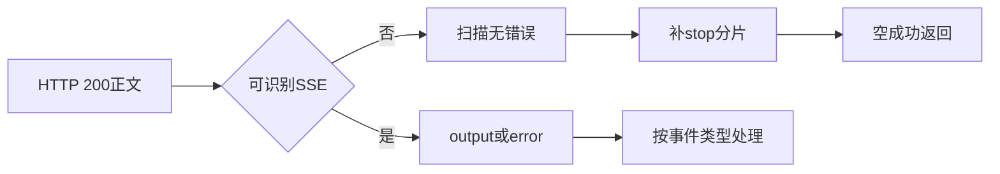
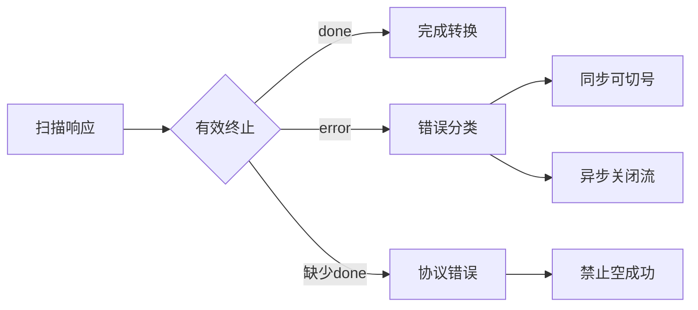

# Trae HTTP 200 异常响应被静默当作空成功

结论：0.1.26 能识别长输入下的短正文 `done`，但识别时失败账号的内容、stop 和 close 已经发送，当前请求仍会提前结束；本地修复已把判断前移到首次输出承诺之前，并在同一请求内换号。影响：`qwen3.8-max` 偶发伪完成时，客户端不再看到失败账号短答，只接收备用账号的最终结果。范围：单次 SSE 健康门槛、同步和异步流式协调器、失败核算、资源关闭与确定性回归。非范围：不改模型映射、600 字节与 200 字节阈值、账号冷却算法、宿主 ABI、其他插件和生产配置。变化：长输入前 600 字节正文与 reasoning 先缓存，伪完成时全部丢弃并复用原 payload、`StreamID` 与 `HostCallbackID` 选择下一账号。完成标准：本地 A 至 B 零泄漏、唯一终止和池耗尽测试通过，0.1.27 发布部署后再完成允许环境中的真实 `/v1/responses` 验收。术语说明：伪完成是长输入下正文只有 1 至 599 个 UTF-8 字节但上游已明确发送 `done`；健康门槛是正文达到 600 字节后才向客户端承诺当前账号输出。验证状态：本地 build、vet、test、静态门禁和风格回归通过；0.1.27 尚未发布，生产入口尚未验收。图片资产决策：N/A，原因：本次变更只涉及 Go 流协议与状态核算；证据：没有页面或视觉输出。

## 问题现象

用户反馈 Qwen 请求表面成功，但返回数据异常。Trae 上游已知会将部分业务错误包装为 HTTP 200 加 `event:error`，因此 HTTP 状态码本身不能证明模型完成成功。

## 静态根因

`traework/upstream.go` 的 `scanSSE` 仅在读到以换行结束的 `event:` 或 `data:` 行时派发事件；普通 JSON、HTML、没有换行的正文及未知事件都可能没有形成有效业务事件。随后 `traework/stream.go` 的两个聚合函数没有校验“是否接收到有效输出、done 或 error”：

1. `aggregateTraeCompletion` 在扫描无错误返回后直接生成 `chat.completion`，即使 `text` 和 `reasoning` 均为空。
2. `collectTraeStream` 在扫描无错误返回后无条件补一个 `finish_reason=stop` 分片。
3. `pumpTraeStream` 也会在扫描无错误返回后补 stop 分片并将账号状态复位为成功。

因此，未被识别为 SSE 错误的 HTTP 200 异常正文会落入“无错误扫描完成”的分支，静默变成空成功。该问题与已被分类处理的 `4011`、`14018` 不同：后两者只要按预期到达 `event:error`，就会触发账号失败核算；本问题发生在事件格式不符合解析器预期时。

图形目的：说明 HTTP 200 异常正文如何绕过当前 SSE 事件识别并被合成为空成功。
关联 ID：EVIDENCE-TRAE-HTTP200-001。

## 已排除与待区分的情况

| 形态 | 当前处理 | 是否属于本 Bug |
| --- | --- | --- |
| `event:error` + `4011` | 识别为限流，可进入账号失败处理 | 否 |
| `event:error` + `14018` | 识别为额度耗尽，可进入账号失败处理 | 否 |
| `event:error` + `4001` | 透传参数错误，不应换号 | 否 |
| `event:error` + `4023` | 透传模型错误，不应换号 | 否 |
| HTTP 200 普通 JSON、HTML、无换行正文或未知事件 | 可能生成空 completion / stop | 是，静态已确认 |

## 修复边界

SSE 聚合层采用单一终止契约：只有收到明确 `done` 才能完成业务响应。收到 `output` 后传输直接 EOF 属于截断；既无有效 `output` 也无 `done` 属于无效响应。两类情况都禁止生成 completion、stop 分片、成功用量或成功账号复位。

同步和异步流式路径都在长输入正文达到 600 字节前缓存当前 attempt。门槛前收到 1 至 599 字节正文和 `done` 时，丢弃该 attempt 的正文与 reasoning，记录账号失败并在同一逻辑请求内选择下一账号；门槛打开后不再换号，避免混合两个账号的输出。CPA 提供的 `HostCallbackID` 在所有 attempt 间保持不变，用于客户端取消时终止当前上游读取。

图形目的：展示修复后同步与异步路径共享的有效终止判定边界。
关联 ID：FIX-TRAE-HTTP200-001。

## 原始响应证据入口

已使用本机 Trae SOLO 授权完成 `qwen3.8-max` 真实短流和长流验证，凭据只在内存中解析，没有写入日志或文档。长流样本证明上游能够持续生成并以 `done -> EOF` 完成。

CPA OpenAI API 本地入口当前不可用，因此尚未取得“客户端经 CPA 调用 TraeWork”的端到端时序证据。恢复本地服务后，应记录首包时间、分片间隔、最终 done 与 stop 数量；证据必须去除账号、Cookie、Authorization、token、用户私密消息和完整请求体。

## 文档信息

- 关联测试：`TEST-TRAE-HTTP200-TERMINAL-20260830`。
- 图片资产决策：N/A，原因：本次变更只涉及 Go 响应解析；证据：没有页面或视觉输出。

## 修复与验证结论

已完成最小代码修复：`traework/executor.go` 的异步入口改用宿主流桥，`traework/stream.go` 只有收到 `done` 才允许成功结束。`output` 后直接 EOF 返回 `truncated SSE response`；最终 stop 下发失败同样进入失败用量与错误出口，不再复位账号或记录成功。

风险评估：中等。变更集中在异步 HTTP 读取方式、三条 SSE 成功出口、EOF 尾帧解析和最终 stop 核算。`event:error` 分类与异步流不换号重放的既有边界保持不变。direct fallback 仍使用完整缓冲并受共享 HTTP client 的 120 秒超时约束，本轮没有扩展 transport 重构。

验证结论：真实上游 `qwen3.8-max` 连续输出 107.164 秒，产生 298 个 `output` 事件和 11,683 个字符，最终收到 `done -> EOF`，未出现 `event:error`。`scanSSE` 现在会在 EOF 时解析没有末尾换行的最后一条行，回归测试覆盖无换行 `done`、无换行 `output` 和只有 `event:` 的残缺尾帧。模块 cgo shim 的 build、vet、test 全部通过，最新测试耗时 1.311 秒；生产代码测试污染扫描为 `POLLUTION: PASS`。本机 `127.0.0.1:8317` 没有可用 CPA 服务，因此尚未从 CPA OpenAI API 入口验证首包、持续分片和唯一 stop；对应记录见 `../5-tests/2026-08-30_210125_Trae_HTTP200异常响应终止校验.md`。

## 完成标准

1. 三条响应出口只有收到 `done` 才允许成功；`output -> EOF` 返回截断错误。
2. EOF 前没有换行的最后一条 `done` 或 `output` 行仍会被解析，孤立的 `event:` 尾帧不会伪造业务事件。
3. 异步请求通过宿主流桥持续下发，并透传 `HostCallbackID`。
4. 最终 stop 下发失败不得复位账号或记录成功用量。
5. 模块 build、vet、test 和生产代码测试污染扫描通过；`6-review` 在测试资产归位前保持 `STYLE: FIX_REQUIRED`。
6. CPA 本地入口可用后，验证首包及时、生成期间持续分片、最终只有一个成功 stop；该项当前为受限验证，不作为代码级修复回退条件。

## 本地授权验证补充

已使用本机 Trae SOLO `storage.json` 的授权条目完成两次最小真实上游流式请求。凭据按插件同等的 `tc-header` AES 解密与完整性校验流程在内存中解析，过程中没有输出 credential、token、用户字段或模型正文。

1. `qwen3.8-max` 短请求：HTTP 200、`Content-Type: text/event-stream`，事件序列为 `metadata -> timing_cost -> output × 4 -> extra_info -> token_usage -> done`，解析到 79 个输出字符，1.7 秒后 EOF，没有 SSE error。
2. `qwen3.8-max` 长请求：首事件 1.152 秒，持续 107.164 秒，最大事件间隔 1.951 秒；收到 298 个 `output` 事件、11,683 个输出字符和一个 `done`，终止序列为 `done -> EOF`，没有 SSE error。
3. `qwen-max-latest -> qwen3.8-max` 的别名映射由 CPA 完成。TraeWork 实际请求的 `config_name` 是 `qwen3.8-max`，因此 `qwen-max-latest` 直连 `4001` 不用于解释生产提前结束。

真实长流证明 Trae 上游能够持续生成。已确认的插件缺陷是异步路径先完整缓冲再回放、缺少 `done` 时仍补成功 stop，以及最终 stop 下发失败仍可能成功记账。`HostCallbackID` 未透传会削弱客户端取消传播，但不会在单次 callback 返回后立刻终止上游。

修复后复盘：这个 Bug 应由三类契约测试拦截，分别是首包必须在上游完成前到达、`output -> EOF` 必须失败、最终 stop 下发失败不得记录成功。当前已覆盖后两类代码级回归；首包时序仍需 CPA 本地入口恢复后完成端到端验证。

**0.1.26 后续反证与同请求恢复。** 0.1.26 的发布和部署事实保持有效，但一次健康长输出只能证明该次请求完整，不能证明伪完成时当前请求可恢复。后续生产现象证明：伪完成检测发生在内容、stop 和 close 已发送之后，失败账号的短答已不可回滚；失败核算与会话驱逐只会影响下一请求。因此此前“生产验证完成、目标达成”的行为结论撤回。

当前本地修复将 `stream.go` 拆出单次 attempt 解析器，在 600 字节健康门槛前缓存全部标准化分片；`executor.go` 的同步和异步协调器在 pseudo 时丢弃缓冲、记录失败、拒绝同请求重复账号，并继续原逻辑请求。异步路径固定客户端 `StreamID` 和 OpenAI request ID，所有上游 attempt 复用原 `HostCallbackID`，最终健康账号独占 finish 和 close。

验证结论：本地确定性测试通过，覆盖 599/600 字节边界、A 伪完成至 B 健康、A 零泄漏、唯一 stop、唯一客户端 close、全账号 pseudo 显式失败、A 至 B 至 A 回跳拒绝、emit 失败不换号和 panic 资源关闭。测试记录见 [`Trae 伪完成同请求换号恢复回归`](../5-tests/2026-09-01_225756_Trae伪完成同请求换号恢复回归.md)，实施记录见 [`Trae 伪完成同请求换号恢复实施总览`](../3-实施/2026-09-01_225756_Bug-Trae伪完成同请求换号恢复_实施总览.md)，风格回归为 [`STYLE: PASS`](../6-review/2026-09-01_225756_Bug-Trae伪完成同请求换号恢复_6-review.md)。

关闭建议：暂不关闭。0.1.27 尚未发布，真实 `/v1/responses` 尚未验收。生产验证在当前仓库规则下为 N/A，原因是测试连接只允许 local 配置；证据是实施总览 TASK-006 的环境边界。

修复后复盘：正确测试接缝必须位于“单次 attempt 解析器加逻辑请求协调器”，否则只能证明伪完成会被记账，无法证明失败内容没有先泄漏。此次新增 emitter、脚本化 A/B opener 和唯一终结计数，使同类回归在进入发布前即可失败；当前不需要额外架构重构。

## 执行附录

关键调用链：`handleExecExecute` / `handleExecStream` → `callLLM` → `aggregateTraeCompletion` / `collectTraeStream` / `pumpTraeStream` → `scanSSE` / `normalizeOutput`。

关键位置：

- `traework/upstream.go`：`scanSSE` 在 EOF 时补齐缓冲区中的最后一条无换行行，再沿既有 `event:` 与 `data:` 分支解析。
- `traework/stream.go`：三条出口在生成成功结果前调用有效终止校验。

## 追踪附录

| 追踪 ID | 对应内容 | 证据 |
| --- | --- | --- |
| REQ-TRAE-HTTP200-001 | HTTP 200 异常正文不得被包装为空成功 | 用户问题反馈 |
| AC-TRAE-HTTP200-001 | 缺少 done 时返回无效或截断协议错误 | `traeSSETerminal.validate` |
| CYCLE-TRAE-HTTP200-001 | 最小修复与代码级验证周期 | 本轮修复记录 |
| TASK-TRAE-HTTP200-001 | 统一有效终止状态 | `traework/stream.go` |
| TEST-TRAE-HTTP200-001 | 三条出口的代码级验证 | `TEST-TRAE-HTTP200-TERMINAL-20260830` |
| EVIDENCE-TRAE-HTTP200-001 | 非预期正文可落入扫描无错误分支 | `upstream.go`、`stream.go` 静态调用链 |
| EVIDENCE-TRAE-HTTP200-002 | 已知 SSE 账号错误已有分类测试 | `accountFailover_test.go` |
| EVIDENCE-TRAE-HTTP200-003 | 截断、分片与尾帧回归 | callback wire、跨 chunk SSE、`output -> EOF`、EOF 无换行测试 |
| EVIDENCE-TRAE-HTTP200-004 | 模块级验证 | cgo shim build、vet、test，最新测试耗时 1.311 秒 |
| EVIDENCE-TRAE-HTTP200-005 | 无生产测试污染 | `POLLUTION: PASS` |
| EVIDENCE-TRAE-HTTP200-006 | 真实上游长流 | 107.164 秒、298 个 output、11,683 字符、`done -> EOF` |
| EVIDENCE-TRAE-HTTP200-007 | CPA 入口验证限制 | 本机 8317 端口没有可用 CPA 服务 |
