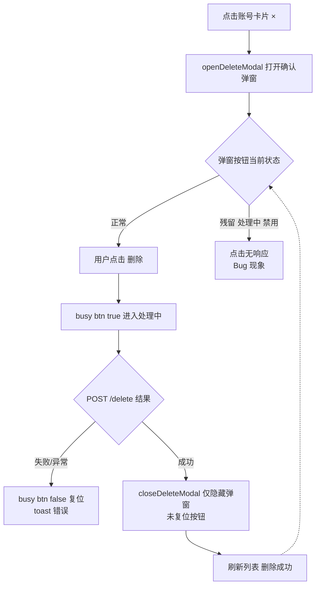
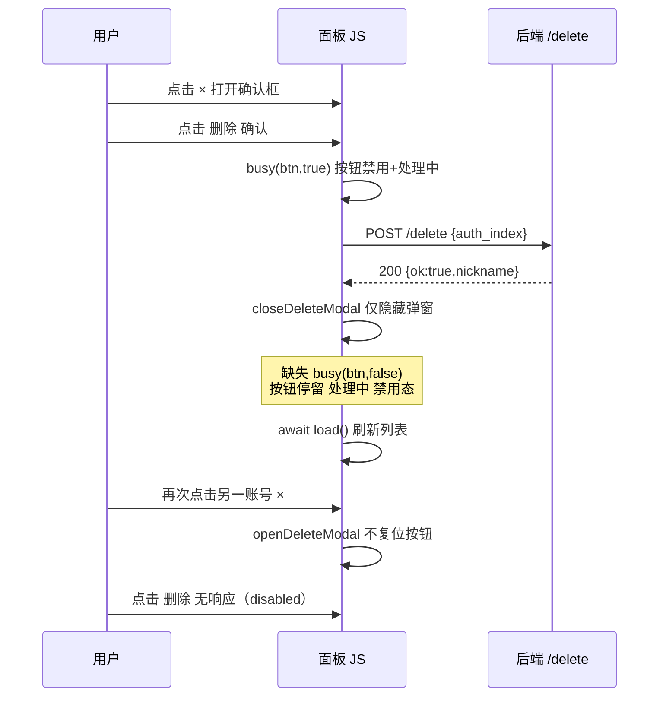

# Bug：账号面板删除确认按钮 busy 状态泄漏导致无法连续删除

结论：删除账号成功后，确认弹窗的"删除"按钮停留在"处理中…"禁用态且从未被复位，弹窗 DOM 被复用，下次打开时按钮不可点击，表现为"一直处理中、删不了下一个"；影响：workbuddy / qoderwork / traework 三个 provider 插件账号面板的所有连续删除操作，单次删除成功后必须刷新页面才能再删；范围：本记录确认前端 `confirmDeleteAuth()` 成功分支缺少 `busy(btn,false)` 复位与 `openDeleteModal()` 缺少防御性复位的根因链，以及三插件同构代码的修复与验证；非范围：后端 `/delete` 接口行为（已确认同步返回、无挂起）、删除业务逻辑本身、其他 busy 按钮的用法；变化：用户删除第一个账号成功后，第二次打开删除确认框时按钮显示"处理中…"且点击无效；完成标准：三插件成功路径补齐按钮复位、打开弹窗时防御性复位，本地构建通过，用户在面板实测可连续删除两个账号；术语说明：busy 状态指 `busy(btn,true)` 给按钮设置的 `disabled=true` + 文案替换为"处理中…"的交互锁，用于防重复提交；验证状态：静态证据链已闭环（busy 实现 → 成功分支无复位 → 弹窗 DOM 复用 → 与用户现象完全吻合），待修复后用户实测闭环。

## 问题现象

- 用户在 WorkBuddy 账号面板点击账号卡片右上角 ×，弹出删除确认框，点击"删除"。
- 第一个账号删除成功（卡片消失、弹窗关闭）。
- 再次点击另一个账号的 × 打开确认框时，"删除"按钮显示"处理中…"（转圈）且处于禁用态，点击无响应，无法删除第二个账号。

## 影响范围

- 页面：三个 provider 插件（workbuddy / qoderwork / traework）的管理面板账号卡片删除确认弹窗。
- 接口：不涉及，`POST /v0/management/plugins/
/delete` 行为正常。
- 用户范围：所有需要连续删除多个账号的操作者；单次删除后不刷新页面必然复现。

## 出现环境

- 线上：服务器 45.207.222.65 面板（用户截图，cpa.luode.vip 管理页）。
- 前端为插件内嵌 panel.html，与插件版本一致；后端同步 handler 无差异。

## 触发条件

- 删除一个账号成功（成功分支执行完毕）后，不刷新页面，再次打开删除确认框。

## 期望结果

- 删除成功后弹窗关闭；再次打开删除确认框时，"删除"按钮为正常可点击状态，可连续删除多个账号。

## 实际结果

- 删除成功后确认按钮的 busy 状态残留（disabled + "处理中…"），下次打开弹窗按钮不可用。

## 根因定位（证据链）

1. `busy(btn,on)` 实现（workbuddy/panel.html:380-384）：`on=true` 时 `btn.disabled=true` 且文案替换为 `处理中…`；`on=false` 时才恢复。状态写在按钮元素自身。
2. `confirmDeleteAuth()`（workbuddy/panel.html:1120-1142）：`busy(btn,true)` 后，失败分支（`d.error`）与异常分支（catch）都调用了 `busy(btn,false)`；**成功分支只调用 `closeDeleteModal()` 隐藏弹窗并 `await load()`，从未调用 `busy(btn,false)`**。
3. 删除确认弹窗是静态 DOM（`
` 固定写在页面里，按钮固定 id `deleteConfirmBtn`），`closeDeleteModal()` 仅移除 `show` class，不重建、不复位按钮。
4. `openDeleteModal()`（workbuddy/panel.html:1106-1112）只设置提示文案并加 `show` class，不复位按钮状态。
5. 因此成功删除一次后，`deleteConfirmBtn` 永久停留在 disabled + "处理中…"，下次打开弹窗即为用户所见现象。
6. 后端 `handleDeleteAuth`（workbuddy/credits_handler.go:276-340）同步执行、同步返回，无挂起路径，排除后端原因。
7. 同构确认：qoderwork/panel.html:1019-1041 与 traework/panel.html:444-466 的 `confirmDeleteAuth()` 成功分支同样缺少复位，同一 Bug 三插件并存。token-usage-tracker 无删除功能，不涉及。

症状分类：五类中的"没反应"类；根因层次：实现问题（成功分支资源/状态泄漏），非设计问题；唯一根因候选，无竞争假设。

## 图示产物（必填）

删除操作前端状态流转流程图：

删除请求时序图：

## 修复方案摘要

- 成功分支补 `busy(btn,false)`（根治状态泄漏）。
- `openDeleteModal()` 打开时防御性复位按钮（保证"弹窗打开即按钮可用"不变量，抵御任何未来路径的残留）。
- 三个插件同构函数逐一适配修改，不整文件覆盖。

## 修复实施与风险评估（2026-09-05）

主方案：上述两点在 workbuddy / qoderwork / traework 三插件的 panel.html 各实施两处改动，共 6 处：

- workbuddy/panel.html:1110-1111（openDeleteModal 防御复位）、1136-1137（成功分支 busy(btn,false)）
- qoderwork/panel.html:1009-1010、1035-1036
- traework/panel.html:434-435、460-461

备选方案（未采用）：仅在 openDeleteModal 入口复位（能消除现象但成功分支泄漏仍在，属入口兜底）；将复位逻辑并入 closeDeleteModal（语义混杂，复位职责归弹窗打开入口更清晰）。

风险点：纯前端 panel.html 内嵌 JS 两行级改动，不触碰 Go 逻辑、管理接口契约与数据；`busy(btn,false)` 对非 busy 按钮幂等（disabled=false、dataset.orig 缺失时不改文案），无副作用。JS 注释按铁律未使用 markdown 反引号。

确认结论：改动面小、风险低、无竞争方案代价差异，按修复建议规则判定可直接编码，未等用户确认即实施。

## 修复验证结论（2026-09-05）

- 验证环境：local（Windows 开发机 F:\cpa-plugin，cgo-shim 本地构建）。
- 验证路径：三插件 `python scripts/cgo-shim-build.py <plugin>` 全部 all green（workbuddy 11.5s / qoderwork 7.4s / traework 1.3s，go test 全过）；grep 回读确认 6 处改动全部落盘。
- 通过项：panel.html 内嵌注入无损（无反引号截断）、Go 层零回归、成功分支复位与入口防御复位双路径齐备。
- 未覆盖说明：面板 UI 人工点击验证（连续删除两个账号）需插件部署到服务器后进行，本地无插件宿主运行环境；本次改动为纯前端 DOM 状态逻辑，静态证据充分。
- 关闭建议：受限交接——代码修复与构建验证已完成，待用户在面板实测"连续删除两个账号"成功后正式关闭；不属于阻断（BLK）情形。

## 修复后复盘（Post-mortem）

- 测试接缝：panel.html 前端交互无自动化测试设施（go test 仅覆盖 Go 层），此接缝缺失是面板类 bug 的共性，本次不强制架构调整。
- 调用方纠缠：根因模式为"交互锁状态写在复用 DOM 元素上，成功路径遗漏复位，代价转移给下一次打开"。防御复位模式已作为修复一部分固化；经验沉淀至知识库 `20-Knowledge/工程实践/复用弹窗的交互锁必须在打开入口防御性复位.md`。
- 可验证性：静态代码审查可发现此类泄漏，但无自动 UI 测试通道；构建 + 用户实测是当前唯一验证组合。
- 架构后续项：无（防御复位已固化不变量，不需要额外重构）。

## 当前缺失项

- 修复后 UI 实测确认（用户侧）：连续删除两个账号不再出现"处理中"残留，即可正式关闭本 Bug。

## 执行附录

- local 环境：Windows 开发机 F:\cpa-plugin；验证命令 `python scripts/cgo-shim-build.py <plugin>`（panel.html 内嵌 Go 原始字符串，编译通过即注入无损）。
- 用户截图：Clipboard_Screenshot.png（WorkBuddy 账号面板，红框标注第一个账号卡片 × 按钮）。
- 关键代码位置：workbuddy/panel.html:380-384（busy）、1106-1112（openDeleteModal）、1120-1142（confirmDeleteAuth）；qoderwork/panel.html:1019-1041；traework/panel.html:444-466；workbuddy/credits_handler.go:276-340。

## 追踪附录

- 来源：用户会话报告 + 截图（2026-09-05 00:02）。
- 稳定标识：账号面板删除确认按钮 busy 状态泄漏。
- 证据定位：见"根因定位"节行号。
- 图示关联：流程图与时序图内嵌上文。
- 问题变更记录：2026-09-05 建立 Bug 主文档并完成静态根因定位；同日修复三插件并构建验证。
