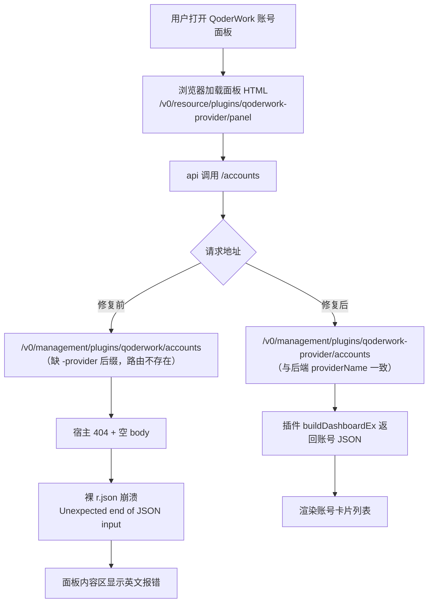
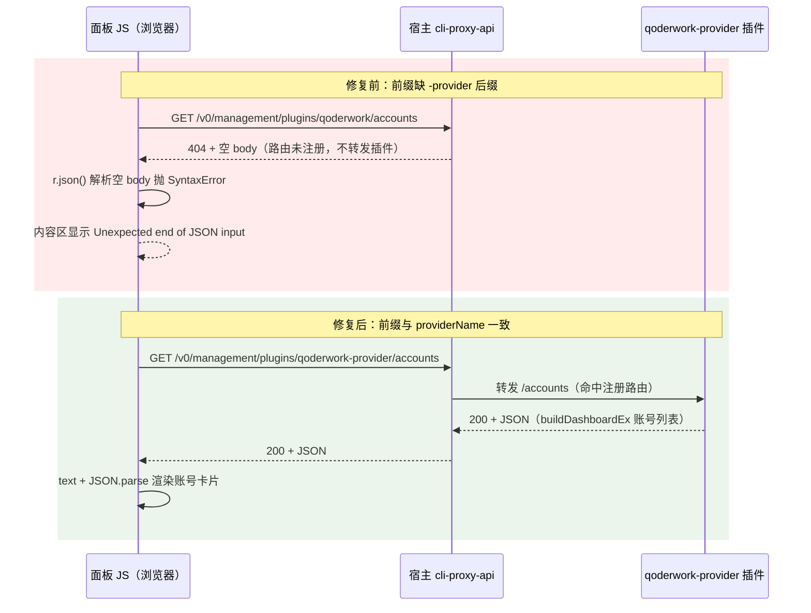

# qoderwork面板API前缀缺provider后缀致账号面板空

结论：QoderWork 账号面板打不开，不是账号数据丢了，而是面板网页里写错的接口地址导致所有数据请求都打到了一个不存在的地址上。服务器收到请求后回复"地址不存在"且不带内容，面板代码遇到这种空回复就崩了，把浏览器的一句英文报错直接显示在页面上。授权生成的认证文件本身是正常的，宿主的认证文件管理页走的另一套地址，所以那边显示一切正常。

影响：所有 QoderWork 账号面板功能全部不可用——账号列表、刷新、签到、导入、删除、区域筛选全都发不出有效请求。Trae 和 WorkBuddy 两个面板不受影响（它们面板里的地址写对了）。生产服务器上当前部署的 QoderWork 插件一直带着这个缺陷。

范围：本仓库 qoderwork/panel.html 一个文件，两处修改。不涉及后端 Go 代码、不涉及其他三个插件、不涉及宿主。

非范围：认证文件管理页里 QoderWork 卡片显示"模型 ?"的现象本轮未追查，与本缺陷无直接证据关联，留待后续观察。

变化：第一处，把面板里的接口地址从 `/v0/management/plugins/qoderwork` 改成 `/v0/management/plugins/qoderwork-provider`，和插件在后端注册的名字对齐。第二处，把面板取数据的代码改成和 WorkBuddy 面板一样的健壮写法：以后再遇到空回复、非 JSON 回复、坏 JSON 回复，页面会显示一句能看懂的中文提示（比如"空响应，多为路由不存在或插件未加载"），而不是浏览器原生英文报错。

完成标准：本地构建（编译、静态检查、单元测试）全绿；面板内嵌脚本语法校验通过；重新构建发布并在服务器安装后，打开 QoderWork 账号面板能看到已授权账号的卡片列表。

术语说明：插件注册 id 是插件在宿主里登记的唯一名字（qoderwork-provider，带 -provider 后缀）；宿主是服务器上运行的管理程序（cli-proxy-api 容器），它负责把面板请求转发给对应插件；面板 HTML 在编译时被打进插件二进制文件里，所以改了源码必须重新构建并发布才生效。

验证状态：本地验证已通过（构建、测试、语法校验）；线上验证已完成——qoderwork-provider 0.9.8 已发布并热部署到生产（2026-09-05 02:02，`plugin hot reloaded active_version=0.9.8 retired_version=0.9.7`），生产 `/v0/management/plugins/qoderwork-provider/accounts` 返回 200 + 真实账号 JSON（修复前 404 空 body），落盘 .so sha256 与本地产物一致，/export 带 key 200 / 无 key 401。同版补充对齐 workbuddy 0.14.20 面板能力（排序/搜索/导出/备份恢复），详见 CHANGELOG 0.9.8。

## 问题现象

- 用户在 Qoder 插件完成一个账号授权，宿主"认证文件管理"页（`#!/auth-files`）出现 `qoderwork-e1a883d86-...` 认证文件，状态启用。
- 打开"QoderWork 账号面板"（`#!/plugin-pages/qoderwork-provider/0`）：页面框架（标题、按钮、筛选器）正常渲染，但内容区空白，显示报错：

  ```
  Failed to execute 'json' on 'Response': Unexpected end of JSON input
  ```

- 同页签的 Trae、WorkBuddy 面板此前工作正常。

## 根因

两层缺陷叠加：

1. **直接根因（地址写错）**：`qoderwork/panel.html:259` 前端硬编码 `const API = "/v0/management/plugins/qoderwork"`，少了 `-provider` 后缀。后端注册的管理路由 base 是 `loadedManagementBasePath() + "/plugins/" + providerName`，其中 `providerName = "qoderwork-provider"`（`main.go:76`，`management.go:171-174`）。于是面板发出的 `/accounts` 请求落在宿主上不存在的路由 → 宿主返回 404 + 空 body。
2. **放大器（报错不可读）**：qoderwork 面板的 `api()` 是旧形态——只特判 401/403，其余状态码一律裸 `return r.json()`（原 673 行）。空 body 上调用 json() 抛出浏览器原生 SyntaxError，`load()` 的 catch 把原始报错写进内容区，用户看到无意义的英文异常而非可行动提示。

对照证据：workbuddy 面板 `const API = "/v0/management/plugins/workbuddy-provider"`（panel.html:298）、traework 面板 `const base = "/v0/management/plugins/traework-provider"`（panel.html:260），均带完整后缀；qoderwork 是三个里面唯一写错的。

为何认证文件管理正常：该页面是宿主自带界面，走宿主自己的管理 API，与插件面板 API 前缀无关。

## 修复

- `qoderwork/panel.html:259`：API 前缀补齐为 `/v0/management/plugins/qoderwork-provider`。
- `qoderwork/panel.html` `api()` 末尾：对齐 workbuddy 面板的健壮解析——先 `r.text()` 再按内容分桶：空 body → 结构化 `{error:"空响应 (HTTP xx)..."}`；非 JSON → `{error:"非 JSON 响应..."}`；坏 JSON → `{error:"JSON 解析失败..."}`。注释同步说明 404 空 body 与 200 空 body 的经验语义。未使用反引号模板字符串，规避嵌入字符串截断风险。
- 调用方兼容性已核实：`load()` 有 `d.error` 分支（原 707-710 行），首屏懒加载调用点有 `if(!d||d.error) return;` 防护（464-465 行），其余调用点与 workbuddy 同构。

## 修复后的请求链路



## 交互时序（修复前 vs 修复后）



## 生效条件

面板 HTML 通过 `//go:embed`（panel.go:317）编译进 .so，运行时从二进制读取。源码修复不发布不生效。需按发布流程：bump VERSION → push → dispatch 构建（plugin 传 `qoderwork-provider`，必须同时传 version）→ 服务器 install → 浏览器强刷面板验证。

## 验证记录

- `python scripts/cgo-shim-build.py qoderwork`：go build / go vet / go test 全绿（test ok 7.449s）。
- node 内联脚本语法校验：2 个 script 块均 OK。
- 全文检索确认无残留裸 `.json()` 调用。

## 执行附录

关键文件与行号（修复前）：

- `qoderwork/panel.html:259` — `const API = "/v0/management/plugins/qoderwork";`
- `qoderwork/panel.html:673` — `return r.json();`
- `qoderwork/main.go:76` — `providerName = "qoderwork-provider"`
- `qoderwork/management.go:171-174` — 路由 base 拼接与 `/accounts` 分发
- `qoderwork/panel.go:317` — `//go:embed panel.html`
- 对照：`workbuddy/panel.html:298`、`workbuddy/panel.html:896-908`（健壮解析范本）、`traework/panel.html:260`

宿主 404 空 body 语义来源：知识库笔记《插件面板API前缀必须硬编码管理前缀》（traework 0.1.6 同类缺陷实证）；200 空 body 对应插件 fused / identity stale 的经验语义来自 workbuddy 面板 api() 分桶注释。

关联笔记：`D:\谷歌云盘\知识库\20-Knowledge\工程实践\插件面板API前缀必须硬编码管理前缀.md`（本轮已补正：硬编码值必须与 providerName 注册 id 完全一致，仅"硬编码模式"本身不保证正确）。
