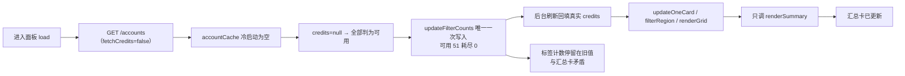
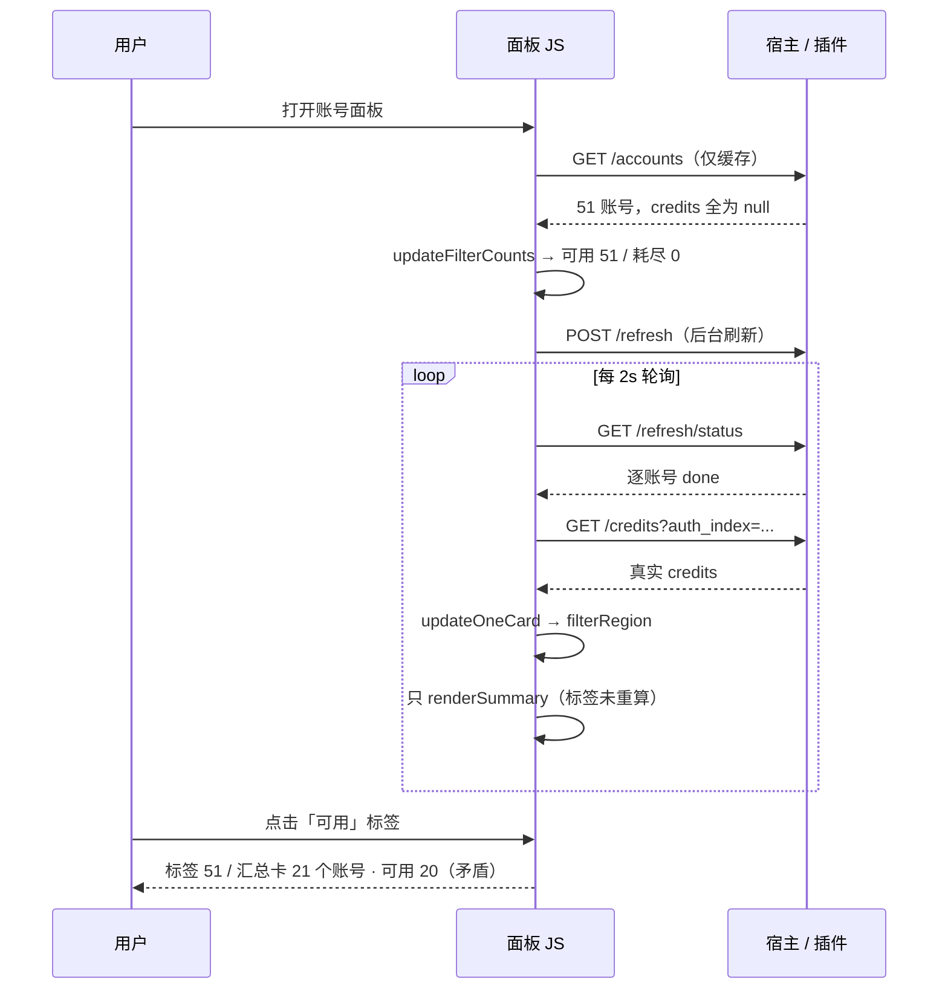

# 账号面板筛选标签计数未随积分回填重算

结论：是缺陷，但属于「显示口径不同步」，不是账号数据错误。面板顶部那排筛选标签（全部 / 可用 / 耗尽 / 失败 / 测试）里的数字只在打开面板那一次算过一次，而卡片上真实积分是之后由后台刷新逐个补回来的；补回来的过程中只重算了下面那张「用量汇总」卡片，没有再重算顶部标签。于是标签长期停在「冷启动时全部算作可用」的那一次结果，出现截图里「标签说 51 个可用，汇总卡说 21 个账号里 20 个可用」的矛盾。账号本身的积分、可用性、调度行为都正常，受影响的只有标签上那几个数字。

影响：WorkBuddy 面板的「可用」「耗尽」两个标签计数会明显偏大或偏小，用户按标签数量判断账号存量时会得到错误结论。同一份写法也存在于 TraeWork 与 QoderWork 两个面板，缺陷模式相同。汇总卡、卡片徽标、实际路由选号都不受影响，属于纯前端展示计数问题，不影响推理请求与账号调度。

范围：本仓库三个面板文件 workbuddy/panel.html、traework/panel.html、qoderwork/panel.html，改动集中在「筛选标签计数的计算时机与口径统一」。不涉及后端 Go 代码、不涉及宿主、不涉及积分拉取链路、不涉及路由选号逻辑。

非范围：不做面板布局或样式调整；不新增筛选维度；不改变「可用」标签的语义构成（仍按现有口径，不把停用账号并入不可用）；不重构面板其余渲染函数。

变化：把筛选标签计数的刷新挂到「账号派生视图的统一刷新入口」上，无论数据来自首屏加载、后台积分回填、单卡刷新还是排序重绘，标签计数都会跟着重算。同时把 WorkBuddy 面板里原本分散在四处、写法互不一致的「是否耗尽」判断收敛成一个共享判定函数，与后端 isCreditsExhausted 同口径，避免标签、筛选、卡片徽标三处再各算各的。

完成标准：本地构建（编译、静态检查、单元测试）全绿；面板内嵌脚本语法校验通过；用真实渲染逻辑复跑复现脚本，标签计数应与汇总卡口径一致（不再出现「可用 51」而汇总卡只有 20 可用）；重新构建发布并在生产安装后，面板标签数字与汇总卡自洽。

术语说明：筛选标签是面板顶部那排可按状态过滤卡片的按钮，按钮上的数字表示该状态下有多少个账号；积分回填是面板打开后由后台刷新把每个账号的最新剩余积分数逐个补进卡片的过程；冷启动指进程刚重启、内存里还没有任何积分缓存的那一刻；耗尽指账号额度已用完（剩余为 0 且确认有过用量或额度包），与「没有积分数据」不同。

验证状态：本地复现已完成（用面板真实脚本在 Node 虚拟环境里跑出与截图一致的错误计数）；本地修复与验证已完成；生产发布与线上验证待执行。

## 问题现象

用户提供的生产截图（WorkBuddy 账号面板，`cpa.luode.vip`）红框标注两处：

- 筛选标签「可用 51」
- 筛选标签「耗尽 0」

同屏正下方的「用量汇总 · 可用账号」卡片显示：

```
21 个账号 · 可用 20 · 不可用 0 · 耗尽 0
```

即同一屏内，标签说 51 个可用、0 个耗尽，汇总卡说当前可见 21 个账号里只有 20 个可用。两者由同一份账号数据派生，却给出互相矛盾的结论。

补充观察：卡片区可见的账号「剩余/已用/额度池」都是正常真实数值，说明积分数据本身已正确回填，仅标签数字停留在旧值。

## 复现

用面板真实脚本在 Node `vm` 环境 + DOM 桩中执行（脚本：`test/workbuddy/panel_filter_counts_repro.mjs`），构造 51 个账号（30 个耗尽、1 个无积分数据、20 个可用）：

阶段 1（冷缓存，进面板首屏 `GET /accounts`，此时不拉积分）：

```
标签: 全部=51 可用=51 CN=51 Global=0 耗尽=0 失败=5 测试=0
汇总(全部): 51 个账号 · 可用 0 · 不可用 0 · 耗尽 0
```

阶段 2（后台刷新把积分逐个回填进 `lastAccounts`，然后用户点「可用」标签，即截图那一刻）：

```
标签: 全部=51 可用=51 CN=51 Global=0 耗尽=0 失败=5 测试=0
汇总(可用): 21 个账号 · 可用 20 · 不可用 0 · 耗尽 0
```

阶段 3（若额外补算一次标签计数）：

```
标签: 全部=51 可用=21 CN=51 Global=0 耗尽=30 失败=5 测试=0
汇总(可用): 21 个账号 · 可用 20 · 不可用 0 · 耗尽 0
```

阶段 2 与用户截图完全一致；阶段 3 说明只要补一次重算，标签即与汇总卡自洽。因此复现稳定、条件明确：凡首屏 `credits` 为空、随后才回填积分的情形都会触发。

## 根因

标签计数只有一个写入口 `updateFilterCounts(accounts)`，而它**只在 `load()` 里被调用一次**。其余所有会改变账号积分类态的重绘入口（`filterRegion` / `renderGrid` / `updateOneCard`）都只调用 `renderSummary()`，从不重算标签计数。

链路：

1. 面板 GET `/accounts` 走 `buildDashboardEx(false, false)`（`workbuddy/management.go:193`），`fetchCredits=false`，只读内存缓存。
2. 冷启动时 `accountCache` 为空，所有账号 `credits=null`、`exhausted=false`。
3. `load()` 调用 `updateFilterCounts(accounts)`：`exhausted=false` 且无积分信号，按「不可用 = 测试失败 或 耗尽」判定全部可用 → 首屏写入「可用=51 耗尽=0」。
4. 后台刷新（`startBackgroundRefresh` → 轮询 `/refresh/status` → `fetchAndPatchCredits` → `updateOneCard` → `filterRegion`）把真实 credits 填进 `lastAccounts`。
5. 该链路只触发 `renderSummary(lastAccounts)`：汇总卡重算了，标签计数没有重算。

结果标签长期停在「可用=51 耗尽=0」，与已更新的汇总卡矛盾；只有用户手动触发一次 `load()`（例如签到、删除账号、重新进入面板）标签才会刷新。

第二层隐患（同源写法分叉）：WorkBuddy 面板对「是否耗尽」有四处彼此不同的写法——标签计数与 `accountsForFilter` 用 `total_used>0 || packages.length`，卡片徽标额外多了 `total_size>0`，汇总卡又走 `creditOf` 的 `known && remain===0 && (used>0||size>0)`。同一账号在这三处可能被算出不同结论，是同一根因的连带风险。

## 缺陷链路

图形目的：说明「标签计数停在冷启动值」是如何形成的。
关联 ID：BUG-FILTER-COUNTS-STALE



## 交互时序

图形目的：对照「首屏写标签」与「回填后只重算汇总」两条并行链路。
关联 ID：BUG-FILTER-COUNTS-STALE-SEQ



## 修复建议

主方案（针对根因，不做表层特判）：

1. 把标签计数刷新挂到「账号派生视图的统一刷新入口」——即 `renderSummary` 内部。`renderSummary` 已有的全部调用点（首屏加载、后台积分回填、单卡刷新、排序重绘、区域筛选、搜索）传入的都是全量账号列表，在它开头调用一次 `updateFilterCounts(all)` 即可覆盖所有重绘路径，并移除 `load()` 里那处会与它重复的调用。这样数据一变、标签必重算，不再依赖「记得在新增入口里补一行」。
2. WorkBuddy 面板新增共享判定 `isAccountExhausted(a)`，与后端 `isCreditsExhausted` 同口径（`remain===0` 且 `used>0 || size>0 || packages 非空`），替换标签计数、`accountsForFilter`、卡片徽标、汇总卡四处各自为政的写法，消除第二层隐患。

备选方案（不采用，仅记录）：在 `filterRegion` / `renderGrid` / `updateOneCard` 每个入口各补一行 `updateFilterCounts`。缺点是新增重绘入口时仍有漏补风险，且分散在多处，属于「打补丁」而非根因修复。

风险与影响面：改动仅限面板内嵌 JS，不触碰后端与宿主；`isAccountExhausted` 与后端口径对齐后，可能让部分此前被徽标判为耗尽、被标签判为可用的账号统一为「耗尽」，这是纠正而非回归。TraeWork 面板口径本就统一，只改重算时机；QoderWork 面板仍是「保号池」旧版口径，只改重算时机，不做口径迁移。

验证方式：Node `vm` + DOM 桩复跑复现脚本（改后标签应为「可用=21 耗尽=30」且与汇总卡一致）；三个面板内嵌脚本按占位符替换后做语法校验；`python scripts/cgo-shim-build.py <plugin>` 全绿。

确认结论：根因明确、方案为根因修复、改动边界清晰且不涉及跨项目写入，按本仓库默认授权直接进入编码实施。

## 验证记录

| 检查项 | 修复前（HEAD `a592abf`） | 修复后（当前工作树） |
| --- | --- | --- |
| 阶段 2 标签「可用」 | 51（错） | 21（对） |
| 阶段 2 标签「耗尽」 | 0（错） | 30（对） |
| 标签计数 与 筛选结果一致性 | 不一致（51 vs 21） | 一致（21 vs 21） |
| 回归脚本退出码 | 1（FAIL 3 项） | 0（PASS） |

- 回归脚本：`node test/workbuddy/panel_filter_counts_repro.mjs workbuddy`（同理传 `traework` / `qoderwork`），自带断言与退出码。对 HEAD 版本执行会失败、对修复后的工作树执行通过，证明该脚本能真实拦截这条缺陷，而不是事后编写的空壳用例。
- 面板脚本语法校验：三个面板的全部 `<script>` 块由回归脚本逐个 `vm.Script` 编译校验通过。
- 三插件回归：`python scripts/cgo-shim-build.py workbuddy` / `traework` / `qoderwork` 的 build + vet + test 全部通过。
- 嵌入生效：三个面板均由 `//go:embed panel.html` 编入各自 `.so`，因此面板改动必须在发布并热重载后才在生产生效。

## 执行附录

受影响文件与关键位点（修复前）：

- `workbuddy/panel.html:725-751` — `updateFilterCounts` 定义（标签计数唯一写入口）
- `workbuddy/panel.html:943` — `updateFilterCounts` 唯一调用点（在 `load()` 内）
- `workbuddy/panel.html:713-724` — `filterRegion` → 只 `renderSummary`
- `workbuddy/panel.html:549-556` — `renderGrid` → 只 `renderSummary`
- `workbuddy/panel.html:694-712` — `updateOneCard` → 走 `renderGrid` 或 `filterRegion`
- `workbuddy/panel.html:452` — `card()` 的耗尽徽标（比标签口径多 `total_size>0`）
- `workbuddy/panel.html:756/759/797` — `accountsForFilter` 与 `renderSummary` 各自的耗尽写法
- `workbuddy/management.go:193` — `GET /accounts` 走 `buildDashboardEx(false, false)`
- `workbuddy/panel.go:47-159` — `buildDashboardEx`，`fetchCredits=false` 时只读 `accountCache`
- `workbuddy/billing.go:437-453` — `isCreditsExhausted`（后端权威口径）
- `traework/panel.html:639-647/653-667/694-735/762` — 同构缺陷位点
- `qoderwork/panel.html:496-520/521-541/619-683/784` — 同构缺陷位点（保号池旧版口径）

复现脚本：`test/workbuddy/panel_filter_counts_repro.mjs`（Node `vm` + DOM 桩，直接加载 `workbuddy/panel.html` 内嵌脚本真实执行）。
