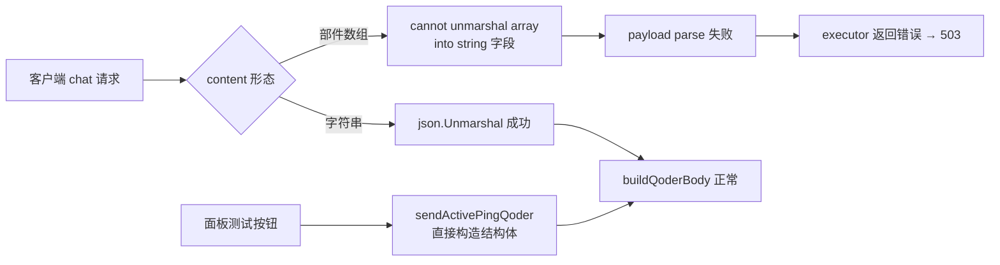
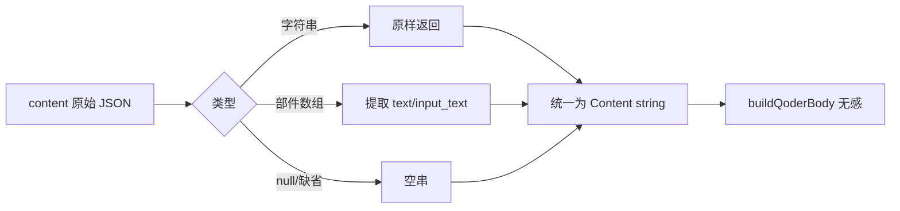

# Qoder 插件多模态 content 数组导致推理请求 503

结论：是缺陷，属于请求体解析的形态兼容遗漏。两个 Qoder 插件（qoder-ai-provider 与 qoderwork-provider）在解析客户端 chat 请求时，把 `messages[].content` 声明为 `string`；当客户端按 OpenAI 多模态规范发送部件数组（`[{"type":"text","text":"..."}]`）时，`json.Unmarshal` 直接失败，executor 返回 `payload parse: json: cannot unmarshal array into Go struct field openAIMessage.messages.content of type string`，对外表现为 503 `auth_unavailable`。面板「测试」按钮不经过这条解析路径，因此测试通过而真实推理必失败。影响：所有发送数组形态 content 的客户端（含主流多模态 SDK 的默认文本封装）在这两个插件上无法推理。范围：`qoder-ai/body.go`、`qoderwork/body.go` 的请求解析与新增回归测试。非范围：不改上游 body 模板、不改模型映射、不改 SSE 转发与账号调度、不动宿主 ABI。变化：为 `openAIMessage` 增加自定义 `UnmarshalJSON`，纯字符串形态原样接收，部件数组提取文本部件拼接。完成标准：本地 build/vet/test 全绿且新增测试在修复前必失败。验证状态：本地已验证通过；生产发布与真实推理验收待执行。

## 问题现象

生产调用该 provider 的模型（示例 `qwen-3.8-flash`）返回：

```
status_code=503, auth_unavailable: no auth available
(providers=qoder-ai-provider, model=qwen-3.8-flash;
 last upstream error: payload parse: json: cannot unmarshal array into
 Go struct field ***.***.content of type string)
```

关键点：面板「测试」按钮对同一账号、同一模型返回成功，与真实推理失败形成矛盾。

## 复现

两个插件均在源码目录新增 `body_test.go`，用多模态 payload 直接驱动解析与构建链路：

```
{"model":"Qwen3.8-Flash","stream":true,
 "messages":[{"role":"user","content":[{"type":"text","text":"你好"}]}]}
```

修复前执行 `python scripts/cgo-shim-build.py qoder-ai` / `qoderwork`，测试稳定失败：

```
--- FAIL: TestOpenAIRequestAcceptsContentPartsArray
    body_test.go:15: content 部件数组应能解析, got error:
      json: cannot unmarshal array into Go struct field
      openAIMessage.messages.content of type string
--- FAIL: TestBuildQoderBodyFromContentPartsPayload
    body_test.go:52: payload 解析失败: json: cannot unmarshal array ...
```

报错文本与生产 `last upstream error` 完全一致，证明复现的是同一条缺陷，而非近似问题。

## 根因

`qoder-ai/body.go:62-65` 与 `qoderwork/body.go:62-65` 定义：

```go
type openAIMessage struct {
	Role    string `json:"role"`
	Content string `json:"content"`
}
```

`Content` 为强类型 `string`。OpenAI 兼容客户端在文本消息上可能发送两种形态：

1. 纯字符串：`"content": "你好"`
2. 部件数组：`"content": [{"type":"text","text":"你好"}]`

第 2 种形态进入 `json.Unmarshal(req.Payload, qwReq)` 时，标准库尝试把 JSON 数组解码进 `string` 字段，直接报 `cannot unmarshal array ... of type string`，于是 `handleExecExecute`（`qoder-ai/main.go:696-699`）与 `handleExecStream`（`qoder-ai/main.go:898-901`）进入 `payload parse` 失败分支，向上返回错误。

「测试通过」的原因：面板测试走 `sendActivePingQoder`，它**直接构造 Go 结构体** `[]openAIMessage{{Role: "user", Content: "hi"}}`（`qoder-ai/active_ping.go:133-137`），完全不经过 JSON 反序列化，因此永远不会触发该缺陷。测试覆盖的是「上游连通性」，不是「客户端 payload 解析」，两者不是同一条路径。

## 缺陷链路

图形目的：说明多模态 payload 如何在解析阶段被拒绝，以及测试路径为何绕过。
关联 ID：BUG-QODER-CONTENT-ARRAY-PARSE



## 已排除与待区分的情况

| 形态 | 当前处理 | 是否属于本 Bug |
| --- | --- | --- |
| `content` 为纯字符串 | 解析正常 | 否 |
| `content` 为部件数组 | 解析失败 → 503 | 是，已复现 |
| 账号额度耗尽 / 429 | 走账号 failover 冷却 | 否 |
| 上游 SSE 错误帧 | 走 stream error 分支 | 否 |
| 面板「测试」按钮 | 直接构造结构体，绕过解析 | 否（本 Bug 的掩盖源） |

## 修复边界

根因修复落在解析层，不触碰上游 body 构建：

1. 为 `openAIMessage` 增加自定义 `UnmarshalJSON`：先用 `json.RawMessage` 接住 `content`，再依次尝试字符串与部件数组。
2. 字符串形态原样返回；数组形态仅提取 `text` / `input_text` 部件的文本并按换行拼接；`null` / 缺省归一为空串。
3. 非文本部件（图片等）在上游 `agent_chat_generation` 模板中没有对应位置，按空处理，不引入新的多模态能力。
4. `Content` 字段类型保持不变，`buildQoderBody`、`extractLatestUserPrompt` 及所有下游调用零改动，diff 面最小。

图形目的：展示修复后两种 content 形态在解析层归一为同一文本。
关联 ID：FIX-QODER-CONTENT-ARRAY-PARSE



## 修复与验证结论

已完成两插件同源修复，并各自补齐回归测试。

验证结论：`python scripts/cgo-shim-build.py qoder-ai` 与 `python scripts/cgo-shim-build.py qoderwork` 的 build、vet、test 全部通过。新增 `body_test.go` 在修复前稳定失败（已分别回退修复块复跑确认），失败报错与生产 `last upstream error` 文本一致，证明测试真实拦截该缺陷而非空壳用例。

风险评估：低。改动仅限单个结构体的反序列化行为，字段类型与下游全部签名不变；未改动模型映射、body 模板、SSE 转发、账号调度与宿主流桥。

关闭建议：暂不关闭。本地修复与回归已完成，但生产发布与真实推理验收尚未执行。

## 完成标准

1. 两插件的部件数组 content 能解析并提取出文本。
2. 纯字符串 content 形态保持兼容。
3. 多文本部件按换行拼接。
4. 完整 `buildQoderBody` 链路对多模态 payload 可用。
5. 两插件 build/vet/test 全绿；新增测试在修复前必失败。
6. 生产发布并完成真实推理验收（待执行）。

## 追踪附录

| 追踪 ID | 对应内容 | 证据 |
| --- | --- | --- |
| REQ-QODER-503-PAYLOAD-PARSE-20261010 | 真实推理不得因 content 数组报 payload parse | 用户生产报错原文 |
| AC-QODER-CONTENT-ARRAY-001 | 部件数组 content 解析并提取文本 | `TestOpenAIRequestAcceptsContentPartsArray` |
| AC-QODER-CONTENT-ARRAY-002 | 字符串 content 保持兼容 | `TestOpenAIRequestAcceptsPlainStringContent` |
| AC-QODER-CONTENT-ARRAY-003 | 多文本部件换行拼接 | `TestOpenAIRequestJoinsMultipleTextParts` |
| AC-QODER-CONTENT-ARRAY-004 | 多模态 payload 走通构建链路 | `TestBuildQoderBodyFromContentPartsPayload` |
| EVIDENCE-QODER-CONTENT-ARRAY-001 | 修复前必失败复现 | `body_test.go:15`、`body_test.go:52` |
| EVIDENCE-QODER-CONTENT-ARRAY-002 | 两插件 build/vet/test 全绿 | cgo-shim 输出 all green |
| EVIDENCE-QODER-CONTENT-ARRAY-003 | 测试按钮绕过解析 | `qoder-ai/active_ping.go:133-137` |
