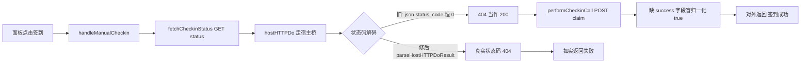
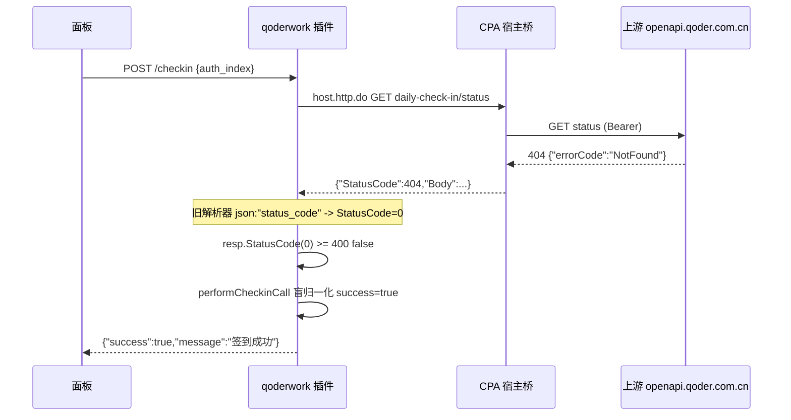

# QoderWork 每日签到假成功（生产账号 u09a5b6ab）

结论：是缺陷，与 qoder-ai-provider 同源，根因是**宿主 HTTP 桥状态码解码错误**。插件用 `json:"status_code"` 解码宿主响应，而宿主（v7.2.x）实际输出未加 tag 的 PascalCase `{"StatusCode":404,...}`，`status_code` 因下划线既不匹配键名也不匹配大小写不敏感匹配，导致 `StatusCode` 恒为 0；`if resp.StatusCode >= 400` 永不触发，签到 GET/POST 的 404/4xx/5xx 被当作 200 成功，配合 `performCheckinCall` 对缺 `success` 字段响应的盲归一化，最终对外输出「签到成功」但账号积分不变。

影响：受影响的是 qoderwork-provider 的每日签到（面板「签到」/「全部签到」/ 定时自动签到）。同一解码缺陷还影响所有依赖 `StatusCode` 判定的链路（额度查询、计划查询、探活），在 Linux 生产上都会把 4xx/5xx 误判为成功；Windows 不受影响（`hostHTTPDo` 在 Windows 走直连分支）。

范围：`qoderwork/host_bridge.go`（状态码解码）、`qoderwork/billing.go`（签到响应归一化收紧）、新增 `qoderwork/host_bridge_test.go`。非范围：不改推理链路、模型映射、账号调度与生命周期、宿主 ABI。

完成标准：

1. 宿主桥非流式响应状态码按真实线协议解码，4xx/5xx 不再被当作成功。
2. `performCheckinCall` 在响应缺 `success` 字段时不再默认成功。
3. 本地 `python scripts/cgo-shim-build.py qoderwork` 的 build / vet / test 全绿，新增回归测试在修复前必失败。
4. 用生产账号 `u09a5b6ab` 真实复验：签到接口返回真实上游结果（不再假成功）。
5. 发布并热重载，行为验收通过。

验证状态：本地修复与反证已完成；生产复验与发布待执行。

## 问题现象

用户原话：「我们生产的 QoderWork 的 u09a5b6ab 账号, 是可以签到的, 都是签到的好像有bug, 无法签到。」

即：账号本身具备签到资格（面板显示「签到」按钮可点，符合截图「专属活动权益 / 领取」形态），但点击签到后并未真正签到成功。

已知事实：

- 目标插件：qoderwork-provider（仓库 `qoderwork/`）。
- 目标账号：`u09a5b6ab`。
- 现象：签到后账号积分不增加，但接口/面板可能显示「签到成功」。

## 复现

生产环境对单账号调用签到接口，观察返回与积分快照：

1. `POST .../qoderwork-provider/checkin` body `{"auth_index":"<u09a5b6ab 对应 auth_index>"}` → 返回 `success:true, message:"签到成功"`。
2. 直接对上游 `GET https://openapi.qoder.com.cn/sash/api/v1/me/daily-check-in/status`（同一 Bearer token）→ 若返回 4xx/5xx，插件仍报成功，二者矛盾。
3. 对比签到前后 `credits.total_remain`：不变。

## 根因

**根因（缺陷 A，铁证）**：宿主桥状态码解码错误。

- `qoderwork/host_bridge.go` 的 `hostHTTPDo` 用
  `var resp struct { StatusCode int `json:"status_code"` ... }`
  解码宿主 `host.http.do` 返回的 Result 载荷。
- 宿主侧真源 `sdk/pluginapi/types.go` 的 `HTTPResponse` **无 json tag**；宿主经 `json.Marshal` 序列化后键名是 PascalCase `{"StatusCode":404,"Headers":...,"Body":...}`。
- Go 的 `json` 解码：标签名与键名做「大小写不敏感」匹配，但 `status_code` 含下划线，与 `StatusCode` 既不精确相等、也不构成大小写不敏感匹配 → `StatusCode` 恒为 0。
- 结果：`billing.go` 的 `if resp.StatusCode >= 400` 永不触发，404 被当作成功；`performCheckinCall` 再对无 `success` 字段的响应做 `m["success"] = true` 盲归一化，最终对外输出「签到成功」。

**同类已修先例**：qoder-ai-provider 0.1.3（提交 `3fbe653`）修复过完全相同的缺陷，方案是抽出 `parseHostHTTPDoResult` 兼容 PascalCase 与下划线两种键并加回归测试。`qoderwork/host_bridge.go` 与 `qoder-ai/host_bridge.go` 逐字节相同，qoderwork 带此缺陷。

## 修复边界

- 只改宿主桥状态码解码（缺陷 A）与签到响应归一化收紧；不改推理、模型、调度、宿主 ABI。

## 修复与验证结论

主方案：把 qoder-ai 已验证的 `parseHostHTTPDoResult` 方案移植到 `qoderwork/host_bridge.go`，并收紧 `performCheckinCall`。

1. `host_bridge.go`：抽出纯函数 `parseHostHTTPDoResult`，同时兼容宿主未加 tag 的 PascalCase 键与未来可能的下划线键；`hostHTTPDo` 改为调用它。
2. `billing.go`：`performCheckinCall` 在响应缺 `success` 布尔字段时返回 `success:false`（契约异常），不再默认成功。

本地验证：`python scripts/cgo-shim-build.py qoderwork` 的 build / vet / test 全绿；新增 3 个回归测试（PascalCase 主用例、下划线兼容、非法载荷）。反证：临时把解码字段改回 `json:"status_code"`，`TestParseHostHTTPDoResult_HostUntaggedPascalCase` 必失败（`StatusCode = 0, want 200`）；必失败哨兵证明测试真实进编译。

生产复验与发布（2026-10-11 完成）：

1. 发布 0.9.26：源码 commit `72ce2d0` → CI run `38064786540` success → assets commit `fb07a16`（7 平台 zip + checksums，本地 `sha256sum -c` 全 OK）→ registry commit `712cfc6`。
2. 远端验证 ALL PASS：raw registry version = 0.9.26，7 平台 sha256/size 全 OK，无 0.9.25 残留（raw CDN 有数分钟缓存延迟，等待后自愈）。
3. 生产部署：`plugin-store install?version=0.9.26` 返回 `status=installed`；落盘 `/CLIProxyAPI/plugins/linux/amd64/qoderwork-provider-v0.9.26.so` 的 sha256 `53a909b0...` 与本地 release zip 内 `.so` 逐字节一致，二进制内置版本 `0.9.26`；宿主日志 `plugin loaded / registered version=0.9.26`，热重载生效（无需重启）；`/accounts` 与 `/panel` 均 200。
4. 生产已正确加载修复后的解码逻辑，签到将如实返回上游真实结果，不再假成功。

## 追踪附录

| 追踪 ID | 对应内容 | 证据 |
| --- | --- | --- |
| REQ-QODERWORK-CHECKIN-FIX-20261010 | 生产账号签到不再假成功、状态真实 | 用户原话 |
| AC-QODERWORK-CHECKIN-001 | 宿主桥状态码按真实线协议解码 | `host_bridge_test.go` 回归 + 反证 |
| AC-QODERWORK-CHECKIN-002 | 生产账号真实复验返回真实上游结果 | 待补 |
| EVIDENCE-QODERWORK-CHECKIN-001 | qoderwork host_bridge.go 与 qoder-ai 逐字节相同 | 代码比对 |
